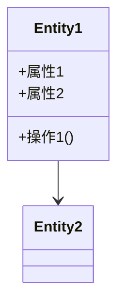
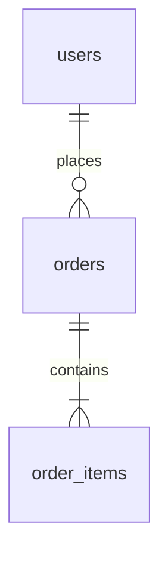
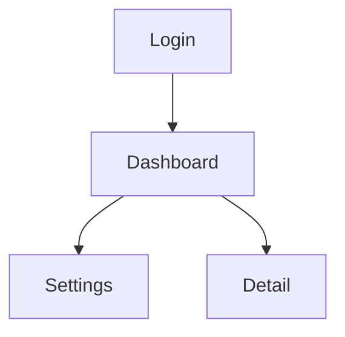
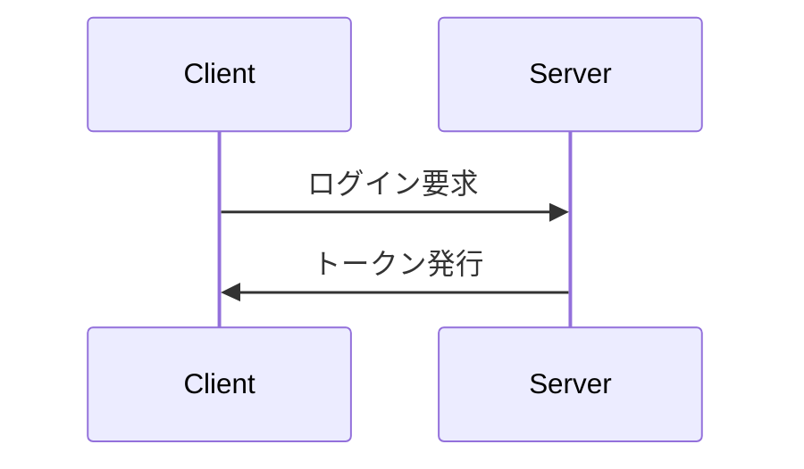
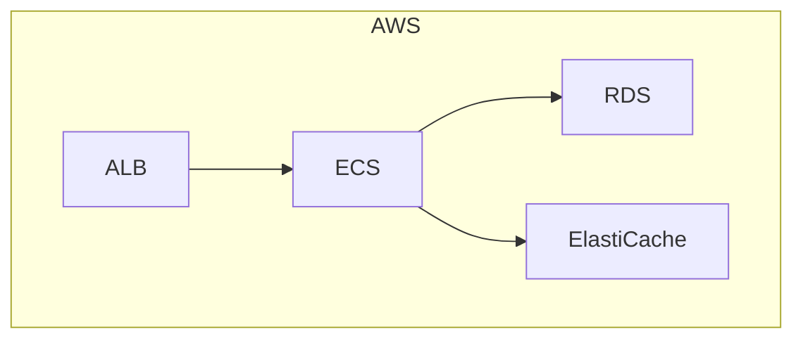
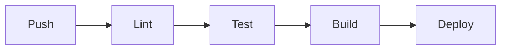

# Phase 2: ドキュメント生成（サブエージェント並列実行）

## 前提
以下のファイルが完了済みであること:
- `docs/requirements/business-requirements.md`
- `docs/architecture/architecture.md`

---

## 実行指示

docs/requirements/business-requirements.md と
docs/architecture/architecture.md を読み込み、
残りのドキュメントをすべて生成してください。

## 実行方法
- このタスクは **ultrathink** で実行すること
- 各ファイルは **subAgent** で並列実行すること
- mock/ 配下は除外（後で作成）

## 生成対象ファイル一覧

### Group 1: 基盤ドキュメント
| ファイル | subAgent |
|---------|----------|
| `docs/README.md` | Y |
| `docs/requirements/non-functional.md` | Y |

### Group 2: ドメイン設計
| ファイル | subAgent |
|---------|----------|
| `docs/domain/glossary.md` | Y |
| `docs/domain/domain-model.md` | Y |
| `docs/domain/entities.md` | Y |
| `docs/domain/business-rules.md` | Y |

### Group 3: データベース設計
| ファイル | subAgent |
|---------|----------|
| `docs/database/er-diagram.md` | Y |
| `docs/database/tables/*.md` | Y |
| `docs/database/indexes.md` | Y |
| `docs/database/migrations.md` | Y |

### Group 4: API設計
| ファイル | subAgent |
|---------|----------|
| `docs/api/overview.md` | Y |
| `docs/api/endpoints/*.md` | Y |
| `docs/api/error-codes.md` | Y |

### Group 5: 画面設計
| ファイル | subAgent |
|---------|----------|
| `docs/screens/flow.md` | Y |
| `docs/screens/components.md` | Y |

### Group 6: 認証・認可
| ファイル | subAgent |
|---------|----------|
| `docs/auth/authentication.md` | Y |
| `docs/auth/authorization.md` | Y |
| `docs/auth/roles.md` | Y |

### Group 7: インフラ
| ファイル | subAgent |
|---------|----------|
| `docs/infrastructure/infra-architecture.md` | Y |
| `docs/infrastructure/environments.md` | Y |
| `docs/infrastructure/ci-cd.md` | Y |
| `docs/infrastructure/docker.md` | Y |

### Group 8: セキュリティ
| ファイル | subAgent |
|---------|----------|
| `docs/security/threat-model.md` | Y |
| `docs/security/data-protection.md` | Y |
| `docs/security/audit-log.md` | Y |

### Group 9: テスト
| ファイル | subAgent |
|---------|----------|
| `docs/testing/strategy.md` | Y |
| `docs/testing/test-cases/*.md` | Y |
| `docs/testing/e2e-scenarios.md` | Y |

### Group 10: 運用
| ファイル | subAgent |
|---------|----------|
| `docs/operations/monitoring.md` | Y |
| `docs/operations/logging.md` | Y |
| `docs/operations/alerting.md` | Y |
| `docs/operations/backup.md` | Y |

---

## 各subAgentへの共通指示

1. business-requirements.md と architecture.md を必ず参照すること
2. 不明点は「【要確認】」タグを付ける
3. 仮定を置いた場合は「【仮定】」タグを付ける
4. 各ファイル冒頭に関連ドキュメントへのリンクを記載
5. Mermaid図を積極的に活用
6. 実装可能な具体性を持たせる

---

## 各ファイルの出力フォーマット

### docs/README.md
```markdown
# ドキュメントナビゲーション

> 最終更新: YYYY-MM-DD

## 概要
[プロジェクト概要を1-2文で]

## ドキュメント構成

| カテゴリ | ドキュメント | 概要 |
|---------|------------|-----|
| 要件 | [business-requirements](./requirements/business-requirements.md) | ビジネス要件 |
| 要件 | [non-functional](./requirements/non-functional.md) | 非機能要件 |
| ドメイン | [glossary](./domain/glossary.md) | 用語集 |
| ドメイン | [domain-model](./domain/domain-model.md) | ドメインモデル |
| ドメイン | [entities](./domain/entities.md) | エンティティ定義 |
| ドメイン | [business-rules](./domain/business-rules.md) | ビジネスルール |
| DB | [er-diagram](./database/er-diagram.md) | ER図 |
| DB | [tables](./database/tables/) | テーブル定義 |
| DB | [indexes](./database/indexes.md) | インデックス |
| DB | [migrations](./database/migrations.md) | マイグレーション |
| API | [overview](./api/overview.md) | API概要 |
| API | [endpoints](./api/endpoints/) | エンドポイント |
| API | [error-codes](./api/error-codes.md) | エラーコード |
| 画面 | [flow](./screens/flow.md) | 画面遷移図 |
| 画面 | [components](./screens/components.md) | 共通コンポーネント |
| 認証 | [authentication](./auth/authentication.md) | 認証 |
| 認証 | [authorization](./auth/authorization.md) | 認可 |
| 認証 | [roles](./auth/roles.md) | ロール・権限 |
| インフラ | [infra-architecture](./infrastructure/infra-architecture.md) | インフラ構成 |
| インフラ | [environments](./infrastructure/environments.md) | 環境別設定 |
| インフラ | [ci-cd](./infrastructure/ci-cd.md) | CI/CD |
| インフラ | [docker](./infrastructure/docker.md) | Docker構成 |
| セキュリティ | [threat-model](./security/threat-model.md) | 脅威モデル |
| セキュリティ | [data-protection](./security/data-protection.md) | データ保護 |
| セキュリティ | [audit-log](./security/audit-log.md) | 監査ログ |
| テスト | [strategy](./testing/strategy.md) | テスト方針 |
| テスト | [test-cases](./testing/test-cases/) | テストケース |
| テスト | [e2e-scenarios](./testing/e2e-scenarios.md) | E2Eシナリオ |
| 運用 | [monitoring](./operations/monitoring.md) | 監視 |
| 運用 | [logging](./operations/logging.md) | ログ |
| 運用 | [alerting](./operations/alerting.md) | アラート |
| 運用 | [backup](./operations/backup.md) | バックアップ |
```

### docs/requirements/non-functional.md
```markdown
# 非機能要件

> 関連: [business-requirements](./business-requirements.md) | [architecture](../architecture/architecture.md)

## 1. パフォーマンス
| 項目 | 目標値 | 計測方法 |
|-----|-------|---------|
| ページ表示 | X秒以内 | Lighthouse |
| API応答(p95) | Xms以内 | APM |

## 2. 可用性
| 項目 | 目標 |
|-----|-----|
| 稼働率 | 99.9% |
| RTO | X時間 |
| RPO | X時間 |

## 3. スケーラビリティ
...

## 4. セキュリティ
...

## 5. 保守性
...
```

### docs/domain/glossary.md
```markdown
# 用語集

> 関連: [business-requirements](../requirements/business-requirements.md) | [domain-model](./domain-model.md)

| 用語 | 英語表記 | 定義 | 備考 |
|-----|---------|-----|-----|
| ... | ... | ... | ... |
```

### docs/domain/domain-model.md
```markdown
# ドメインモデル

> 関連: [glossary](./glossary.md) | [entities](./entities.md)

## ドメイン関係図



## 主要な関係性
...
```

### docs/domain/entities.md
```markdown
# エンティティ定義

> 関連: [domain-model](./domain-model.md) | [glossary](./glossary.md)

## [エンティティ名]

### 概要
...

### 属性
| 属性名 | 型 | 必須 | 説明 |
|-------|---|-----|-----|
| ... | ... | ... | ... |

### 責務
- ...

### ライフサイクル
...
```

### docs/domain/business-rules.md
```markdown
# ビジネスルール

> 関連: [business-requirements](../requirements/business-requirements.md)

## ルール一覧

| ID | カテゴリ | ルール | 例外 |
|----|---------|-------|-----|
| BR-001 | ... | Xの場合はY | ... |

## ルール詳細

### BR-001
...
```

### docs/database/er-diagram.md
```markdown
# ER図

> 関連: [tables](./tables/) | [domain-model](../domain/domain-model.md)

## 全体ER図



## テーブル関係の説明
...
```

### docs/database/tables/*.md
```markdown
# [テーブル名] テーブル

> 関連: [ER図](../er-diagram.md)

## 概要
...

## カラム定義
| カラム名 | 型 | NULL | デフォルト | 説明 |
|---------|---|------|-----------|-----|
| id | UUID | NO | gen_random_uuid() | PK |
| ... | ... | ... | ... | ... |

## 制約
- PK: `id`
- FK: `user_id` -> `users.id`
- UNIQUE: ...

## インデックス
- `idx_xxx`: ...
```

### docs/database/indexes.md
```markdown
# インデックス設計

> 関連: [tables](./tables/)

| テーブル | インデックス名 | カラム | 種別 | 用途 |
|---------|--------------|-------|-----|-----|
| users | idx_users_email | email | UNIQUE | ログイン検索 |
| ... | ... | ... | ... | ... |
```

### docs/database/migrations.md
```markdown
# マイグレーション運用

> 関連: [architecture](../architecture/architecture.md)

## マイグレーションツール
...

## 命名規則
...

## 運用ルール
...
```

### docs/api/overview.md
```markdown
# API概要

> 関連: [architecture](../architecture/architecture.md)

## API形式
- 形式: REST / GraphQL
- ベースURL: `/api/v1`

## 認証
- 方式: Bearer Token (JWT)
- ヘッダー: `Authorization: Bearer <token>`

## 共通レスポンス形式
```json
{
  "data": {},
  "meta": {},
  "errors": []
}
```

## レートリミット
...
```

### docs/api/endpoints/*.md
```markdown
# [エンドポイント名]

> 関連: [overview](../overview.md) | [error-codes](../error-codes.md)

## エンドポイント
`POST /api/v1/xxx`

## 概要
...

## 認証
要 / 不要

## リクエスト
### Headers
| ヘッダー | 必須 | 説明 |
|---------|-----|-----|
| Authorization | Yes | Bearer token |

### Body
```json
{
  "field": "value"
}
```

## レスポンス
### 200 OK
```json
{
  "data": {}
}
```

### エラー
| コード | 説明 |
|-------|-----|
| 400 | ... |
| 401 | ... |
```

### docs/api/error-codes.md
```markdown
# エラーコード一覧

> 関連: [overview](./overview.md)

| コード | HTTPステータス | メッセージ | 対処法 |
|-------|--------------|----------|-------|
| E001 | 400 | ... | ... |
| E002 | 401 | ... | ... |
```

### docs/screens/flow.md
```markdown
# 画面遷移図

> 関連: [business-requirements](../requirements/business-requirements.md)

## 全体遷移図



## 主要フロー

### ユーザー登録フロー
1. ...
2. ...

### メインフロー
1. ...
2. ...
```

### docs/screens/components.md
```markdown
# 共通コンポーネント

> 関連: [flow](./flow.md)

## ボタン
| 種別 | 用途 | スタイル |
|-----|-----|---------|
| Primary | 主要アクション | 青背景 |
| Secondary | 補助アクション | 白背景 |
| Danger | 削除等 | 赤背景 |

## フォーム要素
| 要素 | 用途 | バリデーション |
|-----|-----|--------------|
| TextInput | テキスト入力 | ... |
| Select | 選択 | ... |

## モーダル
...

## 通知
...
```

### docs/auth/authentication.md
```markdown
# 認証設計

> 関連: [architecture](../architecture/architecture.md) | [api/overview](../api/overview.md)

## 認証方式
- 方式: JWT
- 有効期限: アクセストークン X分 / リフレッシュトークン X日

## 認証フロー



## セッション管理
...
```

### docs/auth/authorization.md
```markdown
# 認可設計

> 関連: [authentication](./authentication.md) | [roles](./roles.md)

## 認可モデル
- RBAC / ABAC / etc.

## 認可チェックポイント
| レイヤー | 実装場所 | チェック内容 |
|---------|---------|------------|
| API | ミドルウェア | ロール確認 |
| 画面 | ルートガード | 認証状態 |

## 実装方針
...
```

### docs/auth/roles.md
```markdown
# ロール・権限

> 関連: [authorization](./authorization.md)

## ロール定義
| ロール | 説明 |
|-------|-----|
| admin | 管理者 |
| user | 一般ユーザー |

## 権限マトリクス
| 機能 | admin | user | guest |
|-----|-------|------|-------|
| ユーザー管理 | Y | - | - |
| データ閲覧 | Y | Y | - |
```

### docs/infrastructure/infra-architecture.md
```markdown
# インフラ構成

> 関連: [architecture](../architecture/architecture.md)

## 構成図



## サービス一覧
| サービス | 用途 | 選定理由 |
|---------|-----|---------|
| ... | ... | ... |
```

### docs/infrastructure/environments.md
```markdown
# 環境別設定

> 関連: [infra-architecture](./infra-architecture.md)

| 項目 | 開発 | ステージング | 本番 |
|-----|-----|------------|-----|
| URL | ... | ... | ... |
| DB | ... | ... | ... |
| ... | ... | ... | ... |
```

### docs/infrastructure/ci-cd.md
```markdown
# CI/CD設計

> 関連: [environments](./environments.md)

## パイプライン概要



## ワークフロー詳細
...

## デプロイ戦略
- 方式: Blue-Green / Rolling / Canary
```

### docs/infrastructure/docker.md
```markdown
# Docker構成

> 関連: [architecture](../architecture/architecture.md)

## ローカル開発環境

```yaml
# docker-compose.yml 概要
services:
  app:
    ...
  db:
    ...
```

## Dockerfile方針
...
```

### docs/security/threat-model.md
```markdown
# 脅威モデル

> 関連: [data-protection](./data-protection.md)

## STRIDE分析

| 脅威 | 対象 | リスク | 対策 |
|-----|-----|-------|-----|
| Spoofing | 認証 | 高 | JWT + HTTPS |
| Tampering | データ | 中 | 署名検証 |
| ... | ... | ... | ... |
```

### docs/security/data-protection.md
```markdown
# データ保護

> 関連: [threat-model](./threat-model.md)

## 機密データ分類
| 分類 | 例 | 保護レベル |
|-----|---|----------|
| 高 | パスワード | 暗号化必須 |
| 中 | メールアドレス | アクセス制限 |

## 暗号化方針
...

## データマスキング
...
```

### docs/security/audit-log.md
```markdown
# 監査ログ設計

> 関連: [operations/logging](../operations/logging.md)

## 記録対象
| イベント | 記録内容 |
|---------|---------|
| ログイン | user_id, IP, timestamp, 成否 |
| データ更新 | who, what, when, before, after |

## 保持期間
...

## アクセス制限
...
```

### docs/testing/strategy.md
```markdown
# テスト戦略

> 関連: [architecture](../architecture/architecture.md)

## テストピラミッド
| 種別 | 比率 | ツール |
|-----|-----|-------|
| 単体 | 70% | Jest |
| 結合 | 20% | ... |
| E2E | 10% | Playwright |

## カバレッジ目標
- 全体: X%以上
- 重要機能: X%以上
```

### docs/testing/test-cases/*.md
```markdown
# [機能名] テストケース

> 関連: [strategy](../strategy.md)

## 対象機能
F-XXX: ...

## テストケース
| ID | 条件 | 操作 | 期待結果 | 優先度 |
|----|-----|-----|---------|-------|
| TC-001 | ... | ... | ... | P0 |
```

### docs/testing/e2e-scenarios.md
```markdown
# E2Eシナリオ

> 関連: [strategy](./strategy.md) | [screens/flow](../screens/flow.md)

## シナリオ一覧
| ID | シナリオ名 | 概要 | 優先度 |
|----|----------|-----|-------|
| E2E-001 | ユーザー登録 | ... | P0 |

## シナリオ詳細

### E2E-001: ユーザー登録
1. ...
2. ...
```

### docs/operations/monitoring.md
```markdown
# 監視設計

> 関連: [alerting](./alerting.md)

## メトリクス
| メトリクス | 説明 | 閾値 |
|-----------|-----|-----|
| CPU使用率 | ... | 80% |
| メモリ使用率 | ... | 85% |
| レスポンスタイム(p99) | ... | 500ms |

## ダッシュボード
...
```

### docs/operations/logging.md
```markdown
# ログ設計

> 関連: [monitoring](./monitoring.md)

## ログレベル
| レベル | 用途 |
|-------|-----|
| ERROR | エラー |
| WARN | 警告 |
| INFO | 通常操作 |
| DEBUG | デバッグ |

## フォーマット
```json
{
  "timestamp": "...",
  "level": "...",
  "message": "...",
  "context": {}
}
```

## 出力先・保持期間
...
```

### docs/operations/alerting.md
```markdown
# アラート設計

> 関連: [monitoring](./monitoring.md)

## アラート一覧
| 名前 | 条件 | 重要度 | 通知先 |
|-----|-----|-------|-------|
| High CPU | CPU > 80% 5分継続 | Warning | Slack |
| Error Rate | 5xx > 1% | Critical | PagerDuty |

## エスカレーション
...
```

### docs/operations/backup.md
```markdown
# バックアップ設計

> 関連: [database](../database/)

## バックアップ方針
| 対象 | 頻度 | 保持期間 | 方式 |
|-----|-----|---------|-----|
| DB | 日次 | 30日 | スナップショット |
| ファイル | ... | ... | ... |

## リカバリ目標
- RTO: X時間
- RPO: X時間

## リカバリ手順
1. ...
2. ...
```

---

## 完了条件
- すべてのファイルが生成されている（mock/除く）
- 【要確認】タグが残っていない
- ファイル間の相互リンクが正しい
- Mermaid図が正しく記述されている
