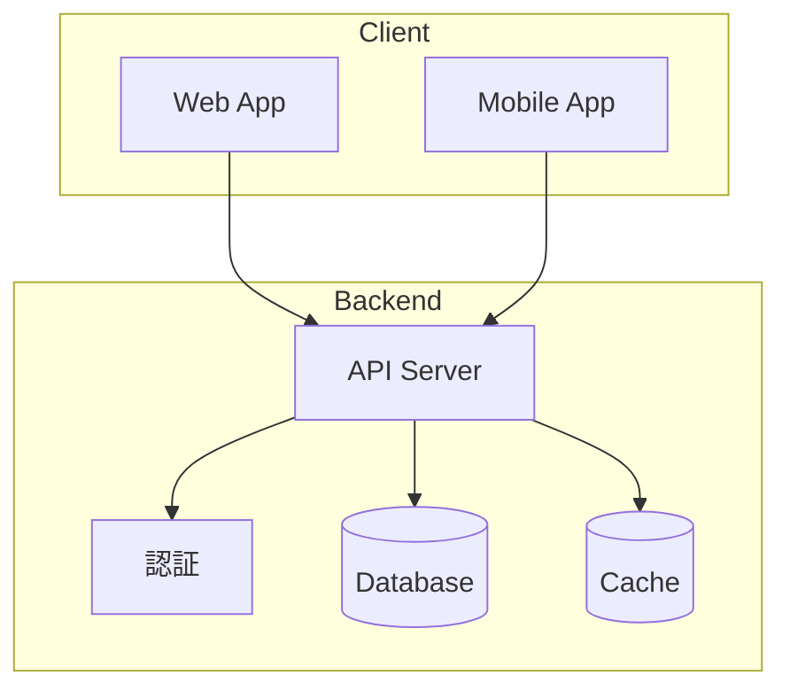
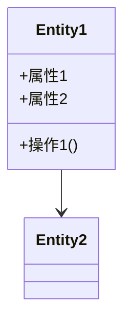
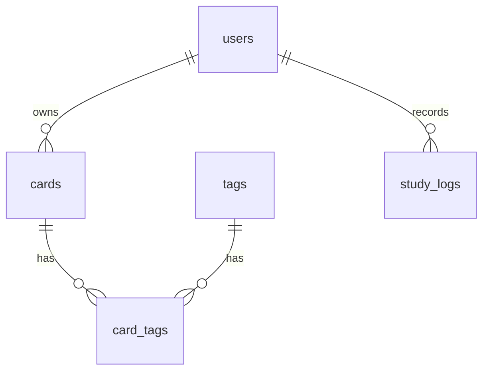
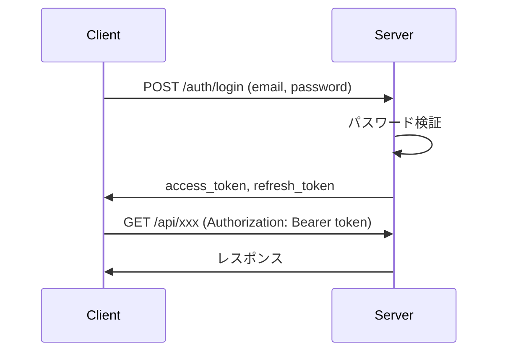
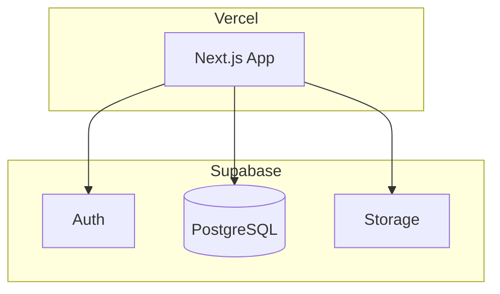
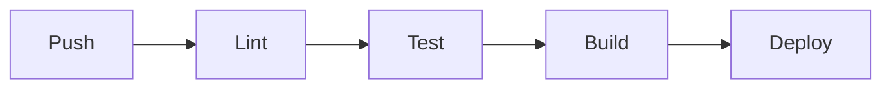

# Phase 2: アーキテクチャ設計

## 前提
以下のファイルが完了済みであること:
- `docs/requirements/business-requirements.md`
- `docs/requirements/functions/_index.md`

---

## 実行指示

以下のファイルを読み込み、アーキテクチャ設計と非機能要件を作成してください:
- `docs/requirements/business-requirements.md`
- `docs/requirements/functions/_index.md`

※ 詳細仕様が必要な場合は `docs/requirements/functions/` 配下の各ファイルを参照

## あなたの役割
経験豊富なシステムアーキテクト。
最新の技術トレンドを把握し、プロジェクトに最適な構成を提案できる。

## 実行方法
このタスクは **ultrathink** で実行すること。

---

## Step 1: ヒアリング（1回のみ）

business-requirements.md を読み込んだ後、以下を1回で質問する:

```
要件を確認しました。アーキテクチャ設計に入る前に、いくつか教えてください。

1. **使いたい技術・フレームワーク**はありますか？
   （例: Next.js, Python, AWS など。なければ「おまかせ」でOK）

2. **避けたい技術**はありますか？
   （例: 学習コストが高いもの、ライセンス問題があるもの など）

3. **チームの技術スタック経験**を教えてください
   （例: TypeScript得意、Python初心者、AWS経験あり など）

4. **重視するポイント**は何ですか？
   - [ ] 開発スピード
   - [ ] スケーラビリティ
   - [ ] コスト最小化
   - [ ] 保守性・可読性
   - [ ] 最新技術の採用
   （複数選択可、優先順位があれば教えてください）

5. **その他、制約や要望**があれば教えてください
   （例: 既存システムとの連携、社内規定 など）
```

---

## Step 2: 調査・検討

ユーザーの回答を受けて、以下を実行:

1. **Web検索で最新情報を確認**
   - 指定された技術の現在のバージョン・状況
   - 技術の組み合わせにおけるベストプラクティス
   - 類似プロジェクトでの採用事例
   - 各技術の最新トレンドや注意点

2. **ultrathinkで構成を検討**
   - business-requirements.md の要件との適合性
   - ユーザーの希望との整合性
   - トレードオフの評価
   - 代替案の検討

---

## Step 3: 全体構成の提案

調査結果を踏まえ、**2つのファイルを一括で提案**する。

### 生成対象ファイル

| ファイル | 内容 |
|---------|------|
| `docs/requirements/architecture.md` | システム全体設計（技術スタック、ドメイン、DB、API、認証、インフラ、セキュリティ、テスト、運用） |
| `docs/requirements/non-functional.md` | 非機能要件（パフォーマンス、可用性、セキュリティ等） |

### 提案時のフォーマット

```
## 提案するアーキテクチャ

### 1. architecture.md

[architecture.md の全内容を出力]

---

### 2. non-functional.md

[non-functional.md の全内容を出力]

---

## 選定のポイント

### 検索で確認した情報
- [技術A]: ...の理由で現在も推奨
- [技術B]: ...という最新動向を踏まえて選定

### 主な判断理由
1. ...
2. ...

### 代替案として検討したもの
| 項目 | 代替案 | 採用しなかった理由 |
|-----|-------|------------------|
| ... | ... | ... |

---

修正したい箇所があれば指摘してください。
例:「フロントエンドはVueに変更」「認証はFirebase Authを使いたい」
```

---

## Step 4: 修正サイクル

ユーザーからの修正指示に対して:

1. 指摘された箇所を修正
2. 修正に伴う他の部分への影響を確認
3. 必要に応じて関連技術も再検索
4. 更新した architecture.md / non-functional.md を出力

「完成」「OK」「これで進めて」等の承認があるまで繰り返す。

---

## 出力フォーマット

### docs/requirements/architecture.md

```markdown
# システムアーキテクチャ

> 関連ドキュメント: [ビジネス要件](./business-requirements.md) | [非機能要件](./non-functional.md)
> 最終更新: YYYY-MM-DD

---

## 1. アーキテクチャ概要

### 1.1 システム全体像



### 1.2 設計方針
- **重視したポイント**: ...
- **基本アプローチ**: ...

---

## 2. 技術スタック

### 2.1 フロントエンド
| 項目 | 選定技術 | バージョン | 選定理由 |
|-----|---------|-----------|---------|
| フレームワーク | ... | ... | ... |
| 状態管理 | ... | ... | ... |
| UIライブラリ | ... | ... | ... |
| フォーム | ... | ... | ... |
| その他 | ... | ... | ... |

### 2.2 バックエンド
| 項目 | 選定技術 | バージョン | 選定理由 |
|-----|---------|-----------|---------|
| 言語 | ... | ... | ... |
| フレームワーク | ... | ... | ... |
| API形式 | ... | ... | ... |
| 認証 | ... | ... | ... |

### 2.3 データストア
| 項目 | 選定技術 | 選定理由 |
|-----|---------|---------|
| メインDB | ... | ... |
| キャッシュ | ... | ... |
| ファイルストレージ | ... | ... |

### 2.4 インフラ・DevOps
| 項目 | 選定技術 | 選定理由 |
|-----|---------|---------|
| ホスティング | ... | ... |
| CI/CD | ... | ... |
| IaC | ... | ... |
| コンテナ | ... | ... |
| 監視・ログ | ... | ... |

### 2.5 技術選定の経緯
| 項目 | 採用案 | 代替案 | 代替を選ばなかった理由 |
|-----|-------|-------|---------------------|
| ... | ... | ... | ... |

---

## 3. ディレクトリ構成

```
project-root/
├── src/
│   ├── app/           # アプリケーションコード
│   ├── components/    # UIコンポーネント
│   ├── lib/           # ユーティリティ
│   └── types/         # 型定義
├── docs/              # ドキュメント
├── tests/             # テスト
└── ...
```

### 各ディレクトリの役割
| ディレクトリ | 役割 |
|------------|-----|
| `src/app/` | ... |
| `src/components/` | ... |
| `src/lib/` | ... |
| ... | ... |

---

## 4. ドメイン設計

### 4.1 用語集
| 用語 | 英語表記 | 定義 | 備考 |
|-----|---------|-----|-----|
| ... | ... | ... | ... |

### 4.2 ドメインモデル



### 4.3 エンティティ定義

#### [エンティティ名]
| 属性名 | 型 | 必須 | 説明 |
|-------|---|-----|-----|
| ... | ... | ... | ... |

**責務**: ...

### 4.4 ビジネスルール
| ID | カテゴリ | ルール | 例外 |
|----|---------|-------|-----|
| BR-001 | ... | 〜の場合は〜 | ... |

---

## 5. データベース設計

### 5.1 ER図



### 5.2 テーブル定義

#### users テーブル
| カラム名 | 型 | NULL | デフォルト | 説明 |
|---------|---|------|-----------|-----|
| id | UUID | NO | gen_random_uuid() | PK |
| email | VARCHAR(255) | NO | - | メールアドレス |
| ... | ... | ... | ... | ... |

**制約**: PK: `id`, UNIQUE: `email`

#### [他のテーブル]
...

### 5.3 インデックス設計
| テーブル | インデックス名 | カラム | 種別 | 用途 |
|---------|--------------|-------|-----|-----|
| users | idx_users_email | email | UNIQUE | ログイン検索 |
| ... | ... | ... | ... | ... |

### 5.4 マイグレーション運用
- **ツール**: ...
- **命名規則**: `YYYYMMDDHHMMSS_description.sql`
- **ロールバック方針**: ...

---

## 6. API設計

### 6.1 概要
- **形式**: REST
- **ベースURL**: `/api/v1`
- **認証**: Bearer Token (JWT)

### 6.2 共通レスポンス形式
```json
{
  "data": {},
  "meta": {},
  "errors": []
}
```

### 6.3 エンドポイント一覧

#### 認証
| メソッド | パス | 説明 | 認証 |
|---------|-----|-----|-----|
| POST | /auth/register | ユーザー登録 | 不要 |
| POST | /auth/login | ログイン | 不要 |
| POST | /auth/logout | ログアウト | 要 |
| POST | /auth/refresh | トークンリフレッシュ | 要 |

#### カード
| メソッド | パス | 説明 | 認証 |
|---------|-----|-----|-----|
| GET | /cards | カード一覧取得 | 要 |
| POST | /cards | カード作成 | 要 |
| GET | /cards/:id | カード詳細取得 | 要 |
| PUT | /cards/:id | カード更新 | 要 |
| DELETE | /cards/:id | カード削除 | 要 |

#### [他のリソース]
...

### 6.4 エラーコード
| コード | HTTPステータス | メッセージ | 対処法 |
|-------|--------------|----------|-------|
| E001 | 400 | バリデーションエラー | リクエストを確認 |
| E002 | 401 | 認証エラー | 再ログイン |
| ... | ... | ... | ... |

### 6.5 レートリミット
| エンドポイント | 制限 |
|--------------|-----|
| 認証系 | 10回/分 |
| その他 | 100回/分 |

---

## 7. 認証・認可設計

### 7.1 認証方式
- **方式**: JWT
- **アクセストークン有効期限**: 15分
- **リフレッシュトークン有効期限**: 7日

### 7.2 認証フロー



### 7.3 ロール・権限
| ロール | 説明 |
|-------|-----|
| user | 一般ユーザー |
| admin | 管理者（将来用） |

### 7.4 権限マトリクス
| 機能 | user | admin |
|-----|------|-------|
| カード作成・編集・削除 | 自分のみ | 全ユーザー |
| 学習履歴閲覧 | 自分のみ | 全ユーザー |
| ユーザー管理 | - | ✓ |

---

## 8. インフラ設計

### 8.1 構成図



### 8.2 環境別設定
| 項目 | dev | stg | prod |
|-----|-----|-----|------|
| URL | localhost:3000 | stg.example.com | example.com |
| DB | Supabase (dev) | Supabase (stg) | Supabase (prod) |
| ログレベル | DEBUG | INFO | WARN |

### 8.3 CI/CD



- **ツール**: GitHub Actions
- **トリガー**: main/develop ブランチへのpush
- **デプロイ先**: Vercel

### 8.4 Docker構成（ローカル開発）
```yaml
services:
  app:
    build: .
    ports:
      - "3000:3000"
  db:
    image: postgres:16
    environment:
      POSTGRES_PASSWORD: postgres
```

---

## 9. セキュリティ設計

### 9.1 脅威モデル（STRIDE）
| 脅威 | 対象 | リスク | 対策 |
|-----|-----|-------|-----|
| Spoofing | 認証 | 高 | JWT + HTTPS |
| Tampering | データ | 中 | 署名検証、入力バリデーション |
| Repudiation | 操作 | 低 | 監査ログ |
| Information Disclosure | DB | 高 | 暗号化、アクセス制御 |
| Denial of Service | API | 中 | レートリミット、WAF |
| Elevation of Privilege | 認可 | 高 | RBAC |

### 9.2 データ保護
| 分類 | 例 | 保護レベル |
|-----|---|----------|
| 極秘 | パスワード | bcryptハッシュ化 |
| 機密 | メールアドレス | アクセス制限 |
| 一般 | カード内容 | 認証必須 |

### 9.3 監査ログ
| イベント | 記録内容 |
|---------|---------|
| ログイン | user_id, IP, timestamp, 成否 |
| データ変更 | who, what, when, before, after |

---

## 10. テスト設計

### 10.1 テストピラミッド
| 種別 | 比率 | ツール | 対象 |
|-----|-----|-------|-----|
| 単体 | 70% | Vitest | ユーティリティ、フック |
| 結合 | 20% | Testing Library | コンポーネント |
| E2E | 10% | Playwright | 主要フロー |

### 10.2 カバレッジ目標
- 全体: 80%以上
- 重要機能（認証、学習）: 90%以上

### 10.3 E2Eシナリオ
| ID | シナリオ | 優先度 |
|----|---------|-------|
| E2E-001 | ユーザー登録〜ログイン | P0 |
| E2E-002 | カード作成〜学習〜自己評価 | P0 |
| E2E-003 | 復習通知〜学習完了 | P1 |

---

## 11. 運用設計

### 11.1 監視
| メトリクス | 閾値 | アラート |
|-----------|-----|---------|
| エラーレート | > 1% | Slack通知 |
| レスポンスタイム(p99) | > 500ms | Slack通知 |
| DB接続数 | > 80% | Slack通知 |

### 11.2 ログ設計
| レベル | 用途 | 出力先 |
|-------|-----|-------|
| ERROR | エラー | Vercel Logs |
| WARN | 警告 | Vercel Logs |
| INFO | 通常操作 | Vercel Logs |

**フォーマット**:
```json
{
  "timestamp": "2025-01-02T12:00:00Z",
  "level": "INFO",
  "message": "User logged in",
  "context": { "userId": "xxx" }
}
```

### 11.3 バックアップ
| 対象 | 頻度 | 保持期間 | 方式 |
|-----|-----|---------|-----|
| DB | 日次 | 30日 | Supabase自動バックアップ |
| Storage | リアルタイム | 無期限 | Supabase |

### 11.4 障害対応
- **RTO**: 4時間
- **RPO**: 1時間
- **エスカレーション**: Slack → メール → 電話

---

## 12. 外部サービス連携

| サービス | 用途 | 選定理由 |
|---------|-----|---------|
| Supabase | 認証・DB・Storage | オールインワン、無料枠あり |
| Vercel | ホスティング | Next.js最適化、無料枠あり |
| GitHub Actions | CI/CD | GitHub連携、無料枠あり |

---

## 13. 今後の検討事項

- [ ] プッシュ通知の実装（Firebase Cloud Messaging）
- [ ] PWA対応
- [ ] オフライン対応
- [ ] AIによるカード自動生成

---

## 14. 参考情報

- [Next.js Documentation](https://nextjs.org/docs)
- [Supabase Documentation](https://supabase.com/docs)
- [Vercel Documentation](https://vercel.com/docs)
```

---

### docs/requirements/non-functional.md

```markdown
# 非機能要件

> 関連ドキュメント: [ビジネス要件](./business-requirements.md) | [アーキテクチャ](./architecture.md)
> 最終更新: YYYY-MM-DD

## 1. パフォーマンス

### 1.1 レスポンス時間
| 項目 | 目標値 | 計測方法 |
|-----|-------|---------|
| 初回ページ表示（LCP） | 2.5秒以内 | Lighthouse |
| API応答（p50） | 100ms以内 | APM |
| API応答（p95） | 300ms以内 | APM |
| API応答（p99） | 500ms以内 | APM |

### 1.2 スループット
| 項目 | 目標値 |
|-----|-------|
| 同時接続ユーザー数 | 1,000人 |
| 1日あたりAPIリクエスト | 100万件 |

### 1.3 データ量
| 項目 | 初期 | 1年後 | 3年後 |
|-----|-----|------|------|
| ユーザー数 | 100 | 10,000 | 100,000 |
| カード数 | 1,000 | 100,000 | 1,000,000 |
| ストレージ | 1 GB | 50 GB | 500 GB |

## 2. 可用性

### 2.1 稼働目標
| 項目 | 目標 | 備考 |
|-----|-----|-----|
| 稼働率（SLA） | 99.9% | 月間ダウンタイム約43分まで |
| 計画停止 | 月1回以下 | メンテナンスウィンドウ: 深夜2時〜4時 |

### 2.2 障害復旧
| 項目 | 目標 |
|-----|-----|
| RTO（目標復旧時間） | 4時間 |
| RPO（目標復旧地点） | 1時間 |

### 2.3 冗長化
- データベース: Supabaseによる自動冗長化
- アプリケーション: Vercel Edge Network
- ファイルストレージ: Supabase Storage（自動冗長化）

## 3. スケーラビリティ

### 3.1 垂直スケーリング
| コンポーネント | 現行スペック | 最大スペック |
|--------------|------------|------------|
| API Server | Vercel Serverless | 自動スケール |
| Database | Supabase Free | Supabase Pro |

### 3.2 水平スケーリング
| コンポーネント | スケーリング方式 | トリガー |
|--------------|----------------|---------|
| API Server | Vercel自動スケール | リクエスト数 |
| Database | Supabaseプラン変更 | 接続数・データ量 |

## 4. セキュリティ

### 4.1 認証・認可
| 項目 | 要件 |
|-----|-----|
| パスワードポリシー | 最低8文字、英数字必須 |
| 多要素認証 | 【将来対応】 |
| セッション有効期限 | アクセストークン15分、リフレッシュ7日 |
| ログイン試行制限 | 5回失敗で30分ロック |

### 4.2 データ保護
| データ種別 | 暗号化 | 保持期間 |
|-----------|-------|---------|
| パスワード | bcrypt (cost=12) | - |
| 個人情報 | Supabase暗号化 | 退会後30日 |
| 学習データ | - | 退会後30日 |

### 4.3 通信
| 項目 | 要件 |
|-----|-----|
| プロトコル | HTTPS (TLS 1.3) |
| 証明書 | Vercel自動管理 |

### 4.4 脆弱性対策
| 脅威 | 対策 |
|-----|-----|
| XSS | CSP, React自動エスケープ |
| CSRF | SameSite Cookie |
| SQLi | Supabase パラメータ化クエリ |
| DDoS | Vercel Edge Network |

## 5. 保守性

### 5.1 コード品質
| 項目 | 基準 |
|-----|-----|
| テストカバレッジ | 80%以上 |
| 静的解析 | Biome |
| コードフォーマット | Biome |
| 型チェック | TypeScript strict |

### 5.2 ドキュメント
| 項目 | 要件 |
|-----|-----|
| API仕様書 | OpenAPI 3.0 |
| コードコメント | JSDoc形式 |
| アーキテクチャ図 | Mermaid |

### 5.3 ログ・監視
| 項目 | 要件 |
|-----|-----|
| ログレベル | ERROR, WARN, INFO, DEBUG |
| ログ保持期間 | 30日 |
| アラート通知 | Slack |

## 6. 運用性

### 6.1 デプロイ
| 項目 | 要件 |
|-----|-----|
| デプロイ方式 | Vercel自動デプロイ |
| デプロイ頻度 | 随時（mainブランチpush時） |
| ロールバック | 1分以内（Vercel instant rollback） |

### 6.2 バックアップ
| 対象 | 頻度 | 保持期間 | 方式 |
|-----|-----|---------|-----|
| DB | 日次 | 30日 | Supabase自動バックアップ |
| Storage | リアルタイム | 無期限 | Supabase Storage |

### 6.3 監視項目
| カテゴリ | メトリクス | 閾値 |
|---------|----------|-----|
| アプリ | エラーレート | > 1% |
| アプリ | レスポンスタイム(p99) | > 500ms |
| DB | 接続数 | > 80% |

## 7. 互換性

### 7.1 ブラウザサポート
| ブラウザ | バージョン |
|---------|----------|
| Chrome | 最新2バージョン |
| Safari | 最新2バージョン |
| Firefox | 最新2バージョン |
| Edge | 最新2バージョン |

### 7.2 モバイルサポート
| OS | バージョン |
|----|----------|
| iOS | 15.0以上 |
| Android | 10以上 |

## 8. 法規制・コンプライアンス

| 項目 | 対応状況 |
|-----|---------|
| 個人情報保護法 | 対応必須 |
| GDPR | 【要確認】対象地域の確認 |
| Cookie同意 | 対応必須 |

## 9. 将来の拡張性

### 9.1 想定される拡張
- プッシュ通知（Firebase Cloud Messaging）
- PWA対応
- オフライン対応
- AIカード生成

### 9.2 拡張に向けた設計考慮
- API設計: RESTful + バージョニング対応
- DB設計: 拡張性を考慮したスキーマ設計
- フロントエンド: コンポーネント分離によるPWA対応準備
```

---

## 共通指示

1. business-requirements.md を必ず参照すること
2. 不明点は「【要確認】」タグを付ける
3. 仮定を置いた場合は「【仮定】」タグを付ける
4. 各セクション間の整合性を保つこと
5. Mermaid図を積極的に活用
6. 実装可能な具体性を持たせる

---

## 完了条件

- ユーザーから「完成」「OK」「これで進めて」等の承認がある
- 【要確認】タグが残っていない（またはユーザーが承認済み）
- 矛盾する技術選定がない
- architecture.md と non-functional.md の整合性が取れている

---

## 完了後のアクション

```
Phase 2（アーキテクチャ設計）を出力しました。

出力ファイル:
- docs/requirements/architecture.md（システム全体設計を統合）
- docs/requirements/non-functional.md（非機能要件）

内容を確認し、問題なければ「OK」と入力してください。
修正がある場合は、修正内容を指示してください。
```
