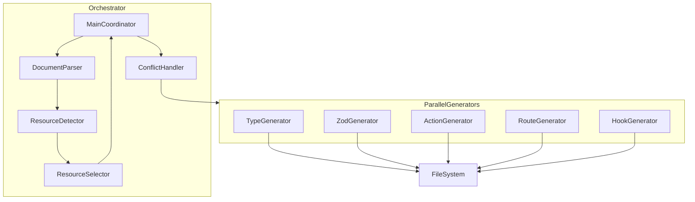
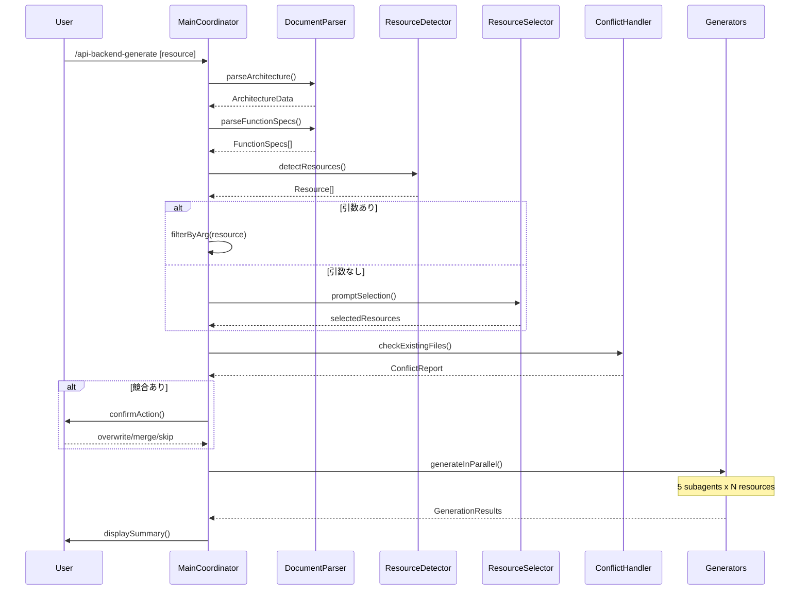
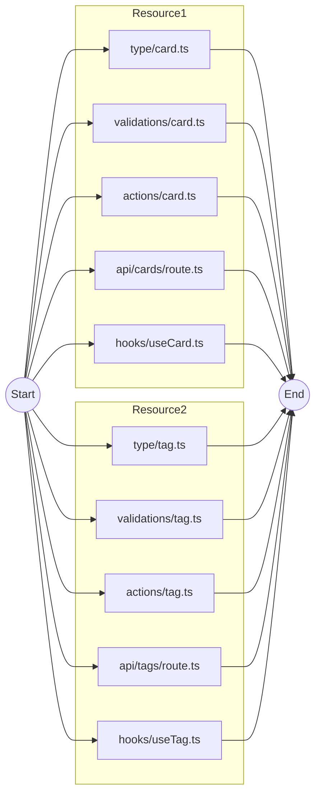
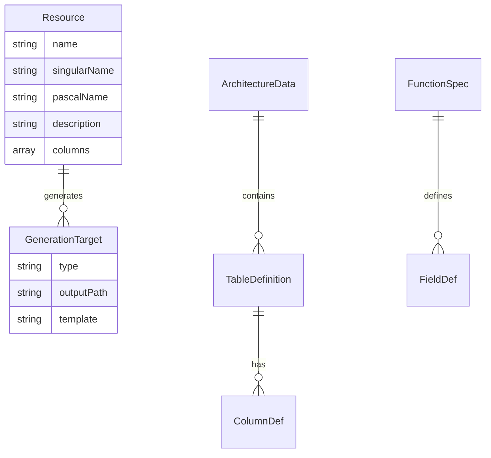

# Technical Design Document: api-backend-generate

## Overview

**Purpose**: 本スキルは、機能仕様書からAPIバックエンドコード（型定義・Zodスキーマ・Server Actions・API Routes・TanStack Queryフック）を一括生成し、開発者の定型作業を大幅に削減する。

**Users**: Next.js + Supabase構成のプロジェクトで開発する開発者が、新規リソース追加時やCRUD実装時に使用する。

**Impact**: 従来手動で5種類のファイルを個別作成していた作業を、並列subagent実行により数分で完了可能にする。

### Goals
- 機能仕様書から5種類のファイル（型定義、Zodスキーマ、Server Actions、API Routes、フック）を自動生成
- Task toolによる並列実行で生成時間を最小化
- 既存コードパターンに準拠した高品質なコード生成
- 既存ファイルとの競合を安全に処理

### Non-Goals
- Supabaseマイグレーション（DDL）の自動生成（別スキル scope）
- フロントエンドUIコンポーネントの生成
- テストコードの自動生成
- リファクタリング・既存コードの修正

## Architecture

### Existing Architecture Analysis

本スキルは既存のスキル定義（`.claude/skills/api-backend-generate/SKILL.md`）を構造化・拡張する。

**現状の制約**:
- スキル定義は詳細な手順書として存在するが、実行フローの形式化が必要
- 既存の型定義・Zodスキーマパターン（`apps/web/src/types/card.ts`, `validations/card.ts`）を厳守
- Server Actionsは`createClient()`と`revalidatePath()`パターンを維持

**維持すべきパターン**:
- Named exportのみ（default export禁止）
- パスエイリアス使用（`@/`）
- camelCase型名、日本語Zodエラーメッセージ

### Architecture Pattern & Boundary Map

**選択パターン**: 並列コーディネータパターン



**Architecture Integration**:
- **選択パターン**: 並列コーディネータ - 中央オーケストレータが独立したsubagentを管理
- **境界分離**: 解析フェーズ（直列）と生成フェーズ（並列）を明確に分離
- **既存パターン保持**: Next.js App Router, Server Actions, TanStack Queryの既存実装パターンを継承
- **新規コンポーネント理由**: 各ジェネレータは独立したsubagentとして実行可能な単位で設計
- **Steering準拠**: Named export、パスエイリアス、型安全性を維持

### Technology Stack

| Layer | Choice / Version | Role in Feature | Notes |
|-------|------------------|-----------------|-------|
| CLI / Orchestration | Claude Code Task tool | subagent並列実行 | model: haiku推奨 |
| Code Generation | TypeScript Templates | 生成コードのベース | 既存パターン準拠 |
| Validation | Zod | 入力スキーマ定義 | 日本語エラーメッセージ |
| Data Access | Supabase Client | Server Actions/API Routes | `@/lib/supabase/server` |
| State Management | TanStack Query v5 | フック生成 | queryKeys factory pattern |

## System Flows

### Main Execution Flow



**Key Decisions**:
- 解析フェーズは直列実行（依存関係あり）
- 生成フェーズは完全並列（各ファイル独立）
- 競合確認は生成前に一括実施

### Parallel Generation Flow



## Requirements Traceability

| Requirement | Summary | Components | Interfaces | Flows |
|-------------|---------|------------|------------|-------|
| 1.1-1.6 | ドキュメント解析 | DocumentParser | parseArchitecture, parseFunctionSpecs | Main Flow |
| 2.1-2.4 | リソース自動特定 | ResourceDetector | detectResources | Main Flow |
| 3.1-3.6 | 対話的リソース選択 | ResourceSelector | promptSelection | Main Flow |
| 4.1-4.6 | 型定義ファイル生成 | TypeGenerator | generateTypeFile | Parallel Flow |
| 5.1-5.5 | Zodスキーマ生成 | ZodGenerator | generateZodFile | Parallel Flow |
| 6.1-6.8 | Server Actions生成 | ActionGenerator | generateActionFile | Parallel Flow |
| 7.1-7.8 | API Routes生成 | RouteGenerator | generateRouteFiles | Parallel Flow |
| 8.1-8.8 | TanStack Queryフック生成 | HookGenerator | generateHookFile | Parallel Flow |
| 9.1-9.5 | 並列生成実行 | MainCoordinator | executeParallel | Parallel Flow |
| 10.1-10.5 | 既存ファイル競合処理 | ConflictHandler | checkConflicts, resolveConflict | Main Flow |
| 11.1-11.7 | コード規約準拠 | All Generators | - | - |
| 12.1-12.6 | 前提条件検証 | PrerequisiteChecker | validatePrerequisites | Main Flow |

## Components and Interfaces

| Component | Domain/Layer | Intent | Req Coverage | Key Dependencies | Contracts |
|-----------|--------------|--------|--------------|------------------|-----------|
| MainCoordinator | Orchestration | 全体フロー制御 | 9.1-9.5 | All components (P0) | Service |
| DocumentParser | Analysis | ドキュメント解析 | 1.1-1.6 | File System (P0) | Service |
| ResourceDetector | Analysis | リソース特定 | 2.1-2.4 | DocumentParser (P0) | Service |
| ResourceSelector | Interaction | リソース選択UI | 3.1-3.6 | AskUserQuestion (P0) | Service |
| ConflictHandler | Safety | 競合処理 | 10.1-10.5 | File System (P0) | Service |
| PrerequisiteChecker | Validation | 前提条件検証 | 12.1-12.6 | File System (P0) | Service |
| TypeGenerator | Generation | 型定義生成 | 4.1-4.6 | Write tool (P0) | Service |
| ZodGenerator | Generation | Zodスキーマ生成 | 5.1-5.5 | Write tool (P0) | Service |
| ActionGenerator | Generation | Server Actions生成 | 6.1-6.8 | Write tool (P0) | Service |
| RouteGenerator | Generation | API Routes生成 | 7.1-7.8 | Write tool (P0) | Service |
| HookGenerator | Generation | TanStack Queryフック生成 | 8.1-8.8 | Write tool (P0) | Service |

### Orchestration Layer

#### MainCoordinator

| Field | Detail |
|-------|--------|
| Intent | スキル全体のオーケストレーション |
| Requirements | 9.1, 9.2, 9.3, 9.4, 9.5 |

**Responsibilities & Constraints**
- 解析→選択→競合確認→生成の全体フロー制御
- Task toolによるsubagent並列実行の管理
- 生成結果の集約とサマリー表示

**Dependencies**
- Inbound: User invocation via skill command (P0)
- Outbound: All analysis/generation components (P0)
- External: Claude Code Task tool (P0)

**Contracts**: Service [x]

##### Service Interface
```typescript
interface MainCoordinator {
  execute(args: ExecuteArgs): Promise<ExecutionResult>;
}

type ExecuteArgs = {
  resource?: string;      // 指定リソース（省略時は対話選択）
  all?: boolean;          // 全リソース生成フラグ
  force?: boolean;        // 競合時強制上書きフラグ
  docsPath?: string;      // ドキュメントパス（デフォルト: docs/requirements/）
};

type ExecutionResult = {
  success: boolean;
  generatedFiles: string[];
  skippedFiles: string[];
  errors: GenerationError[];
};
```

**Implementation Notes**
- Task toolの`run_in_background`は使用しない（完了待機が必要）
- 単一メッセージ内で複数Task呼び出しにより並列実行を実現

### Analysis Layer

#### DocumentParser

| Field | Detail |
|-------|--------|
| Intent | アーキテクチャ・機能仕様の解析 |
| Requirements | 1.1, 1.2, 1.3, 1.4, 1.5, 1.6 |

**Responsibilities & Constraints**
- `docs/requirements/architecture.md`からER図・テーブル定義を抽出
- `docs/requirements/functions/`から機能仕様を抽出
- Mermaid ER図の正規表現パース

**Dependencies**
- Inbound: MainCoordinator (P0)
- Outbound: None
- External: File System via Read/Glob tools (P0)

**Contracts**: Service [x]

##### Service Interface
```typescript
interface DocumentParser {
  parseArchitecture(basePath: string): Promise<ArchitectureData>;
  parseFunctionSpecs(basePath: string): Promise<FunctionSpec[]>;
}

type ArchitectureData = {
  tables: TableDefinition[];
  relationships: Relationship[];
  authPattern: 'rls' | 'middleware' | 'both';
  directoryStructure: DirectoryConfig;
};

type TableDefinition = {
  name: string;           // e.g., "cards"
  columns: ColumnDef[];
  primaryKey: string;
  foreignKeys: ForeignKey[];
};

type FunctionSpec = {
  id: string;             // e.g., "F-CARD-001"
  category: string;       // e.g., "card"
  title: string;
  inputs: FieldDef[];
  outputs: FieldDef[];
  businessRules: string[];
};
```

#### ResourceDetector

| Field | Detail |
|-------|--------|
| Intent | APIリソースの自動特定 |
| Requirements | 2.1, 2.2, 2.3, 2.4 |

**Responsibilities & Constraints**
- ER図エンティティからリソース抽出
- 機能カテゴリからリソース補完
- リソース名のkebab-case正規化

**Dependencies**
- Inbound: MainCoordinator (P0)
- Outbound: DocumentParser (P0)

**Contracts**: Service [x]

##### Service Interface
```typescript
interface ResourceDetector {
  detectResources(
    architecture: ArchitectureData,
    specs: FunctionSpec[]
  ): Resource[];
}

type Resource = {
  name: string;           // kebab-case: "cards", "study-sessions"
  singularName: string;   // "card", "study-session"
  pascalName: string;     // "Card", "StudySession"
  description: string;
  relatedFunctions: string[];
  columns: ColumnDef[];
};
```

### Interaction Layer

#### ResourceSelector

| Field | Detail |
|-------|--------|
| Intent | 対話的リソース選択UI |
| Requirements | 3.1, 3.2, 3.3, 3.4, 3.5, 3.6 |

**Responsibilities & Constraints**
- 検出リソースの番号付き一覧表示
- ユーザー選択の受付（番号、all、引数指定）
- 無効リソース指定時のエラー表示

**Dependencies**
- Inbound: MainCoordinator (P0)
- External: AskUserQuestion tool (P0)

**Contracts**: Service [x]

##### Service Interface
```typescript
interface ResourceSelector {
  promptSelection(resources: Resource[]): Promise<Resource[]>;
  filterByName(resources: Resource[], name: string): Resource[];
}
```

### Safety Layer

#### ConflictHandler

| Field | Detail |
|-------|--------|
| Intent | 既存ファイル競合の検出と解決 |
| Requirements | 10.1, 10.2, 10.3, 10.4, 10.5 |

**Responsibilities & Constraints**
- 生成対象パスの既存ファイルチェック
- ユーザーへの処理方法確認（上書き/マージ/スキップ）
- マージは単純追記のみ（AST解析は行わない）

**Dependencies**
- Inbound: MainCoordinator (P0)
- External: File System, AskUserQuestion tool (P0)

**Contracts**: Service [x]

##### Service Interface
```typescript
interface ConflictHandler {
  checkConflicts(targetPaths: string[]): Promise<ConflictReport>;
  resolveConflict(
    path: string,
    action: 'overwrite' | 'merge' | 'skip'
  ): Promise<ResolutionResult>;
}

type ConflictReport = {
  conflicts: ConflictFile[];
  safeToGenerate: string[];
};

type ConflictFile = {
  path: string;
  existingContent: string;
  suggestedAction: 'overwrite' | 'merge' | 'skip';
};
```

#### PrerequisiteChecker

| Field | Detail |
|-------|--------|
| Intent | 生成前提条件の検証 |
| Requirements | 12.1, 12.2, 12.3, 12.4, 12.5, 12.6 |

**Responsibilities & Constraints**
- Supabaseクライアント（`src/lib/supabase/server.ts`）の存在確認
- 必要ディレクトリの存在確認・自動作成
- package.json依存関係の確認

**Dependencies**
- Inbound: MainCoordinator (P0)
- External: File System, Bash tool (P1)

**Contracts**: Service [x]

##### Service Interface
```typescript
interface PrerequisiteChecker {
  validatePrerequisites(): Promise<PrerequisiteResult>;
}

type PrerequisiteResult = {
  valid: boolean;
  missingFiles: string[];
  missingDirs: string[];
  missingDeps: string[];
  autoCreated: string[];
};
```

### Generation Layer

#### TypeGenerator

| Field | Detail |
|-------|--------|
| Intent | TypeScript型定義ファイル生成 |
| Requirements | 4.1, 4.2, 4.3, 4.4, 4.5, 4.6 |

**Responsibilities & Constraints**
- `src/types/[resource].ts`への型定義生成
- エンティティ型、レスポンス型、入力型のnamed export
- camelCase命名、default export禁止

**Dependencies**
- Inbound: MainCoordinator via Task tool (P0)
- External: Write tool (P0)

**Contracts**: Service [x]

##### Service Interface
```typescript
interface TypeGenerator {
  generateTypeFile(resource: Resource, context: GenerationContext): Promise<GenerationResult>;
}

type GenerationContext = {
  outputDir: string;      // e.g., "apps/web/src"
  architecture: ArchitectureData;
  functionSpecs: FunctionSpec[];
};

type GenerationResult = {
  success: boolean;
  filePath: string;
  error?: string;
};
```

**Implementation Notes**
- 型名: `Card`, `CardsResponse`, `CreateCardInput`, `UpdateCardInput`
- 日付フィールド: `string`型（ISO 8601形式）
- nullable: `string | null`

#### ZodGenerator

| Field | Detail |
|-------|--------|
| Intent | Zodバリデーションスキーマ生成 |
| Requirements | 5.1, 5.2, 5.3, 5.4, 5.5 |

**Responsibilities & Constraints**
- `src/validations/[resource].ts`へのスキーマ生成
- 作成・更新・クエリスキーマの定義
- 日本語エラーメッセージ

**Dependencies**
- Inbound: MainCoordinator via Task tool (P0)
- External: Write tool (P0)

**Contracts**: Service [x]

**Implementation Notes**
- 更新スキーマ: `createSchema.partial()`
- バリデーション: `.min()`, `.max()`, `.uuid()`, `.email()`
- エラーメッセージ: `'必須項目です'`, `'10000文字以内で入力してください'`

#### ActionGenerator

| Field | Detail |
|-------|--------|
| Intent | Server Actionsファイル生成 |
| Requirements | 6.1, 6.2, 6.3, 6.4, 6.5, 6.6, 6.7, 6.8 |

**Responsibilities & Constraints**
- `src/actions/[resource].ts`へのServer Actions生成
- `'use server'`ディレクティブ配置
- 認証チェック、Zodバリデーション、revalidatePath

**Dependencies**
- Inbound: MainCoordinator via Task tool (P0)
- External: Write tool (P0)

**Contracts**: Service [x]

**Implementation Notes**
- CRUD: `create[Resource]`, `update[Resource]`, `delete[Resource]`, `get[Resource]`, `get[Resource]s`
- 認証: `supabase.auth.getUser()` → エラー時throw
- キャッシュ無効化: `revalidatePath('/[resource]')`

#### RouteGenerator

| Field | Detail |
|-------|--------|
| Intent | REST API Routesファイル生成 |
| Requirements | 7.1, 7.2, 7.3, 7.4, 7.5, 7.6, 7.7, 7.8 |

**Responsibilities & Constraints**
- `src/app/api/[resource]/route.ts`（一覧・作成）生成
- `src/app/api/[resource]/[id]/route.ts`（詳細・更新・削除）生成
- Bearer Token認証、標準エラー形式

**Dependencies**
- Inbound: MainCoordinator via Task tool (P0)
- External: Write tool (P0)

**Contracts**: Service [x] / API [x]

##### API Contract
| Method | Endpoint | Request | Response | Errors |
|--------|----------|---------|----------|--------|
| GET | /api/[resource] | QueryParams | `{ data, pagination }` | 401, 500 |
| POST | /api/[resource] | CreateInput | Resource | 400, 401, 500 |
| GET | /api/[resource]/[id] | - | Resource | 401, 404, 500 |
| PATCH | /api/[resource]/[id] | UpdateInput | Resource | 400, 401, 404, 500 |
| DELETE | /api/[resource]/[id] | - | 204 No Content | 401, 404, 500 |

**Implementation Notes**
- 認証: `Authorization: Bearer {token}` → `supabase.auth.getUser()`
- エラー形式: `{ error: { code: string, message: string } }`
- 特殊エンドポイント: `/today`, `/search`（機能仕様に応じて追加生成）

#### HookGenerator

| Field | Detail |
|-------|--------|
| Intent | TanStack Queryフック生成 |
| Requirements | 8.1, 8.2, 8.3, 8.4, 8.5, 8.6, 8.7, 8.8 |

**Responsibilities & Constraints**
- `src/hooks/use[Resource].ts`へのフック生成
- queryKeys factory pattern
- Server ActionsをmutationFnとして使用

**Dependencies**
- Inbound: MainCoordinator via Task tool (P0)
- External: Write tool (P0)

**Contracts**: Service [x]

**Implementation Notes**
- クエリキー: `[resource]Keys = { all, lists, list, detail }`
- 一覧: `use[Resource]s()` → `useQuery`
- 詳細: `use[Resource](id)` → `useQuery`
- 作成/更新/削除: `useCreate/Update/Delete[Resource]()` → `useMutation` + `invalidateQueries`

## Data Models

### Domain Model



**Aggregates**:
- `Resource`: 生成対象リソースの集約ルート
- `ArchitectureData`: ドキュメント解析結果の集約

**Business Rules**:
- リソース名はkebab-caseで正規化
- 1リソースにつき5種類のファイルを生成
- 既存ファイルは明示的な確認なしに上書きしない

### Logical Data Model

**GenerationContext**: subagentに渡す生成コンテキスト

| Field | Type | Description |
|-------|------|-------------|
| resource | Resource | 対象リソース情報 |
| outputDir | string | 出力ベースディレクトリ |
| architecture | ArchitectureData | アーキテクチャ情報 |
| existingPatterns | CodePattern[] | 既存コードパターン参照 |
| conventions | CodeConventions | コード規約 |

## Error Handling

### Error Strategy

| Error Type | Handling | User Message |
|------------|----------|--------------|
| ドキュメント未検出 | 処理中断 | `--docs-path`オプション案内 |
| リソース未検出 | 警告表示・継続 | アーキテクチャのみから推定 |
| 前提条件不足 | 処理中断 | 不足要素とインストールコマンド提示 |
| ファイル競合 | ユーザー確認 | 上書き/マージ/スキップ選択 |
| 生成エラー | 部分成功許容 | 失敗ファイルとエラー詳細表示 |

### Error Categories and Responses

**User Errors (4xx equivalent)**:
- 無効なリソース名指定 → 有効なリソース一覧を提示
- 引数の誤り → 使用方法を表示

**System Errors (5xx equivalent)**:
- ファイル書き込み失敗 → リトライまたはスキップ
- subagent実行失敗 → 個別エラーとしてサマリーに記録

### Monitoring

- 生成完了後にサマリー表示（成功/失敗/スキップ件数）
- 各subagentの実行結果をTaskOutputで収集

## Testing Strategy

### Unit Tests
- DocumentParser: ER図パース正規表現のエッジケース
- ResourceDetector: リソース名正規化ロジック
- ConflictHandler: 競合検出ロジック

### Integration Tests
- 実際のドキュメント構造からのリソース抽出
- 生成コードの構文検証（TypeScript compile check）
- 既存パターンとの整合性検証

### E2E Tests
- cards/tags/reviewsリソースの完全生成フロー
- 競合発生時の各選択肢（上書き/マージ/スキップ）
- `--all`および`--force`オプションの動作

## Security Considerations

- Server Actions生成時は必ず認証チェックを含める
- API Routes生成時はBearer Token検証を必須化
- RLS対応: Supabaseクライアントはユーザーコンテキストで実行

## Supporting References

### Code Pattern Examples

詳細な生成コードパターンは`research.md`のExisting Code Pattern Analysisセクションを参照。

- 型定義パターン: `apps/web/src/types/card.ts`
- Zodスキーマパターン: `apps/web/src/validations/card.ts`
- Server Actionsパターン: `apps/web/src/actions/auth.ts`
