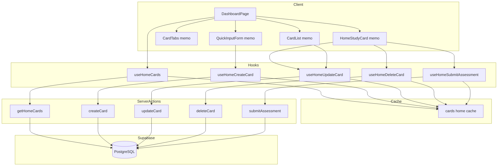
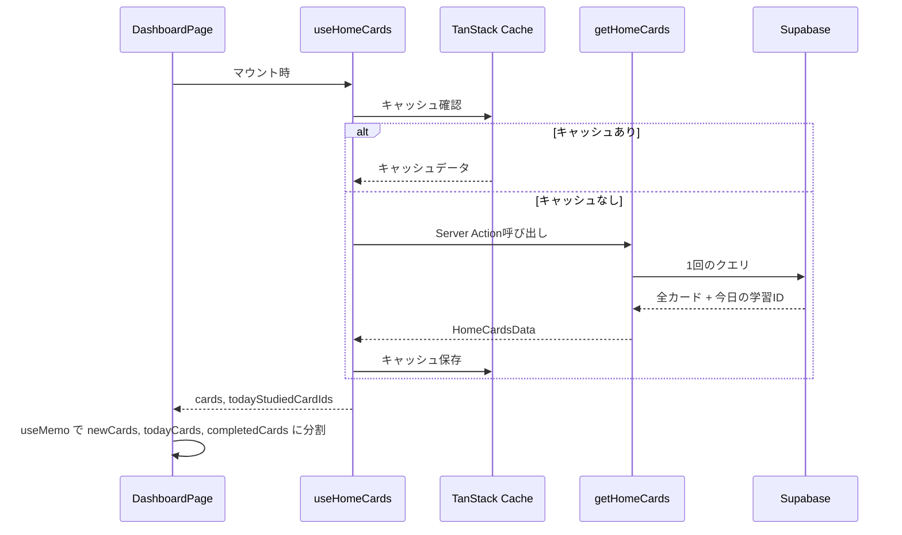
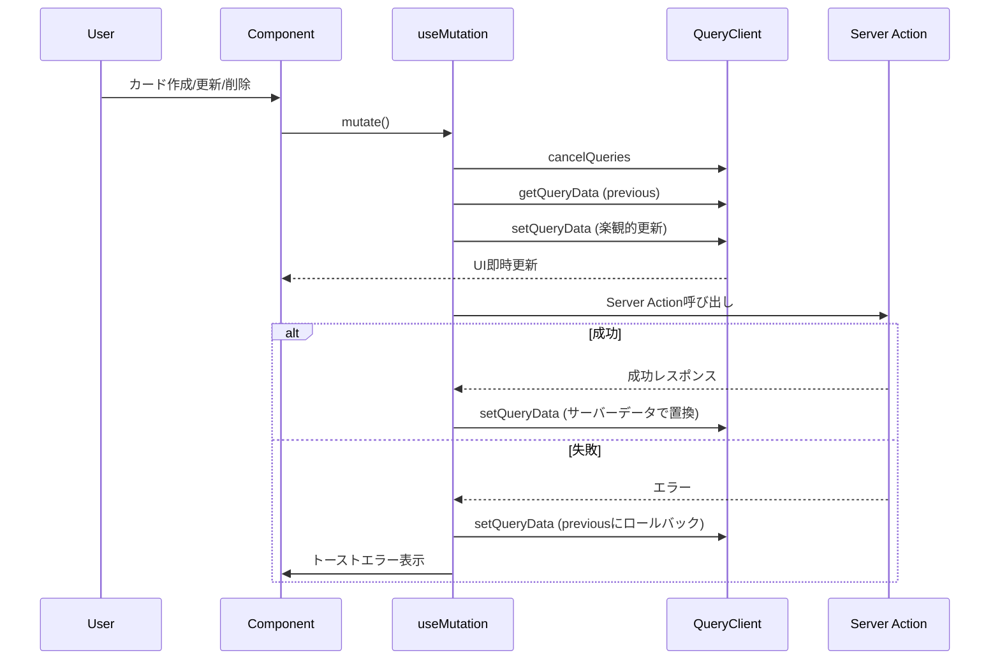

# Design Document: Home Cache Optimization

## Overview

**Purpose**: ホーム画面のパフォーマンスを改善し、メモリ消費を削減する。TanStack Queryのキャッシュ戦略を「単一ソース + 派生データ」パターンに移行し、コンポーネントのメモ化を適用する。

**Users**: ReSaveユーザーがホーム画面でカードの学習・作成・編集・削除を行う際のレスポンス向上。

**Impact**: 初期ロードのSupabaseリクエストを3回から1回に削減、ミューテーション後のリフェッチを排除、activeTab変更時の不要な再レンダリングを防止。

### Goals
- Supabaseへのリクエスト数を3回→1回に削減
- TanStack Queryキャッシュのメモリ使用量を約50%削減
- ミューテーション後のリフェッチを0回に（直接キャッシュ更新）
- コンポーネントの不要な再レンダリングを防止

### Non-Goals
- `/cards` ページのキャッシュ最適化（本仕様はホーム画面のみ）
- ページネーション/仮想スクロールの新規導入（既存実装を維持）
- Mobile (Expo) アプリへの適用（API Routes経由のため対象外）
- Server Actionsの `revalidatePath` 削除（既存動作への影響を考慮）

## Architecture

### Existing Architecture Analysis

現在のホーム画面は以下の課題を抱えている：

- **3つの独立クエリ**: `useNewCards`, `useTodayCards`, `useTodayCompletedCards` が別々にキャッシュ
- **過剰なinvalidation**: ミューテーション時に4〜5つのクエリを `invalidateQueries` で無効化
- **コンテキスト肥大化**: 楽観的更新で5つのスナップショットをメモリに保持
- **メモ化不足**: QuickInputForm, CardTabs がメモ化されていない

### Architecture Pattern & Boundary Map



**Architecture Integration**:
- **Selected pattern**: 単一ソース + 派生データ（TanStack Query標準パターン）
- **Domain boundaries**: ホーム専用フック群が独立したキャッシュキー `['cards', 'home']` を管理
- **Existing patterns preserved**: 既存の `useCards`, `useNewCards` 等は `/cards` ページ用に維持
- **New components rationale**: `useHomeCards.ts` を新規作成し、ホーム画面専用の最適化されたキャッシュ戦略を実装
- **Steering compliance**: TypeScript strict mode、named exports only、TanStack Query for data fetching

### Technology Stack

| Layer | Choice / Version | Role in Feature | Notes |
|-------|------------------|-----------------|-------|
| Frontend | React 19 + Next.js 16 | ホーム画面UI、Suspense境界 | App Router |
| Data Fetching | TanStack Query v5 | キャッシュ管理、楽観的更新 | 単一キャッシュパターン |
| State | useMemo / useCallback | 派生データ、メモ化 | React標準hooks |
| Backend | Server Actions | データ取得・更新 | `getHomeCards` 新規追加 |
| Database | Supabase PostgreSQL | カード・タグ・学習ログ | 既存スキーマ維持 |

## System Flows

### データ取得フロー



### ミューテーションフロー（楽観的更新）



## Requirements Traceability

| Requirement | Summary | Components | Interfaces | Flows |
|-------------|---------|------------|------------|-------|
| 1.1 | 統合Server Action作成 | getHomeCards | HomeCardsData | データ取得 |
| 1.2 | 統合フック作成 | useHomeCards | homeCardKeys | データ取得 |
| 1.3 | クライアント派生 | DashboardPage | useMemo | データ取得 |
| 2.1 | 単一キャッシュ直接更新 | useHome*Mutation | setQueryData | ミューテーション |
| 2.2 | ホーム専用ミューテーション | useHomeCards.ts | 4つのmutation hooks | ミューテーション |
| 2.3 | コンテキスト簡素化 | useHome*Mutation | HomeCardMutationContext | ミューテーション |
| 3.1 | gcTime短縮 | providers.tsx | QueryClientOptions | - |
| 3.2 | staleTime調整 | useHomeCards | UseQueryOptions | - |
| 4.1 | QuickInputFormメモ化 | QuickInputForm | memo, useCallback | - |
| 4.2 | CardTabsメモ化 | CardTabs | memo | - |
| 4.3 | VirtualizedCardList最適化 | CardList | memo | - |
| 4.4 | DashboardPageコールバック | DashboardPage | useCallback | - |
| 5.1 | Suspense境界 | DashboardPage | Suspense | - |
| 7.1-7.3 | ページコンポーネント更新 | page.tsx, HomeStudyCard, CardList | - | 両フロー |

## Components and Interfaces

### Summary Table

| Component | Domain/Layer | Intent | Req Coverage | Key Dependencies | Contracts |
|-----------|--------------|--------|--------------|------------------|-----------|
| getHomeCards | Server Action | ホーム用全カード取得 | 1.1 | Supabase (P0) | Service |
| useHomeCards | Hook | データ取得・キャッシュ | 1.2, 1.3, 3.2 | TanStack Query (P0) | Service, State |
| useHomeCreateCard | Hook | カード作成 | 2.1, 2.2, 2.3 | TanStack Query (P0) | Service |
| useHomeUpdateCard | Hook | カード更新 | 2.1, 2.2, 2.3 | TanStack Query (P0) | Service |
| useHomeDeleteCard | Hook | カード削除 | 2.1, 2.2, 2.3 | TanStack Query (P0) | Service |
| useHomeSubmitAssessment | Hook | 評価送信 | 2.1, 2.2, 2.3 | TanStack Query (P0) | Service |
| QuickInputForm | UI Component | カード入力フォーム | 4.1 | useHomeCreateCard (P0) | - |
| CardTabs | UI Component | タブ切替 | 4.2 | - | - |
| DashboardPage | Page | ホーム画面 | 1.3, 4.4, 5.1, 7.1 | useHomeCards (P0) | - |

---

### Server Actions

#### getHomeCards

| Field | Detail |
|-------|--------|
| Intent | ホーム画面に必要な全カードと今日の学習済みカードIDを1回のクエリで取得 |
| Requirements | 1.1 |

**Responsibilities & Constraints**
- 認証済みユーザーのカードのみ取得
- status が 'new', 'active', 'completed' のカードを全て取得
- タグ情報をJOINで含める
- 今日の study_logs から学習済みカードIDを取得

**Dependencies**
- External: Supabase Client — DB接続 (P0)

**Contracts**: Service [x]

##### Service Interface
```typescript
export async function getHomeCards(): Promise<HomeCardsData>;

type HomeCardsData = {
  cards: CardWithTags[];
  todayStudiedCardIds: string[];
};
```
- Preconditions: ユーザーが認証済み
- Postconditions: ユーザー所有の全カードとタグ情報、今日の学習済みIDを返却
- Invariants: 他ユーザーのカードは含まれない

---

### Hooks

#### useHomeCards

| Field | Detail |
|-------|--------|
| Intent | ホーム画面用の統合データ取得フック |
| Requirements | 1.2, 1.3, 3.2 |

**Responsibilities & Constraints**
- 単一キャッシュキー `['cards', 'home']` でデータ管理
- staleTime: 30秒、gcTime: グローバル設定に従う

**Dependencies**
- External: TanStack Query — キャッシュ管理 (P0)
- Outbound: getHomeCards — データ取得 (P0)

**Contracts**: Service [x] / State [x]

##### Service Interface
```typescript
export const homeCardKeys = {
  all: ['cards', 'home'] as const,
};

export function useHomeCards(): UseQueryResult<HomeCardsData>;
```

##### State Management
- State model: `HomeCardsData` を TanStack Query キャッシュに保持
- Persistence: メモリキャッシュ（gcTime: 2分）
- Concurrency: TanStack Query の内部管理に委譲

---

#### useHomeCreateCard

| Field | Detail |
|-------|--------|
| Intent | ホーム画面用カード作成（楽観的更新付き） |
| Requirements | 2.1, 2.2, 2.3 |

**Responsibilities & Constraints**
- 楽観的更新: 即座にUIに反映
- エラー時: 前の状態にロールバック
- 成功時: サーバーレスポンスでキャッシュを更新

**Dependencies**
- External: TanStack Query — ミューテーション管理 (P0)
- Outbound: createCard — Server Action (P0)

**Contracts**: Service [x]

##### Service Interface
```typescript
type HomeCardMutationContext = {
  previousData: HomeCardsData | undefined;
};

export function useHomeCreateCard(): UseMutationResult<
  Card,
  Error,
  CreateCardInput,
  HomeCardMutationContext
>;
```
- Preconditions: `input.front` が空でない
- Postconditions: 新規カードがキャッシュに追加
- Error handling: ロールバック + トースト通知

---

#### useHomeUpdateCard

| Field | Detail |
|-------|--------|
| Intent | ホーム画面用カード更新（楽観的更新付き） |
| Requirements | 2.1, 2.2, 2.3 |

**Dependencies**
- External: TanStack Query (P0)
- Outbound: updateCard (P0)

**Contracts**: Service [x]

##### Service Interface
```typescript
export function useHomeUpdateCard(): UseMutationResult<
  Card,
  Error,
  { id: string; input: UpdateCardInput },
  HomeCardMutationContext
>;
```

---

#### useHomeDeleteCard

| Field | Detail |
|-------|--------|
| Intent | ホーム画面用カード削除（楽観的更新付き） |
| Requirements | 2.1, 2.2, 2.3 |

**Dependencies**
- External: TanStack Query (P0)
- Outbound: deleteCard (P0)

**Contracts**: Service [x]

##### Service Interface
```typescript
export function useHomeDeleteCard(): UseMutationResult<
  void,
  Error,
  string,
  HomeCardMutationContext
>;
```

---

#### useHomeSubmitAssessment

| Field | Detail |
|-------|--------|
| Intent | ホーム画面用評価送信（楽観的更新付き） |
| Requirements | 2.1, 2.2, 2.3 |

**Dependencies**
- External: TanStack Query (P0)
- Outbound: submitAssessment (P0)

**Contracts**: Service [x]

##### Service Interface
```typescript
export function useHomeSubmitAssessment(): UseMutationResult<
  SubmitAssessmentResult,
  Error,
  SubmitAssessmentInput,
  HomeCardMutationContext
>;
```

---

### UI Components

#### QuickInputForm（メモ化対応）

| Field | Detail |
|-------|--------|
| Intent | カードのクイック入力フォーム（メモ化済み） |
| Requirements | 4.1 |

**Implementation Notes**
- `React.memo()` でラップ
- 内部の `handleSubmit`, `handleDialogSubmit` を `useCallback` でメモ化
- `useHomeCreateCard` を使用（`useCreateCard` から置換）

---

#### CardTabs（メモ化対応）

| Field | Detail |
|-------|--------|
| Intent | 未学習/復習中/完了のタブ切替（メモ化済み） |
| Requirements | 4.2 |

**Implementation Notes**
- `React.memo()` でラップ
- props: `value`, `onChange`, `counts`
- 親の DashboardPage で `onChange` を `useCallback` でメモ化

---

#### DashboardPage

| Field | Detail |
|-------|--------|
| Intent | ホーム画面のメインページコンポーネント |
| Requirements | 1.3, 4.4, 5.1, 7.1 |

**Implementation Notes**
- `useHomeCards()` でデータ取得
- `useMemo` で `newCards`, `todayCards`, `completedCards`, `counts` を派生
- `useCallback` で `handleEdit`, `handleEditDialogClose`, `handleCardCreated`, `handleTabChange` をメモ化
- `Suspense` 境界でカードリスト部分をラップ

## Data Models

### Domain Model

既存のカードエンティティを拡張せず、新しい型 `HomeCardsData` を追加する。

```typescript
// types/card.ts に追加
export type HomeCardsData = {
  cards: CardWithTags[];
  todayStudiedCardIds: string[];
};
```

**Business Rules**:
- `newCards`: `status === 'new'` のカード
- `todayCards`: `status === 'active'` かつ `nextReviewAt <= today` のカード
- `completedCards`: `status === 'completed'` または `todayStudiedCardIds` に含まれるカード

### Data Contracts & Integration

**API Data Transfer**:
- `getHomeCards()` は `HomeCardsData` を返却
- 既存の `CardWithTags` 型を再利用
- Zodバリデーションは既存の `createCardSchema`, `updateCardSchema` を継続使用

## Error Handling

### Error Strategy

楽観的更新パターンに基づくエラーハンドリング:

1. **onMutate**: 前の状態を `context` に保存、楽観的にUIを更新
2. **onError**: `context` から前の状態を復元、トースト通知
3. **onSuccess**: サーバーレスポンスでキャッシュを最終更新

### Error Categories and Responses

| Category | Example | Response |
|----------|---------|----------|
| 認証エラー | Unauthorized | トースト + リダイレクト（既存動作） |
| バリデーションエラー | 空のfront | フォームでブロック（既存動作） |
| ネットワークエラー | タイムアウト | ロールバック + トースト |
| サーバーエラー | DB障害 | ロールバック + トースト |

## Testing Strategy

### Unit Tests
- `useHomeCards`: データ取得、キャッシュキー、staleTime設定
- `useHomeCreateCard`: 楽観的更新、ロールバック
- `useHomeUpdateCard`: 楽観的更新、ロールバック
- `useHomeDeleteCard`: 楽観的更新、ロールバック
- `useHomeSubmitAssessment`: キャッシュ更新

### Integration Tests
- DashboardPage: 3タブ間のデータ派生
- ミューテーション後のキャッシュ一貫性
- 複数ミューテーションの競合処理

### E2E Tests
- カード作成 → 未学習タブに表示
- 評価送信 → 完了タブに移動
- カード削除 → 一覧から消える
- タブ切替時の再レンダリングなし（React DevToolsで確認）

## Performance & Scalability

### Target Metrics

| Metric | Before | After |
|--------|--------|-------|
| 初期ロードのSupabaseリクエスト | 3回 | 1回 |
| ミューテーション後のリフェッチ | 4回 | 0回 |
| activeTab変更時の再レンダリング | QuickInputForm + CardTabs | なし |
| キャッシュメモリ使用量 | 3つのキャッシュ | 1つ |

### Measurement Strategy
- React DevTools Profiler でレンダリング回数を計測
- Network タブで Supabase リクエスト数を確認
- Chrome DevTools Memory パネルでヒープサイズを監視
