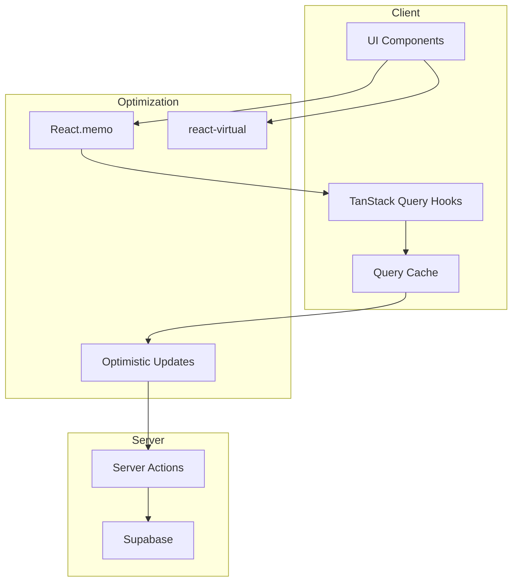
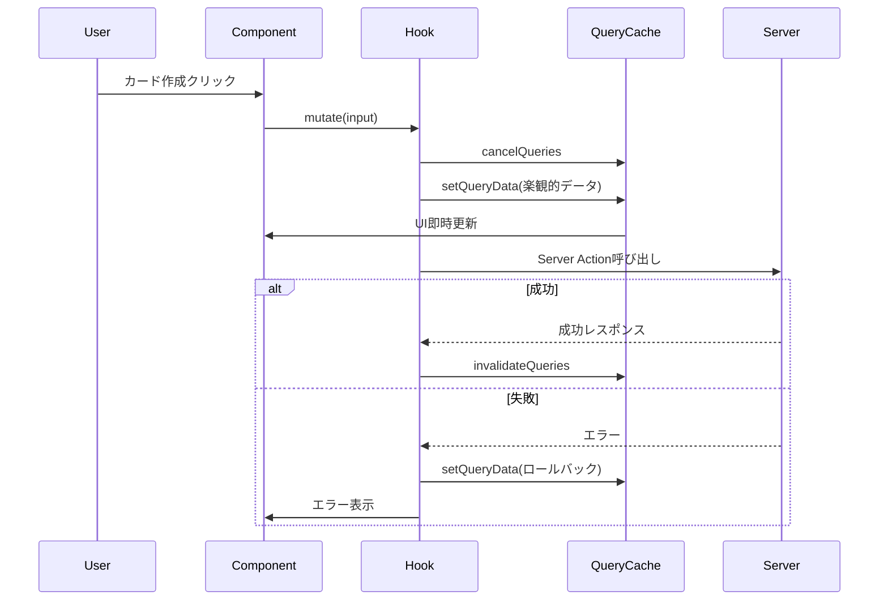

# Technical Design: Performance Optimization

## Overview

**Purpose**: ReSaveアプリ全体のパフォーマンスを向上させ、タップ時のレスポンス改善、再レンダリング最適化、大量データ対応を実現する。

**Users**: Web（Next.js）とMobile（Expo）の両プラットフォームのユーザーが、よりスムーズな学習体験を得られる。

**Impact**: 既存のhooks、コンポーネント、設定ファイルを最適化し、体感速度を大幅に向上させる。

### Goals
- タップ操作時の即時UI反映（楽観的更新）
- 不要な再レンダリングの削減（React.memo/useCallback）
- 大量カード表示時のスムーズなスクロール（仮想化）
- バンドルサイズの削減（Next.js設定最適化）

### Non-Goals
- データベースクエリの最適化（別スコープ）
- Server Actionsの内部実装変更
- 新機能の追加

## Architecture

### Existing Architecture Analysis

現在のデータフロー:
```
Component → hooks/use*.ts → actions/*.ts (Server Actions) → Supabase
```

**現状の課題**:
- hooksで動的import使用 → 毎回import評価
- React.memo未使用 → 親再レンダリング時に子も再描画
- QueryClient設定最小限 → 不要なリフェッチ発生
- next.config.ts空 → バンドル最適化未実施

### Architecture Pattern & Boundary Map



**Architecture Integration**:
- **Selected pattern**: 既存パターン維持 + 最適化レイヤー追加
- **Domain boundaries**: hooks層に楽観的更新、components層にメモ化・仮想化
- **Existing patterns preserved**: Server Actions、TanStack Query、Component構成
- **New components rationale**: VirtualizedCardListのみ新規（既存CardListを拡張）

### Technology Stack

| Layer | Choice / Version | Role in Feature | Notes |
|-------|------------------|-----------------|-------|
| Frontend | React 19 + Next.js 16 | コンポーネント最適化 | React.memo, useCallback |
| Data Fetching | TanStack Query v5 | 楽観的更新、キャッシュ最適化 | onMutate, gcTime |
| Virtualization (Web) | @tanstack/react-virtual v3 | Web仮想化 | 新規依存 |
| Virtualization (Mobile) | React Native FlatList | Mobile仮想化 | 既存機能活用 |
| Build | Next.js Config | バンドル最適化 | optimizePackageImports |

## System Flows

### 楽観的更新フロー



**Key Decisions**: 楽観的更新はCRUD操作全てに適用し、UXの一貫性を維持する。

## Requirements Traceability

| Requirement | Summary | Components | Interfaces | Flows |
|-------------|---------|------------|------------|-------|
| 1.1 | カード作成即時反映 | useCards | CreateCardOptimistic | 楽観的更新フロー |
| 1.2 | カード更新即時反映 | useCards | UpdateCardOptimistic | 楽観的更新フロー |
| 1.3 | カード削除即時反映 | useCards | DeleteCardOptimistic | 楽観的更新フロー |
| 1.4 | 評価即時反映 | useStudy | SubmitAssessmentOptimistic | 楽観的更新フロー |
| 1.5 | エラー時ロールバック | useCards, useTags, useStudy | onError callback | - |
| 1.6 | クエリキャンセル | useCards, useTags, useStudy | cancelQueries | - |
| 2.1 | staleTime設定 | Providers | QueryClientConfig | - |
| 2.2 | gcTime設定 | Providers | QueryClientConfig | - |
| 2.3 | refetchOnWindowFocus無効 | Providers | QueryClientConfig | - |
| 2.4 | retry制限 | Providers | QueryClientConfig | - |
| 2.5 | タグstaleTime5分 | useTags | TagQueryConfig | - |
| 3.1 | StudyCardメモ化 | StudyCard | React.memo | - |
| 3.2 | HomeStudyCardメモ化 | HomeStudyCard | React.memo | - |
| 3.3 | TagBadgeメモ化 | TagBadge | React.memo | - |
| 3.4 | CardListメモ化 | CardList | React.memo | - |
| 3.5 | useCallbackメモ化 | HomeStudyCard | useCallback | - |
| 3.6 | useMemoメモ化 | 各Component | useMemo | - |
| 4.1 | Web仮想化実装 | CardList | useVirtualizer | - |
| 4.2 | DOM除外 | CardList | VirtualizerConfig | - |
| 4.3 | estimateSize設定 | CardList | VirtualizerConfig | - |
| 4.4 | overscan設定 | CardList | VirtualizerConfig | - |
| 5.1 | FlatList使用 | MobileCardList | FlatListConfig | - |
| 5.2 | initialNumToRender | MobileCardList | FlatListConfig | - |
| 5.3 | maxToRenderPerBatch | MobileCardList | FlatListConfig | - |
| 5.4 | windowSize | MobileCardList | FlatListConfig | - |
| 5.5 | keyExtractor | MobileCardList | FlatListConfig | - |
| 6.1 | optimizePackageImports | next.config.ts | NextConfig | - |
| 6.2 | images.formats | next.config.ts | NextConfig | - |
| 6.3 | compress有効化 | next.config.ts | NextConfig | - |
| 6.4 | バンドル10%削減 | next.config.ts | - | - |
| 7.1 | useCardsトップレベルimport | useCards | - | - |
| 7.2 | useTagsトップレベルimport | useTags | - | - |
| 7.3 | useStudyトップレベルimport | useStudy | - | - |
| 7.4 | queryFn直接参照 | useCards, useTags, useStudy | - | - |
| 8.1 | DevTools Profiler対応 | - | - | - |
| 8.2 | Query DevTools対応 | Providers | ReactQueryDevtools | - |
| 8.3 | UI更新200ms以内 | - | - | - |
| 8.4 | 60FPS維持 | CardList | - | - |

## Components and Interfaces

| Component | Domain/Layer | Intent | Req Coverage | Key Dependencies | Contracts |
|-----------|--------------|--------|--------------|------------------|-----------|
| useCards | hooks | カードCRUD + 楽観的更新 | 1.1-1.3, 1.5-1.6, 7.1, 7.4 | TanStack Query (P0) | Service |
| useTags | hooks | タグCRUD + 楽観的更新 | 1.5-1.6, 2.5, 7.2, 7.4 | TanStack Query (P0) | Service |
| useStudy | hooks | 評価送信 + 楽観的更新 | 1.4-1.6, 7.3, 7.4 | TanStack Query (P0) | Service |
| Providers | components | QueryClient設定 | 2.1-2.4, 8.2 | TanStack Query (P0) | State |
| StudyCard | components/ui | メモ化されたカード表示 | 3.1 | React (P0) | - |
| HomeStudyCard | components/home | メモ化された学習カード | 3.2, 3.5 | useStudy (P0) | - |
| TagBadge | components/ui | メモ化されたタグバッジ | 3.3 | React (P0) | - |
| CardList | components/home | メモ化 + 仮想化リスト | 3.4, 3.6, 4.1-4.4, 8.4 | react-virtual (P0) | Service |
| MobileCardList | mobile/components | FlatList仮想化 | 5.1-5.5 | React Native (P0) | Service |
| next.config.ts | config | ビルド最適化設定 | 6.1-6.4 | Next.js (P0) | - |

### Hooks Layer

#### useCards Hook（拡張）

| Field | Detail |
|-------|--------|
| Intent | カードCRUD操作に楽観的更新を追加 |
| Requirements | 1.1, 1.2, 1.3, 1.5, 1.6, 7.1, 7.4 |

**Responsibilities & Constraints**
- カード作成・更新・削除時のキャッシュ先行更新
- エラー時のロールバック処理
- Server Actionsのトップレベルimport

**Dependencies**
- Outbound: Server Actions (cards) — データ永続化 (P0)
- External: @tanstack/react-query — キャッシュ管理 (P0)

**Contracts**: Service [x]

##### Service Interface
```typescript
import { createCard, updateCard, deleteCard, getCards, getCard, getTodayCards } from '@/actions/cards';

interface OptimisticMutationContext<TPrevious> {
  previousData: TPrevious;
}

interface UseCreateCardConfig {
  onMutate: (input: CreateCardInput) => Promise<{
    previousCards: CardListResponse | undefined;
    previousToday: CardWithTags[] | undefined;
  }>;
  onError: (
    error: Error,
    input: CreateCardInput,
    context: OptimisticMutationContext<{
      previousCards: CardListResponse | undefined;
      previousToday: CardWithTags[] | undefined;
    }> | undefined
  ) => void;
  onSettled: () => Promise<void>;
}

interface UseUpdateCardConfig {
  onMutate: (variables: { id: string; input: UpdateCardInput }) => Promise<{
    previousCards: CardListResponse | undefined;
    previousCard: CardWithTags | undefined;
    previousToday: CardWithTags[] | undefined;
  }>;
  onError: (
    error: Error,
    variables: { id: string; input: UpdateCardInput },
    context: OptimisticMutationContext<{
      previousCards: CardListResponse | undefined;
      previousCard: CardWithTags | undefined;
      previousToday: CardWithTags[] | undefined;
    }> | undefined
  ) => void;
  onSettled: () => Promise<void>;
}

interface UseDeleteCardConfig {
  onMutate: (id: string) => Promise<{
    previousCards: CardListResponse | undefined;
    previousToday: CardWithTags[] | undefined;
  }>;
  onError: (
    error: Error,
    id: string,
    context: OptimisticMutationContext<{
      previousCards: CardListResponse | undefined;
      previousToday: CardWithTags[] | undefined;
    }> | undefined
  ) => void;
  onSettled: () => Promise<void>;
}
```
- Preconditions: QueryClientがProviderで提供されている
- Postconditions: キャッシュが更新される、失敗時はロールバック
- Invariants: データの整合性を維持

**Implementation Notes**
- Integration: 既存hooksのmutation設定を拡張
- Validation: 入力はServer Actions側でZod検証
- Risks: 楽観的データと実データの不整合 → onSettledで必ずinvalidate

#### useTags Hook（拡張）

| Field | Detail |
|-------|--------|
| Intent | タグCRUD操作に楽観的更新を追加 |
| Requirements | 1.5, 1.6, 2.5, 7.2, 7.4 |

**Responsibilities & Constraints**
- useCardsと同様の楽観的更新パターン適用
- タグ一覧のstaleTimeを5分に設定

**Dependencies**
- Outbound: Server Actions (tags) — データ永続化 (P0)
- External: @tanstack/react-query — キャッシュ管理 (P0)

**Contracts**: Service [x]

##### Service Interface
```typescript
import { createTag, updateTag, deleteTag, getTags, getTag } from '@/actions/tags';

interface UseTagsQueryConfig {
  staleTime: number; // 5 * 60 * 1000 (5分)
}

interface UseCreateTagConfig {
  onMutate: (input: CreateTagInput) => Promise<{
    previousTags: TagWithCardCount[] | undefined;
  }>;
  onError: (
    error: Error,
    input: CreateTagInput,
    context: { previousTags: TagWithCardCount[] | undefined } | undefined
  ) => void;
  onSettled: () => Promise<void>;
}
```

#### useStudy Hook（拡張）

| Field | Detail |
|-------|--------|
| Intent | 評価送信に楽観的更新を追加 |
| Requirements | 1.4, 1.5, 1.6, 7.3, 7.4 |

**Responsibilities & Constraints**
- 評価送信時にtodayCardsから対象カードを即座に除外
- エラー時はカードを復元

**Dependencies**
- Outbound: Server Actions (study) — 評価永続化 (P0)
- Outbound: cardKeys — カードキャッシュ無効化 (P1)

**Contracts**: Service [x]

##### Service Interface
```typescript
import { submitAssessment, getStudySession } from '@/actions/study';

interface UseSubmitAssessmentConfig {
  onMutate: (input: SubmitAssessmentInput) => Promise<{
    previousToday: CardWithTags[] | undefined;
  }>;
  onError: (
    error: Error,
    input: SubmitAssessmentInput,
    context: { previousToday: CardWithTags[] | undefined } | undefined
  ) => void;
  onSettled: () => Promise<void>;
}
```

### Components Layer

#### Providers（拡張）

| Field | Detail |
|-------|--------|
| Intent | QueryClient設定の最適化 |
| Requirements | 2.1, 2.2, 2.3, 2.4, 8.2 |

**Contracts**: State [x]

##### State Management
```typescript
interface OptimizedQueryClientConfig {
  defaultOptions: {
    queries: {
      staleTime: 60 * 1000;           // 60秒
      gcTime: 5 * 60 * 1000;          // 5分
      refetchOnWindowFocus: false;
      retry: 1;
    };
  };
}
```

#### StudyCard（メモ化）

| Field | Detail |
|-------|--------|
| Intent | propsが変更されない限り再レンダリングをスキップ |
| Requirements | 3.1 |

**Implementation Notes**
- `React.memo`でラップ
- 内部stateは維持（isOpen）

#### HomeStudyCard（メモ化）

| Field | Detail |
|-------|--------|
| Intent | 学習カードの再レンダリング最適化 |
| Requirements | 3.2, 3.5 |

**Implementation Notes**
- `React.memo`でラップ
- `handleRate`を`useCallback`でメモ化

#### TagBadge（メモ化）

| Field | Detail |
|-------|--------|
| Intent | リスト内タグの再レンダリング最適化 |
| Requirements | 3.3 |

**Implementation Notes**
- `React.memo`でラップ
- シンプルな表示コンポーネントのため効果大

#### CardList（メモ化 + 仮想化）

| Field | Detail |
|-------|--------|
| Intent | 大量カード表示の仮想化とメモ化 |
| Requirements | 3.4, 3.6, 4.1, 4.2, 4.3, 4.4, 8.4 |

**Contracts**: Service [x]

##### Service Interface
```typescript
interface VirtualizedCardListProps {
  cards: CardWithTags[];
  isLoading?: boolean;
  emptyMessage?: string;
  className?: string;
}

interface VirtualizerConfig {
  count: number;
  getScrollElement: () => HTMLElement | null;
  estimateSize: () => number;  // 120px
  overscan: number;            // 5
}

// 仮想化しきい値
const VIRTUALIZATION_THRESHOLD = 50;
```

**Implementation Notes**
- 50件以上で仮想化有効
- `estimateSize`: 120px（カード高さ推定）
- `overscan`: 5（先読み行数）

### Mobile Layer

#### MobileCardList（新規）

| Field | Detail |
|-------|--------|
| Intent | MobileでのFlatList仮想化実装 |
| Requirements | 5.1, 5.2, 5.3, 5.4, 5.5 |

**Contracts**: Service [x]

##### Service Interface
```typescript
interface MobileCardListProps {
  cards: CardWithTags[];
  isLoading?: boolean;
  emptyMessage?: string;
  onCardPress?: (card: CardWithTags) => void;
}

interface FlatListOptimizedConfig {
  initialNumToRender: 10;
  maxToRenderPerBatch: 5;
  windowSize: 5;
  keyExtractor: (item: CardWithTags) => string;
  removeClippedSubviews: true;
}
```

**Implementation Notes**
- FlatListの標準仮想化機能を活用
- `removeClippedSubviews: true`でメモリ最適化
- keyExtractorは`card.id`を使用

### Configuration Layer

#### next.config.ts

| Field | Detail |
|-------|--------|
| Intent | バンドルサイズ最適化とビルド設定 |
| Requirements | 6.1, 6.2, 6.3, 6.4 |

**Contracts**: State [x]

##### State Management
```typescript
import type { NextConfig } from 'next';

const nextConfig: NextConfig = {
  experimental: {
    optimizePackageImports: ['lucide-react', '@tanstack/react-query'],
  },
  images: {
    formats: ['image/avif', 'image/webp'],
  },
  compress: true,
};

export default nextConfig;
```

## Error Handling

### Error Strategy
楽観的更新におけるエラー処理は、ユーザー体験を損なわないよう設計する。

### Error Categories and Responses

**User Errors (4xx)**:
- 楽観的更新中のバリデーションエラー → キャッシュロールバック + フィールドエラー表示

**System Errors (5xx)**:
- Server Action失敗 → キャッシュロールバック + toast通知
- ネットワークエラー → キャッシュロールバック + 再試行オプション表示

**Business Logic Errors (422)**:
- 重複データ等 → キャッシュロールバック + 具体的エラーメッセージ

### Rollback Pattern
```typescript
onError: (error, variables, context) => {
  // 1. キャッシュを元に戻す
  if (context?.previousData) {
    queryClient.setQueryData(queryKey, context.previousData);
  }
  // 2. ユーザーに通知
  toast.error(error.message || '操作に失敗しました');
};

onSettled: async () => {
  // 3. 最新データで再同期（成功・失敗問わず）
  await queryClient.invalidateQueries({ queryKey });
};
```

## Testing Strategy

### Unit Tests
- useCards楽観的更新: onMutate/onError/onSettledの動作確認
- useTags楽観的更新: 同上
- useStudy楽観的更新: todayCardsからのカード除外確認
- QueryClient設定: 各オプションが正しく設定されているか

### Integration Tests
- 楽観的更新 → Server Actionエラー → ロールバック確認
- 仮想化リスト + 楽観的更新の連携
- React.memoによる再レンダリング削減の確認

### E2E Tests
- カード作成 → 即時UI反映 → サーバー同期確認
- 100件カード表示 → スクロール性能確認
- エラー発生時のロールバックUI確認

### Performance Tests
- 100件カード表示時のFPS測定（目標: 60FPS）
- 楽観的更新時のUI更新時間（目標: <200ms）
- バンドルサイズ比較（目標: 10%削減）

## Performance & Scalability

### Target Metrics
| Metric | Current | Target | Measurement |
|--------|---------|--------|-------------|
| タップ→UI更新 | ~500ms | <50ms | 楽観的更新 |
| 100件リストFPS | 30-40 | 60 | 仮想化 |
| 再レンダリング回数 | N | N/2 | React.memo |
| バンドルサイズ | 100% | 90% | optimizePackageImports |

### Measurement Strategy
- React DevTools Profilerで再レンダリング計測
- TanStack Query DevToolsでキャッシュ状態監視
- Lighthouse/WebVitalsでCore Web Vitals計測
