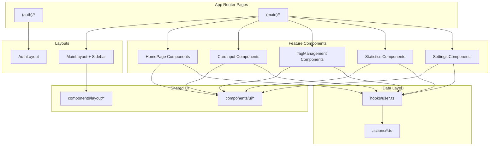
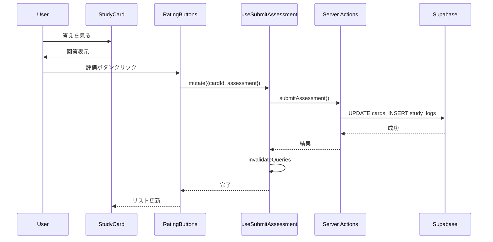

# Technical Design: UI Mock Integration

## Overview

**Purpose**: ReSaveアプリケーションのHTMLモック（docs/screens/mock/v1/）をReactコンポーネントとして実装し、既存のServer Actions・TanStack Queryフックと連携させる。

**Users**: ReSaveを利用する学習者がWeb UIを通じてカードの作成・学習・管理を行う。

**Impact**: 既存のバックエンド実装（hooks、actions、types）に対してフロントエンドUI層を追加する。

### Goals
- HTMLモックに忠実なUIをReact + Tailwind CSS + shadcn/uiで実装
- 既存のTanStack Queryフック（useCards, useTags, useStudy等）との統合
- モバイルファーストのレスポンシブデザイン
- 認証画面・メインアプリケーション全画面のカバー

### Non-Goals
- バックエンドAPI・Server Actionsの変更
- 新規データモデル・スキーマの追加
- PWA機能（v1.2以降）
- 通知機能（v1.2以降）
- データエクスポート/インポート（v1.3以降）

## Architecture

### Existing Architecture Analysis

**現行アーキテクチャ**:
- Next.js 16 App Router（Server Components + Client Components）
- TanStack Query（useCards, useTags, useStudy, useStats）
- Server Actions（actions/cards.ts, actions/tags.ts等）
- Supabase Auth + RLS
- shadcn/ui（基本コンポーネント導入済み）

**維持すべきパターン**:
- Server Components by default、`'use client'`は葉コンポーネントのみ
- フォームはReact Hook Form + Zod
- データフェッチはTanStack Query経由でServer Actionsを呼び出し

### Architecture Pattern & Boundary Map



**Architecture Integration**:
- Selected pattern: Feature-based Component Organization
- Domain/feature boundaries: 画面ごとに`components/{domain}/`で分離
- Existing patterns preserved: Server/Client境界、TanStack Query、React Hook Form
- New components rationale: UIプレゼンテーション層のみ追加
- Steering compliance: Server-first、型安全、Zod validation

### Technology Stack

| Layer | Choice / Version | Role in Feature | Notes |
|-------|------------------|-----------------|-------|
| Frontend | React 19 + Next.js 16 | UIコンポーネント・ルーティング | App Router使用 |
| Styling | Tailwind CSS 3.x + shadcn/ui | スタイリング・UIプリミティブ | モックのデザイン再現 |
| Forms | React Hook Form + Zod | フォーム管理・バリデーション | 既存パターン継続 |
| Data Fetching | TanStack Query 5.x | キャッシュ・ミューテーション | 既存hooks使用 |
| Icons | Lucide React | アイコン | モックと同一 |

## System Flows

### カード評価フロー



**Key Decisions**: 評価後は`invalidateQueries`でカードリストを自動更新。楽観的更新は複雑さを避けるため見送り。

## Requirements Traceability

| Requirement | Summary | Components | Interfaces | Flows |
|-------------|---------|------------|------------|-------|
| 1.1-1.8 | 認証画面 | LoginForm, SignupForm, ResetPasswordForm | 既存 | - |
| 2.1-2.6 | アプリレイアウト | AppSidebar, MobileNav, MainLayout | 既存 | - |
| 3.1-3.7 | クイック入力 | QuickInputForm | QuickInputFormProps | - |
| 4.1-4.9 | カードタブ・リスト | CardTabs, CardList, StudyCard | CardTabsProps, CardListProps | - |
| 5.1-5.7 | 評価ボタン | RatingButtons | RatingButtonsProps | 評価フロー |
| 6.1-6.13 | カード入力/編集 | CardInputPage, CardInputForm, TagSelector | CardInputFormProps | - |
| 7.1-7.13 | タグ管理 | TagManagementPage, TagList, TagFormModal | TagFormModalProps | - |
| 8.1-8.9 | 統計画面 | StatsPage, TodaySummary, StatsChart | - | - |
| 9.1-9.9 | 設定画面 | SettingsPage, LearningSettings, AccountSettings | - | - |
| 10.1-10.10 | 共通UI要件 | 全コンポーネント共通 | - | - |

## Components and Interfaces

### Component Summary

| Component | Domain/Layer | Intent | Req Coverage | Key Dependencies | Contracts |
|-----------|--------------|--------|--------------|-----------------|-----------|
| QuickInputForm | home | カード素早い作成 | 3.1-3.7 | useCreateCard (P0) | Props |
| CardTabs | home | タブ切り替え | 4.1-4.3 | - | Props |
| CardList | home | カード一覧表示 | 4.4-4.9 | useCards (P0) | Props |
| RatingButtons | home | 評価ボタン | 5.1-5.7 | useSubmitAssessment (P0) | Props |
| CardInputPage | cards | カード詳細入力 | 6.1-6.13 | useCard, useCreateCard, useUpdateCard, useDeleteCard (P0) | Props |
| TagSelector | cards | タグ選択UI | 6.5-6.7 | useTags (P0) | Props |
| TagManagementPage | tags | タグCRUD | 7.1-7.13 | useTags, useCreateTag, useUpdateTag, useDeleteTag (P0) | Props |
| TagFormModal | tags | タグ作成/編集 | 7.5-7.9 | - | Props |
| StatsPage | stats | 統計表示 | 8.1-8.9 | useTodayStats, useDailyStats, useSummaryStats (P0) | Props |
| SettingsPage | settings | 設定管理 | 9.1-9.9 | useAuth (P0) | Props |

### Home Domain

#### QuickInputForm

| Field | Detail |
|-------|--------|
| Intent | ホーム画面でカードを素早く作成するフォーム |
| Requirements | 3.1, 3.2, 3.3, 3.4, 3.5, 3.6, 3.7 |

**Responsibilities & Constraints**
- 「覚えたいこと」（必須）と「答え」（任意）の入力
- テキスト空時は保存ボタン無効
- 保存後は入力フィールドをクリア

**Dependencies**
- Outbound: useCreateCard — カード作成 (P0)
- Outbound: router.push — 詳細入力画面遷移 (P1)

**Contracts**: Props [x]

##### Props Interface
```typescript
interface QuickInputFormProps {
  onSuccess?: () => void;
}
```

**Implementation Notes**
- Integration: useCreateCardのmutateAsyncを使用
- Validation: front最小1文字、最大500文字。back最大2000文字
- Risks: なし

---

#### CardTabs

| Field | Detail |
|-------|--------|
| Intent | 未学習/復習中/完了タブの切り替え |
| Requirements | 4.1, 4.2, 4.3 |

**Responsibilities & Constraints**
- 3タブ表示とアクティブ状態管理
- 各タブにカード数バッジ表示

**Dependencies**
- Inbound: CardList — タブ切り替え通知 (P0)

**Contracts**: Props [x]

##### Props Interface
```typescript
type CardTabStatus = 'new' | 'review' | 'completed';

interface CardTabsProps {
  activeTab: CardTabStatus;
  counts: { new: number; review: number; completed: number };
  onTabChange: (tab: CardTabStatus) => void;
}
```

---

#### CardList

| Field | Detail |
|-------|--------|
| Intent | カード一覧の取得と表示 |
| Requirements | 4.4, 4.5, 4.6, 4.7, 4.8, 4.9 |

**Responsibilities & Constraints**
- タブに応じたカードフィルタリング
- ローディング・空状態の表示
- StudyCardコンポーネントのリスト描画

**Dependencies**
- Outbound: useCards — カード取得 (P0)
- Outbound: StudyCard — カード表示 (P0)

**Contracts**: Props [x]

##### Props Interface
```typescript
interface CardListProps {
  status: CardTabStatus;
  onEdit: (cardId: string) => void;
}
```

---

#### RatingButtons

| Field | Detail |
|-------|--------|
| Intent | カード評価ボタン（OK/覚えた/もう一度） |
| Requirements | 5.1, 5.2, 5.3, 5.4, 5.5, 5.6, 5.7 |

**Responsibilities & Constraints**
- 3種類の評価ボタン表示
- 次回復習間隔のプレビュー表示
- 完了カードでは非表示

**Dependencies**
- Outbound: useSubmitAssessment — 評価送信 (P0)

**Contracts**: Props [x]

##### Props Interface
```typescript
type Assessment = 'ok' | 'remembered' | 'again';

interface RatingButtonsProps {
  cardId: string;
  intervals?: { ok?: string; again?: string };
  onRate?: (assessment: Assessment) => void;
  disabled?: boolean;
}
```

既存の`RatingButtons`コンポーネントを拡張。

---

### Cards Domain

#### CardInputPage

| Field | Detail |
|-------|--------|
| Intent | カード詳細入力/編集ページ |
| Requirements | 6.1, 6.2, 6.9, 6.10, 6.11, 6.12, 6.13 |

**Responsibilities & Constraints**
- 新規作成モードと編集モードの切り替え
- CardInputFormの配置
- 編集モード時の削除機能

**Dependencies**
- Outbound: useCard — カード取得(編集時) (P0)
- Outbound: useCreateCard, useUpdateCard, useDeleteCard — CRUD (P0)
- Outbound: router — ナビゲーション (P1)

**Contracts**: Props [x]

##### Props Interface (Route Params)
```typescript
// /cards/new → mode: 'create'
// /cards/[id]/edit → mode: 'edit', cardId: string
```

---

#### CardInputForm

| Field | Detail |
|-------|--------|
| Intent | カード作成/編集フォーム |
| Requirements | 6.1, 6.2, 6.3, 6.4, 6.5, 6.6, 6.7, 6.8, 6.9 |

**Responsibilities & Constraints**
- テキスト・隠しテキスト入力（文字数カウンター付き）
- タグセレクター統合
- ソースURL・リピートモード入力
- Zodバリデーション

**Dependencies**
- Inbound: CardInputPage — 初期値・モード (P0)
- Outbound: TagSelector — タグ選択 (P1)

**Contracts**: Props [x]

##### Props Interface
```typescript
interface CardInputFormProps {
  mode: 'create' | 'edit';
  defaultValues?: {
    front: string;
    back: string;
    tagIds: string[];
    sourceUrl?: string;
    repeatMode?: 'spaced' | 'daily' | 'weekly' | 'none';
  };
  onSubmit: (data: CreateCardInput | UpdateCardInput) => Promise<void>;
  onDelete?: () => Promise<void>;
  isSubmitting?: boolean;
}
```

---

#### TagSelector

| Field | Detail |
|-------|--------|
| Intent | カード編集時のタグ選択UI |
| Requirements | 6.5, 6.6, 6.7 |

**Responsibilities & Constraints**
- 選択済みタグのチップ表示
- タグ削除ボタン
- 最大10個制限

**Dependencies**
- Outbound: useTags — タグ一覧取得 (P0)

**Contracts**: Props [x]

##### Props Interface
```typescript
interface TagSelectorProps {
  selectedTagIds: string[];
  onChange: (tagIds: string[]) => void;
  maxTags?: number; // default: 10
}
```

---

### Tags Domain

#### TagManagementPage

| Field | Detail |
|-------|--------|
| Intent | タグ一覧・CRUD管理ページ |
| Requirements | 7.1, 7.2, 7.3, 7.4, 7.5, 7.6, 7.10, 7.11, 7.12, 7.13 |

**Responsibilities & Constraints**
- タグ一覧表示
- 追加/編集/削除モーダル管理
- 空状態表示

**Dependencies**
- Outbound: useTags, useCreateTag, useUpdateTag, useDeleteTag (P0)
- Outbound: TagFormModal, DeleteConfirmModal (P1)

**Contracts**: Props [x]

---

#### TagFormModal

| Field | Detail |
|-------|--------|
| Intent | タグ作成/編集モーダル |
| Requirements | 7.5, 7.6, 7.7, 7.8, 7.9 |

**Responsibilities & Constraints**
- タグ名入力（最大30文字）
- 8色パレットから色選択
- 作成/編集モード切り替え

**Dependencies**
- External: shadcn/ui Dialog (P0)

**Contracts**: Props [x]

##### Props Interface
```typescript
interface TagFormModalProps {
  isOpen: boolean;
  mode: 'create' | 'edit';
  defaultValues?: { name: string; color: string };
  onSubmit: (data: { name: string; color: string }) => Promise<void>;
  onClose: () => void;
  isSubmitting?: boolean;
}
```

---

#### DeleteConfirmModal

| Field | Detail |
|-------|--------|
| Intent | タグ削除確認モーダル |
| Requirements | 7.10, 7.11, 7.12 |

**Responsibilities & Constraints**
- タグ名・紐付けカード数表示
- 「カードは削除されない」注意表示
- 削除確認

**Dependencies**
- External: shadcn/ui AlertDialog (P0)

**Contracts**: Props [x]

##### Props Interface
```typescript
interface DeleteConfirmModalProps {
  isOpen: boolean;
  tagName: string;
  cardCount: number;
  onConfirm: () => Promise<void>;
  onClose: () => void;
  isDeleting?: boolean;
}
```

---

### Stats Domain

#### StatsPage

| Field | Detail |
|-------|--------|
| Intent | 学習統計の表示 |
| Requirements | 8.1, 8.2, 8.3, 8.4, 8.5, 8.6, 8.7, 8.8, 8.9 |

**Responsibilities & Constraints**
- 今日のサマリー表示
- 期間タブ切り替え
- 日別チャート表示
- 累計統計表示
- ローディング状態管理

**Dependencies**
- Outbound: useTodayStats, useDailyStats, useSummaryStats (P0)

**Contracts**: Props [x]

**Implementation Notes**
- Integration: 3つのstatsフックを並列取得
- Risks: チャートは初期実装ではdivベースの簡易棒グラフ。将来的にRechartsへ移行可能

---

### Settings Domain

#### SettingsPage

| Field | Detail |
|-------|--------|
| Intent | アプリケーション設定管理 |
| Requirements | 9.1, 9.2, 9.3, 9.4, 9.5, 9.6, 9.7, 9.8, 9.9 |

**Responsibilities & Constraints**
- 学習設定セクション（新規カード上限、復習間隔）
- 通知設定セクション（v1.2まで無効）
- アカウント設定（メール表示、パスワード変更、ログアウト）
- データ管理セクション（v1.3まで無効）
- アプリ情報表示

**Dependencies**
- Outbound: signOut action — ログアウト (P0)
- Outbound: router — パスワード変更画面遷移 (P1)

**Contracts**: Props [x]

**Implementation Notes**
- Integration: ログアウトはSupabase Auth signOut
- Risks: 将来バージョンで有効化する機能は`disabled`状態で表示

---

## Data Models

### Domain Model

既存のドメインモデルを使用。新規エンティティは追加しない。

- **Card** (Aggregate Root): front, back, reviewLevel, nextReviewAt, tags
- **Tag** (Aggregate Root): name, color
- **StudyLog** (Event): cardId, assessment, createdAt

### Logical Data Model

既存のSupabaseテーブルを使用。スキーマ変更なし。

### Data Contracts & Integration

**API Data Transfer**: 既存のServer Actions経由。新規エンドポイント不要。

**Event Schemas**: なし（同期処理のみ）

## Error Handling

### Error Strategy

- フォームバリデーションエラー: フィールド直下にエラーメッセージ表示
- API呼び出しエラー: toast通知（sonner使用）
- 認証エラー: ログイン画面へリダイレクト

### Error Categories and Responses

**User Errors (4xx)**:
- 入力バリデーション失敗 → FormMessage表示
- 認証失敗 → エラーメッセージ + ログイン画面誘導

**System Errors (5xx)**:
- API失敗 → toast.error + リトライ誘導

### Monitoring

既存のエラーロギングを使用。

## Testing Strategy

### Unit Tests
- QuickInputForm: 入力・バリデーション・送信
- CardTabs: タブ切り替え・カウント表示
- RatingButtons: 評価ボタンクリック・無効状態
- TagSelector: タグ選択・削除・最大数制限

### Integration Tests
- HomePage: カード取得→表示→評価→リスト更新
- CardInputPage: フォーム入力→保存→リダイレクト
- TagManagementPage: タグCRUD操作フロー

### E2E/UI Tests
- 認証フロー: ログイン→ホーム画面表示
- カード作成フロー: クイック入力→カードリスト確認
- 学習フロー: カード表示→答え確認→評価→次カード

## Optional Sections

### Security Considerations

- 既存のSupabase RLSポリシーによるデータアクセス制御を継続
- クライアントサイドではユーザーID改ざん不可（RLS依存）
- XSS対策: Reactの自動エスケープを使用

### Performance & Scalability

- TanStack Queryのキャッシュ活用
- ページネーション対応（CardListはlimit/offset対応済み）
- 画像最適化: next/image使用（将来のカード添付画像対応時）
