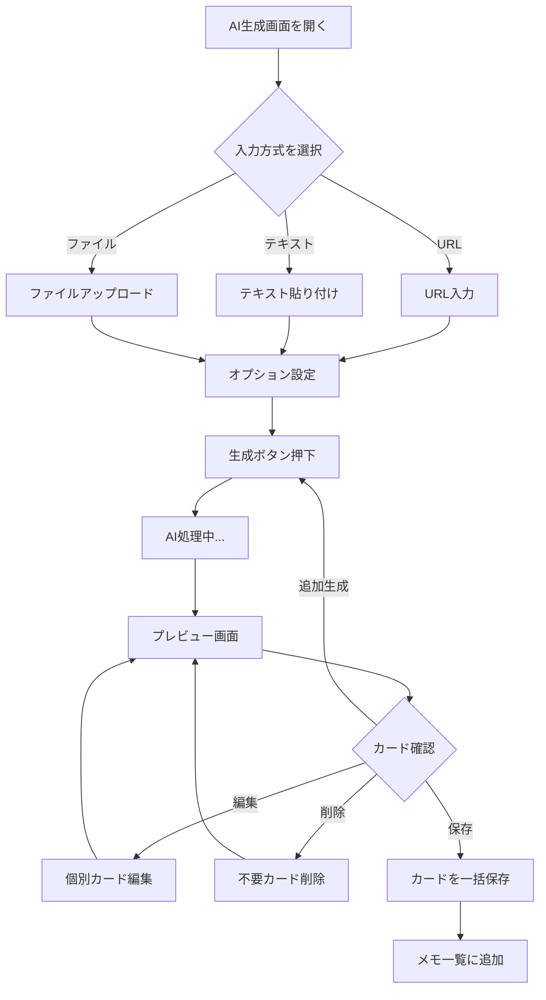

# AI カード自動生成機能 要件定義書

## 1. 機能概要

### 1.1 機能名
**AI カード自動生成（AI Card Generator）**

### 1.2 概要
ユーザーが入力した記事、ドキュメント、URLなどのコンテンツから、AIが自動的に「覚えるべき内容」を抽出し、フラッシュカード（質問/回答形式）を自動生成する機能。

### 1.3 reminDOとの差別化ポイント
reminDOにはない、**AIによる復習カード自動作成機能**がInjection-Brainの強み。
- 手動でカードを作成する手間を大幅削減
- 重要ポイントの抽出漏れを防止
- 学習効率の飛躍的向上

---

## 2. 機能要件

### 2.1 入力形式

| 入力タイプ | 説明 | 優先度 |
|-----------|------|--------|
| テキスト直接入力 | コピペでテキストを貼り付け | 必須 |
| URL入力 | Webページの内容を自動取得・解析 | 必須 |
| ファイルアップロード | PDF、TXT、DOCX等 | 推奨 |
| 画像アップロード | OCRで文字認識後に解析 | 任意 |

### 2.2 カード生成オプション

| 設定項目 | 説明 | デフォルト |
|----------|------|-----------|
| 生成カード数 | 5, 10, 15, 20枚から選択 | 10枚 |
| 難易度 | 基本/標準/発展 | 標準 |
| カードタイプ | 用語定義/概念理解/手順/比較 | 自動判定 |
| 言語 | 入力言語と同じ/日本語に翻訳 | 同じ |
| カテゴリ | 生成後の保存先カテゴリ | 未分類 |

### 2.3 出力形式

各カードは以下の形式で生成：

```json
{
  "question": "質問文（覚えるべきポイントを問う形式）",
  "answer": "回答文（簡潔で明確な回答）",
  "source_excerpt": "元テキストの該当箇所（参照用）",
  "importance": "high | medium | low",
  "tags": ["自動生成タグ1", "タグ2"]
}
```

### 2.4 ユーザーフロー



### 2.5 生成されるカードの例

**入力例（技術記事の一部）：**
> React 18では、新しい並行レンダリング機能が導入されました。useTransitionフックを使用すると、UIの更新に優先度を付けることができます。Suspenseの改善により、サーバーサイドレンダリングとの統合がよりシームレスになりました。

**生成カード例（10枚のうち3枚）：**

| # | 質問 | 回答 |
|---|------|------|
| 1 | React 18で導入された主要な新機能は何ですか？ | 並行レンダリング機能（Concurrent Rendering） |
| 2 | useTransitionフックの目的は何ですか？ | UIの更新に優先度を付けること |
| 3 | React 18でSuspenseが改善された主な点は？ | サーバーサイドレンダリングとの統合がよりシームレスになった |

---

## 3. 技術仕様

### 3.1 AI APIの選択肢と比較

| サービス | モデル | 入力単価 | 出力単価 | 特徴 |
|----------|--------|----------|----------|------|
| **OpenAI** | GPT-4o | $2.50/1M tokens | $10.00/1M tokens | 高精度、マルチモーダル対応 |
| **OpenAI** | GPT-4o-mini | $0.15/1M tokens | $0.60/1M tokens | **コスパ最強、推奨** |
| **Anthropic** | Claude 3.5 Sonnet | $3.00/1M tokens | $15.00/1M tokens | 長文処理に強い |
| **Anthropic** | Claude 3.5 Haiku | $0.80/1M tokens | $4.00/1M tokens | 高速・安価 |
| **Google** | Gemini 1.5 Flash | $0.075/1M tokens | $0.30/1M tokens | 最安、長いコンテキスト |
| **Google** | Gemini 1.5 Pro | $1.25/1M tokens | $5.00/1M tokens | 高精度 |

### 3.2 推奨構成

#### メイン推奨：GPT-4o-mini
- **理由**：コストと精度のバランスが最良
- 日本語処理も十分な品質
- APIが安定、ドキュメント豊富

#### サブ推奨：Gemini 1.5 Flash
- **理由**：最安価、大量処理向け
- 長文コンテキスト（100万トークン）対応
- コスト最優先の場合に選択

---

## 4. コスト試算

### 4.1 前提条件

| 項目 | 値 |
|------|-----|
| 平均入力テキスト | 2,000文字（約1,500トークン）|
| 生成カード数 | 10枚 |
| 平均出力 | 約800トークン |
| 1回の処理 | 入力1,500 + 出力800 = 約2,300トークン |

### 4.2 1回あたりのAPI費用

| モデル | 入力コスト | 出力コスト | 合計/回 |
|--------|-----------|-----------|---------|
| GPT-4o | ¥0.56 | ¥1.20 | **¥1.76** |
| GPT-4o-mini | ¥0.03 | ¥0.07 | **¥0.10** |
| Claude 3.5 Sonnet | ¥0.68 | ¥1.80 | **¥2.48** |
| Claude 3.5 Haiku | ¥0.18 | ¥0.48 | **¥0.66** |
| Gemini 1.5 Flash | ¥0.02 | ¥0.04 | **¥0.06** |
| Gemini 1.5 Pro | ¥0.28 | ¥0.60 | **¥0.88** |

※ $1 = ¥150で計算

### 4.3 月間コスト試算（GPT-4o-mini使用時）

| 利用シナリオ | 月間生成回数 | 月間API費用 |
|-------------|-------------|-------------|
| ライトユーザー | 30回/月 | ¥3 |
| 標準ユーザー | 100回/月 | ¥10 |
| ヘビーユーザー | 300回/月 | ¥30 |
| **1,000ユーザー想定** | 100,000回/月 | **¥10,000** |

---

## 5. 損益分岐点分析

### 5.1 収益モデル案

#### プランA：フリーミアム
| プラン | 月額 | AI生成回数/月 |
|--------|------|--------------|
| Free | ¥0 | 5回 |
| Basic | ¥500 | 50回 |
| Pro | ¥1,000 | 無制限 |

#### プランB：従量課金
| プラン | 月額 | AI生成単価 |
|--------|------|-----------|
| Free | ¥0 | 3回無料、以降¥10/回 |
| Premium | ¥800 | 100回込み、以降¥5/回 |

### 5.2 損益分岐点（GPT-4o-mini使用時）

#### 前提
- サーバー費用（Vercel Pro等）: ¥3,000/月
- その他固定費: ¥2,000/月
- **月間固定費合計: ¥5,000**

#### プランA（フリーミアム）での計算

| 項目 | 計算 |
|------|------|
| Basic会員の粗利 | ¥500 - (50回 × ¥0.10) = ¥495 |
| Pro会員の粗利（100回利用想定） | ¥1,000 - (100回 × ¥0.10) = ¥990 |
| **損益分岐点** | 固定費¥5,000 ÷ 平均粗利¥700 = **約8人の有料会員** |

#### ユーザー規模別収益シミュレーション

| 有料会員数 | 月間売上 | API費用 | 固定費 | **月間利益** |
|-----------|---------|---------|--------|-------------|
| 10人 | ¥7,000 | ¥700 | ¥5,000 | **¥1,300** |
| 50人 | ¥35,000 | ¥3,500 | ¥5,000 | **¥26,500** |
| 100人 | ¥70,000 | ¥7,000 | ¥5,000 | **¥58,000** |
| 500人 | ¥350,000 | ¥35,000 | ¥10,000 | **¥305,000** |
| 1,000人 | ¥700,000 | ¥70,000 | ¥20,000 | **¥610,000** |

※ 有料会員の内訳: Basic 60%, Pro 40%と仮定

### 5.3 重要な指標

| 指標 | 目標値 |
|------|--------|
| 無料→有料転換率 | 5-10% |
| 月間解約率（Churn） | 5%以下 |
| 顧客生涯価値（LTV） | ¥6,000以上（平均6ヶ月継続） |
| 顧客獲得コスト（CAC） | ¥1,000以下 |

---

## 6. 実装優先度

### Phase 1（MVP）
- [x] テキスト直接入力対応
- [x] GPT-4o-mini連携
- [x] 基本的なカード生成（10枚固定）
- [x] プレビュー・編集・保存

### Phase 2
- [ ] URL入力対応（Webスクレイピング）
- [ ] 生成枚数の選択
- [ ] カード品質の向上（プロンプト改善）

### Phase 3
- [ ] PDFアップロード対応
- [ ] 複数AIモデル選択
- [ ] バッチ処理（複数URLの一括処理）

---

## 7. リスクと対策

| リスク | 対策 |
|--------|------|
| API費用の急増 | レート制限、無料枠の上限設定 |
| 生成品質のばらつき | プロンプトの継続的改善、ユーザーフィードバック収集 |
| 著作権問題 | 利用規約での責任範囲明確化、URLソースの保存 |
| APIサービス停止 | 複数プロバイダー対応、フォールバック設計 |

---

## 8. まとめ

### 推奨AI
**GPT-4o-mini** を第一選択として推奨
- 1回あたり約¥0.10の低コスト
- 十分な日本語品質
- 安定したAPI

### 損益分岐点
**有料会員8人**で黒字化
- フリーミアムモデル（Basic ¥500/月、Pro ¥1,000/月）
- API費用は売上の10%程度に抑制可能

### 競合優位性
- reminDOにない**AI自動生成機能**が最大の差別化ポイント
- 低コストでスケーラブルな設計が可能
