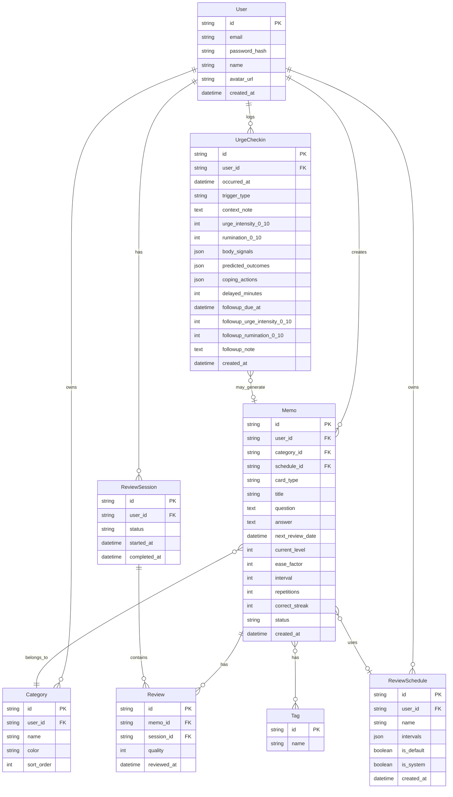

# Injection-Brain 要件定義書

## 1. プロジェクト概要

### 1.1 サービス名
**Injection-Brain**（インジェクション・ブレイン）

### 1.2 コンセプト
脳科学に基づいた記憶支援サービス。忘却曲線を活用し、最適なタイミングで復習リマインドを行うことで、効率的な長期記憶の定着を支援する。

### 1.3 参考サービス
- [reminDO](https://remindo.co/learn) - 脳科学に基づいたメモサービス

### 1.4 ターゲットユーザー
- 語学学習者
- 資格試験受験者
- 読書家（書籍の要点を記憶したい人）
- ビジネスパーソン（業務知識の定着）
- 学生（試験対策）

---

## 2. 機能要件

### 2.1 認証機能

| 機能 | 説明 | 優先度 |
|------|------|--------|
| メールログイン | メール/パスワードによる認証 | 必須 |
| Google OAuth | Googleアカウントでログイン | 必須 |
| 新規登録 | アカウント作成 | 必須 |
| パスワードリセット | メールによるパスワード再設定 | 必須 |
| セッション管理 | ログイン状態の維持 | 必須 |

### 2.2 メモ（カード）機能

| 機能 | 説明 | 優先度 |
|------|------|--------|
| メモ作成 | タイトル、内容（質問/回答形式）を登録 | 必須 |
| メモ編集 | 既存メモの内容更新 | 必須 |
| メモ削除 | メモの削除（論理削除） | 必須 |
| メモ一覧 | 全メモの表示・検索・フィルタ | 必須 |
| カテゴリ分類 | メモをカテゴリで整理 | 必須 |
| タイプ（カード単体） | **カード1枚ごと**にタイプを持たせる（デッキ単位のタイプは採用しない） | 必須 |
| タグ付け | 複数タグによる分類 | 推奨 |
| アーカイブ | 学習完了メモの非表示化 | 推奨 |

#### カード入力制約

| 項目 | 制約 |
|------|------|
| 問題（質問） | 必須、最大500文字 |
| 回答 | 必須、最大1000文字 |
| カテゴリ | 任意（未設定時は「未分類」） |
| タイプ | 必須（例: `knowledge` / `coping` / `custom` など） |
| タグ | 任意、複数可 |

### 2.3 復習機能（コア機能）

| 機能 | 説明 | 優先度 |
|------|------|--------|
| 忘却曲線アルゴリズム | SM-2ベースのスペース学習アルゴリズム | 必須 |
| 復習スケジュール計算 | 記憶度に応じた次回復習日の自動計算 | 必須 |
| フラッシュカード表示 | 質問→回答の段階表示 | 必須 |
| 記憶度選択 | **3ボタン（OK / 覚えた / 覚え直し）** | 必須 |
| 復習セッション管理 | 中断・再開機能 | 必須 |
| カスタムスケジュール | ユーザー独自の復習間隔設定 | 必須 |

#### デフォルト復習スケジュール

忘却曲線に基づいた標準の復習間隔:

| レベル | 間隔 | 累計日数 |
|--------|------|----------|
| 1 | 1日後 | 1日 |
| 2 | 3日後 | 4日 |
| 3 | 7日後 | 11日 |
| 4 | 14日後 | 25日 |
| 5 | 30日後 | 55日 |
| 6 | 365日後 | 420日 |

#### 記憶度による次回復習日の調整

| 評価 | 名称 | 動作 |
|------|------|------|
| 1 | 覚え直し | **同日中に再復習**（レベル/反復回数をリセットして再学習扱い） |
| 2 | OK | 次のレベルへ進む（標準間隔） |
| 3 | 覚えた | 次のレベルへ進む（間隔を1.5倍に延長） |

#### 復習画面（ボタン仕様）

- 回答を表示した後、ユーザーは以下のいずれかを必ず選択する
  - **OK**: ひとまず正解。標準の復習間隔で次へ
  - **覚えた**: 余裕。次回までの間隔を伸ばす
  - **覚え直し**: 定着していない。今日中に再度出す（リセット）

#### カスタムスケジュール機能

ユーザーは独自の復習間隔を設定可能:

| 項目 | 説明 |
|------|------|
| スケジュール名 | 識別用の名前（例: "短期集中"） |
| 復習間隔 | 各レベルの日数を自由に設定 |
| デフォルト設定 | カスタムスケジュールをデフォルトとして使用 |

**カスタムスケジュール例:**
- 短期集中: 1日 → 2日 → 4日 → 7日 → 14日 → 30日
- ゆっくり定着: 2日 → 5日 → 10日 → 21日 → 45日 → 90日 → 180日 → 365日
- 試験直前: 同日 → 1日 → 2日 → 3日 → 5日 → 7日

### 2.4 ホーム画面（復習回数タブ構成）

ホームは「デッキ」ではなく**カード単位**で管理し、復習の**反復回数（repetitions）**ごとにタブを設置する。

#### 復習回数タブ（例）
- **未学習（0回）**: 1回も学習していないカードの一覧（必須）
- **1回**
- **2回**
- **3回**
- **4回**
- **5回+**（上限をまとめるかはUI都合で調整）

#### 各タブ共通
| 機能 | 説明 |
|------|------|
| カード一覧 | 対象タブのカードを一覧表示 |
| 復習期限の表示 | `next_review_date` を表示し、期限切れを強調 |
| ソート/フィルタ | 期限順/作成日順、カテゴリ/タイプ等で絞り込み |
| 一括復習開始 | 対象タブ内のカードから復習セッション開始 |

### 2.5 通知機能

| 機能 | 説明 | 優先度 |
|------|------|--------|
| プッシュ通知 | 復習リマインダー | 必須 |
| 通知時間設定 | ユーザーが通知時間を設定 | 必須 |
| 通知頻度設定 | 1日の通知回数上限 | 推奨 |
| メール通知 | 週次サマリー | 任意 |

### 2.6 設定機能

| 機能 | 説明 | 優先度 |
|------|------|--------|
| プロフィール編集 | 名前、アバター、メール変更 | 必須 |
| 通知設定 | 通知ON/OFF、時間設定 | 必須 |
| カテゴリ管理 | カテゴリのCRUD | 必須 |
| データエクスポート | メモデータのエクスポート | 推奨 |
| アカウント削除 | 退会機能 | 必須 |

### 2.7 外部連携

| 機能 | 説明 | 優先度 |
|------|------|--------|
| Chrome拡張 | Webページからメモをクリップ | 推奨 |
| Safari共有 | iOS Shareシートから追加 | 推奨 |
| API連携 | 外部サービス連携用API | 任意 |

### 2.8 衝動チェックイン（復讐衝動・反芻の可視化と介入）

> 目的: 「復讐したくなる衝動」を“回数”ではなく、**反芻（rumination）**と**報酬学習（reinforcement）**の観点で計測し、ユーザーが安全にクールダウンできる行動を習慣化する。
>
> 安全設計: 他者への危害・違法行為を促す内容は扱わず、**衝動の自己観察・遅延・代替行動**に限定する（危機時はサポート導線を提示）。

| 機能 | 説明 | 優先度 |
|------|------|--------|
| 衝動チェックイン作成 | 1〜2分で入力できる簡易ログ（強度/反芻/衝動の波） | 必須 |
| クールダウン提案 | チェックイン後に短い介入（呼吸/注意転換/行動選択）を提示 | 必須 |
| 遅延タイマー | 「今は行動しない」を支援する10分タイマー（再計測付き） | 推奨 |
| 翌日レビュー | 24h後に「予測（やったらスッキリ）vs 実感」を記録して学習のズレを可視化 | 推奨 |
| 対処カード生成 | チェックイン内容から「対処のフラッシュカード」を作成し、既存の復習機能で定着 | 推奨 |
| 履歴・可視化 | 週次でピーク強度、反芻時間、遅延成功率などをグラフ化 | 任意 |

#### チェックイン入力項目（MVP）

| 項目 | 型 | 制約 | 目的 |
|------|----|------|------|
| 発生時刻 | datetime | 必須 | トリガーの時間帯分析 |
| トリガー種別 | enum | 任意 | 例: 仕事/家族/恋愛/SNS/その他 |
| 状況メモ | text | 任意、最大500文字 | 事実ベースのメモ |
| 衝動の強度 | int | 必須、0-10 | KPI（ピーク強度） |
| 反芻の強さ | int | 必須、0-10 | KPI（思考ループ） |
| 体の反応 | multi-select | 任意 | 例: 動悸/熱感/こわばり/胃の重さ |
| 予測（もし仕返ししたら） | multi-select+自由記述 | 任意 | 例: スッキリ/正義/後悔/悪化 |
| 実行した対処 | multi-select | 任意 | 例: 深呼吸/散歩/誰かに連絡/メモ |
| 遅延できた時間 | int | 任意、分 | KPI（行動までの距離） |

#### 介入（アプリが提示する“安全な選択肢”）

- **10分遅延**: 「10分だけ待つ」→ タイマー → 終了後に強度(0-10)を再入力
- **反芻を断つ**: 30秒呼吸 / 5-4-3-2-1 グラウンディング / 1分歩く
- **再評価テンプレ**: 「事実」「解釈」「別解釈」「次の一手（安全）」を1行ずつ
- **サポート導線**: 自傷他害リスクが高い入力（例: 強度10かつ制御不能）では、アプリ内で緊急支援の案内を優先表示

#### 既存機能との統合ポイント（最適解）

- **メモ（カード）**: 「対処カード」を通常メモとして保存（カテゴリ: メンタル/対処）
- **復習**: 対処カードもSM-2で復習し、“その場で思い出せる”確率を上げる
- **通知**: 復習通知とは別に、翌日レビュー/クールダウンのリマインドを追加（ユーザーがON/OFF）

---

## 3. 非機能要件

### 3.1 パフォーマンス
- ページ読み込み: 3秒以内
- API応答時間: 500ms以内
- 同時接続ユーザー: 1,000人以上対応

### 3.2 可用性
- 稼働率: 99.5%以上
- 定期メンテナンス: 月1回（深夜）

### 3.3 セキュリティ
- HTTPS通信必須
- パスワードハッシュ化（bcrypt）
- JWT認証
- SQLインジェクション対策
- XSS対策
- CSRF対策

### 3.4 対応環境

| プラットフォーム | 対応 |
|------------------|------|
| Web（PC） | Chrome, Safari, Firefox, Edge |
| Web（モバイル） | Chrome, Safari |
| iOS | 16.0以上 |
| Android | 任意（PWA対応） |

---

## 4. 画面一覧

| # | 画面名 | 説明 |
|---|--------|------|
| 1 | スプラッシュ | 起動時ローディング |
| 2 | ログイン | メール/ソーシャルログイン |
| 3 | 新規登録 | アカウント作成 |
| 4 | パスワードリセット | パスワード再設定 |
| 5 | ホーム | 復習回数（repetitions）タブ構成のメイン画面 |
| 5-1 | ├ 未学習（0回）タブ | 1回も学習していないカード一覧 |
| 5-2 | ├ 1回タブ | 学習/復習が1回のカード一覧 |
| 5-3 | ├ 2回タブ | 学習/復習が2回のカード一覧 |
| 5-4 | ├ 3回タブ | 学習/復習が3回のカード一覧 |
| 5-5 | └ 4回+タブ | 学習/復習が4回以上のカード一覧（UI都合でまとめる） |
| 6 | メモ一覧 | 全メモ表示 |
| 7 | メモ追加 | 新規メモ作成 |
| 8 | メモ詳細 | メモ閲覧 |
| 9 | メモ編集 | メモ更新 |
| 10 | 復習画面 | フラッシュカード復習 |
| 11 | 設定 | 設定ハブ |
| 12 | プロフィール編集 | ユーザー情報 |
| 13 | 通知設定 | リマインド設定 |
| 14 | カテゴリ管理 | カテゴリCRUD |
| 15 | 衝動チェックイン | 衝動/反芻の入力、クールダウン導線 |
| 16 | チェックイン履歴 | 一覧・フィルタ（任意） |
| 17 | チェックイン詳細 | 翌日レビュー、対処カード化（任意） |

※詳細は `screen-flow.md` を参照

---

## 5. データモデル（概要）

### 5.1 主要エンティティ

### 5.5 UrgeCheckin（衝動チェックイン）

| フィールド | 型 | 説明 |
|-----------|-----|------|
| id | UUID | 識別子 |
| user_id | UUID | 所有ユーザー |
| occurred_at | datetime | 発生時刻 |
| trigger_type | string | トリガー分類（任意） |
| context_note | text | 状況メモ（任意） |
| urge_intensity_0_10 | int | 衝動強度（0-10） |
| rumination_0_10 | int | 反芻強度（0-10） |
| body_signals | json | 身体反応（配列） |
| predicted_outcomes | json | 予測（配列+自由記述） |
| coping_actions | json | 実行した対処（配列） |
| delayed_minutes | int | 遅延できた時間（分） |
| followup_due_at | datetime | 翌日レビュー予定 |
| followup_* | * | 翌日レビュー結果（任意） |

### 5.6 通知種別（拡張）

- `review_reminder`: 復習リマインド（既存）
- `streak_reminder`: 連続学習リマインド（既存）
- `urge_followup`: 翌日レビュー（新規）
- `cooldown_nudge`: クールダウン支援（新規・ユーザーがON/OFF）

### 5.2 ReviewSchedule（復習スケジュール設定）

| フィールド | 型 | 説明 |
|-----------|-----|------|
| id | UUID | 識別子 |
| user_id | UUID | 所有ユーザー（システムスケジュールはnull） |
| name | string | スケジュール名 |
| intervals | int[] | 各レベルの間隔日数（例: [1,3,7,14,30,365]） |
| is_default | boolean | ユーザーのデフォルトとして使用するか |
| is_system | boolean | システム提供のスケジュールか |

**システム提供スケジュール（is_system=true）:**
- 標準: [1, 3, 7, 14, 30, 365]
- 短期集中: [1, 2, 4, 7, 14, 30]
- ゆっくり: [2, 5, 10, 21, 45, 90, 180, 365]

### 5.3 メモステータス
- `learning`: 学習中
- `review_pending`: 復習待ち
- `mastered`: 習得済み
- `archived`: アーカイブ

### 5.4 復習セッションステータス
- `in_progress`: 進行中
- `completed`: 完了
- `abandoned`: 放棄

---

## 6. 技術スタック（案）

| レイヤー | 技術 |
|----------|------|
| フロントエンド | Next.js 14 (App Router) |
| UIライブラリ | Tailwind CSS + shadcn/ui |
| 状態管理 | Zustand |
| バックエンド | Next.js API Routes |
| データベース | PostgreSQL (Supabase) |
| 認証 | Supabase Auth |
| プッシュ通知 | Firebase Cloud Messaging |
| ホスティング | Vercel |
| モバイルアプリ | React Native または PWA |

---

## 7. 開発フェーズ

### Phase 1: MVP
- 認証機能
- メモCRUD
- 基本的な復習機能
- ホーム画面（3タブ）

### Phase 2: 通知・設定
- プッシュ通知
- 通知設定
- カテゴリ管理

### Phase 3: 拡張
- Chrome拡張
- データエクスポート
- 統計・分析機能

### Phase 4: モバイル
- iOSアプリ または PWA強化
- オフライン対応

---

## 8. 参考資料

- [SM-2アルゴリズム](https://www.supermemo.com/en/archives1990-2015/english/ol/sm2) - スペース学習アルゴリズム
- [Anki](https://apps.ankiweb.net/) - フラッシュカードアプリの代表例
- [reminDO](https://remindo.co/) - 参考サービス
