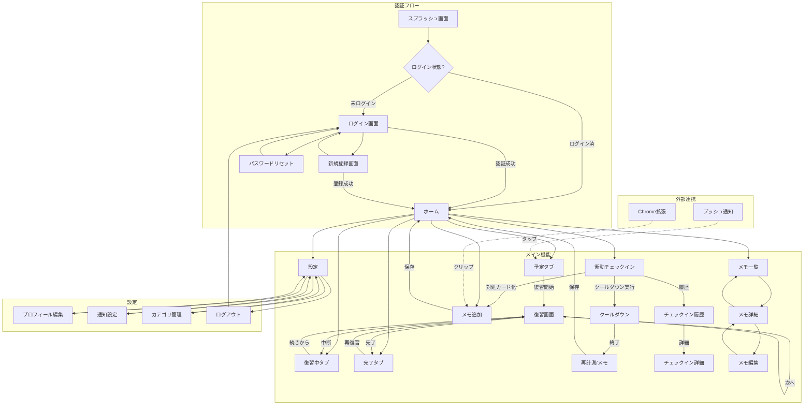
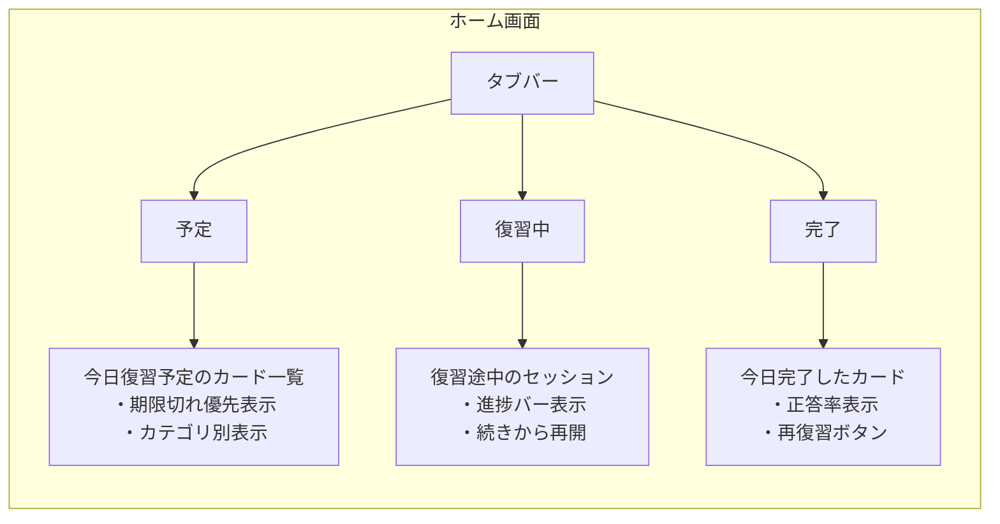
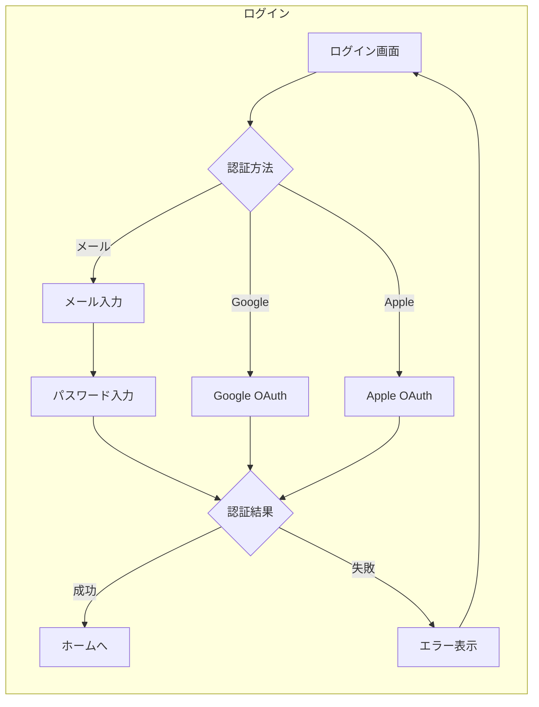
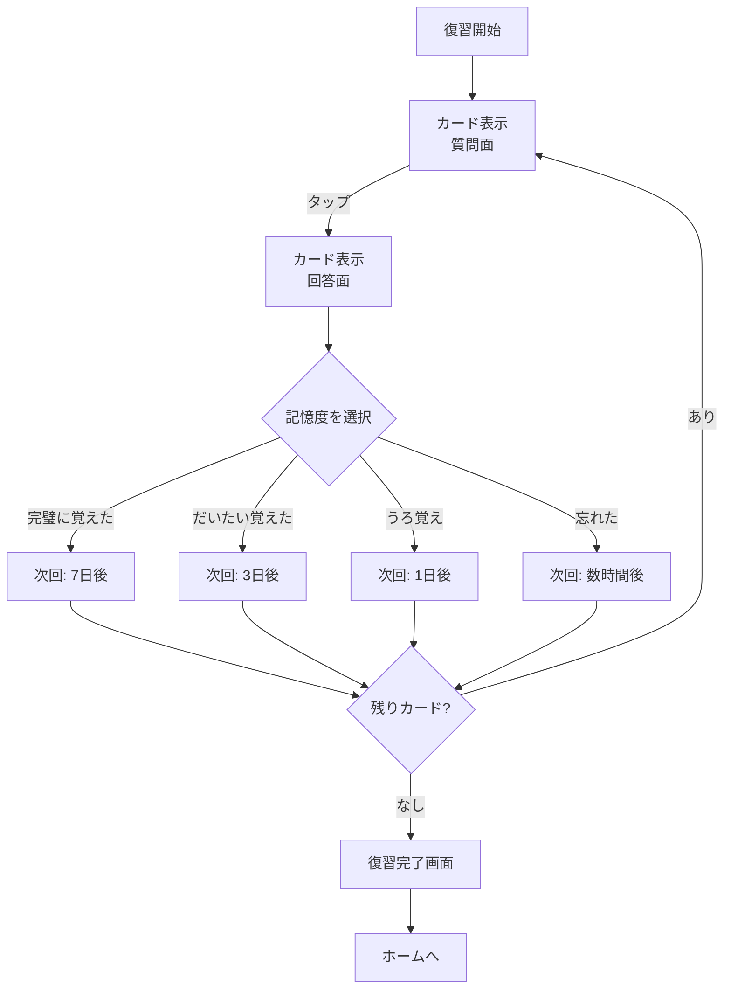
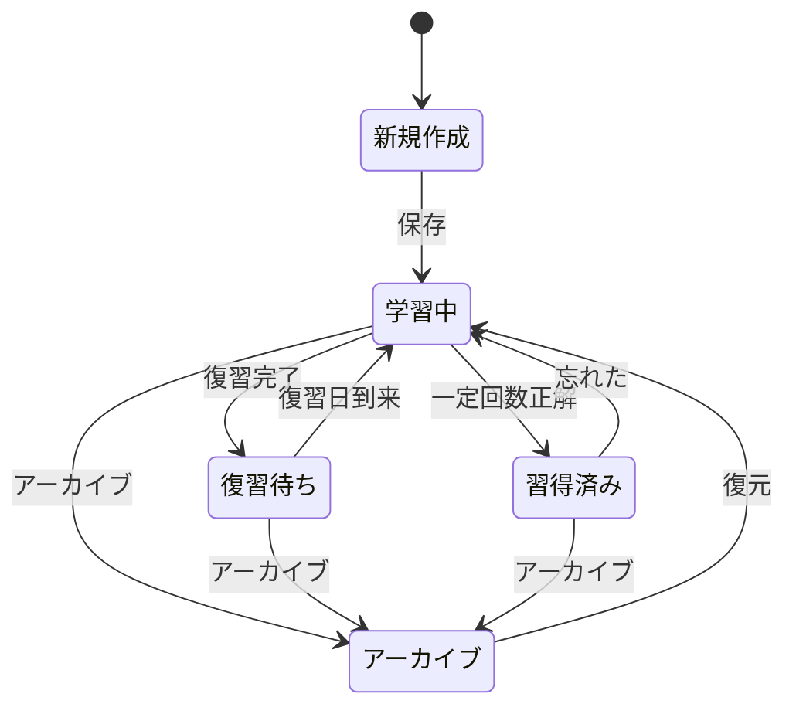
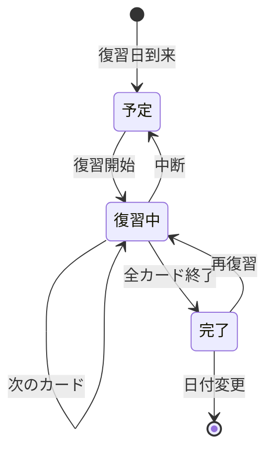

# Injection-Brain 画面遷移図

## 全体フロー



## 衝動チェックイン フロー詳細（MVP）

```mermaid
flowchart TD
    UC1[チェックイン開始] --> UC2[強度入力\n衝動0-10/反芻0-10]
    UC2 --> UC3[トリガー/状況メモ（任意）]
    UC3 --> UC4{いま危険？\n(制御不能/強度10など)}
    UC4 -->|はい| UC5[安全導線\n支援先案内/落ち着く行動]
    UC4 -->|いいえ| UC6[クールダウン選択]
    UC6 -->|10分遅延| UC7[タイマー]
    UC6 -->|呼吸/グラウンディング| UC8[短いガイド]
    UC7 --> UC9[再計測\n衝動0-10/反芻0-10]
    UC8 --> UC9
    UC9 --> UC10[保存]
    UC10 --> UC11{対処カードを作る？}
    UC11 -->|はい| UC12[メモ追加へ\nテンプレで作成]
    UC11 -->|いいえ| UC13[ホームへ]
```

## ホーム画面タブ構成



## 認証フロー詳細



## 復習フロー詳細



## 画面一覧

| # | 画面名 | 説明 | 主要機能 |
|---|--------|------|----------|
| 1 | スプラッシュ | 起動時ローディング | 認証状態チェック |
| 2 | ログイン | ログイン画面 | メール/ソーシャルログイン |
| 3 | 新規登録 | アカウント作成 | メール登録/ソーシャル連携 |
| 4 | パスワードリセット | パスワード再設定 | メール送信 |
| 5 | ホーム | メイン画面（3タブ） | 予定/復習中/完了の管理 |
| 5-1 | ├ 予定タブ | 今日の復習予定 | 期限切れ優先、復習開始 |
| 5-2 | ├ 復習中タブ | 進行中セッション | 続きから再開 |
| 5-3 | └ 完了タブ | 今日完了分 | 正答率、再復習 |
| 6 | メモ一覧 | 全メモ表示 | 検索、フィルタ、ソート |
| 7 | メモ追加 | 新規メモ作成 | タイトル、内容、カテゴリ、タグ |
| 8 | メモ詳細 | メモ閲覧 | 内容表示、次回復習日、編集へ |
| 9 | メモ編集 | メモ更新 | 内容編集、削除 |
| 10 | 復習画面 | カード形式復習 | フラッシュカード、記憶度選択 |
| 11 | 設定 | 設定ハブ | 各設定画面へのナビ |
| 12 | プロフィール編集 | ユーザー情報 | 名前、アバター、メール変更 |
| 13 | 通知設定 | リマインド設定 | 通知時間、頻度、ON/OFF |
| 14 | カテゴリ管理 | カテゴリCRUD | 追加、編集、削除、並び替え |
| 15 | 衝動チェックイン | 衝動/反芻入力とクールダウン | 強度入力、タイマー、対処カード化 |
| 16 | チェックイン履歴 | 過去ログ一覧 | フィルタ、検索（任意） |
| 17 | チェックイン詳細 | 翌日レビュー/振り返り | 予測vs実感、メモ化（任意） |

## 状態遷移（メモ）



## 状態遷移（復習セッション）


