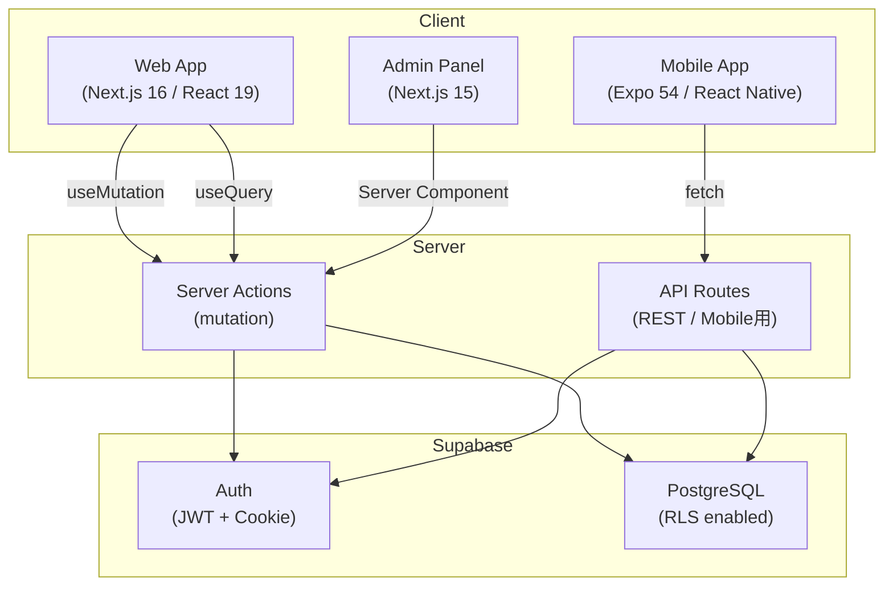
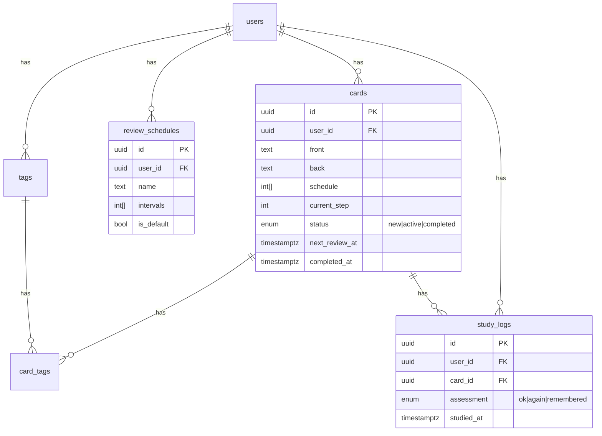

# ReSave

**忘却曲線に基づく間隔反復記憶カードアプリ** — Web・モバイル対応のフルスタック実装


---

## 概要

**ReSave** は、エビングハウスの忘却曲線に基づく**間隔反復（Spaced Repetition）**アルゴリズムを実装した記憶カードアプリです。

- 単語・知識を「覚えにくさ」に応じて最適なタイミングで復習
- Next.js（Web）と Expo（iOS/Android）でコードを共有しながらマルチプラットフォーム対応
- TanStack Query の楽観的更新により、API レスポンス前に即座に UI へ反映

---

## Tech Stack

### Frontend / Mobile

| 技術 | バージョン | 採用理由 |
|------|------------|----------|
| Next.js | 16 | App Router + Server Components でサーバー/クライアントを最適分割 |
| React | 19 | 最新の concurrent features 活用 |
| TypeScript | 5.7 | 型安全を強制、ランタイムエラーを設計段階で排除 |
| Expo | 54 | React Native の標準ツールチェーン。Web と同じ React エコシステム |
| TanStack Query | v5 | 楽観的更新・キャッシュ管理・自動リフェッチを宣言的に実装 |
| @tanstack/react-virtual | v3 | 大量カード表示の仮想スクロールによるパフォーマンス最適化 |
| shadcn/ui + Radix UI | - | アクセシビリティ対応済みの headless コンポーネント |
| NativeWind | v4 | Tailwind CSS を React Native に適用。Web と同じクラス名でスタイリング |
| Zustand | v5 | 軽量なクライアント状態管理 |
| React Hook Form + Zod | - | スキーマ駆動のフォームバリデーション |

### Backend / Infrastructure

| 技術 | 採用理由 |
|------|----------|
| Supabase (PostgreSQL) | RLS（行レベルセキュリティ）で認証・認可をデータ層で保証 |
| Server Actions | API Routes 不要。型安全な RPC でクライアント→サーバー間の通信を簡潔に |
| Supabase Auth | JWT + Cookie ベースの認証。SSR での認証状態を正確に取得 |

### Testing / Dev Tools

| 技術 | 用途 |
|------|------|
| Vitest | ユニット・インテグレーションテスト |
| @testing-library/react | コンポーネントテスト |
| Playwright | E2E テスト |
| Turborepo | モノレポのタスクキャッシュと並列ビルド |

---

## 主要機能

- **フラッシュカード管理** — カードの作成・編集・削除。表/裏テキスト + タグによる分類
- **間隔反復スケジューリング** — `ok / again / remembered` の 3段階評価で次回復習日を自動計算
- **ダッシュボード** — 今日の復習対象カードを優先表示。未学習・復習中のタブ切り替え
- **統計ダッシュボード** — 学習ストリーク・日別学習数・カード進捗率のグラフ表示
- **タグ管理** — タグにカラーコードを付与してカテゴリ管理
- **モバイルアプリ** — iOS/Android 対応。Web と同じビジネスロジックを API 経由で利用

---

## Architecture

### システム構成



### データフロー

**Web アプリ（Server Actions パターン）**

```
Component
  └─ useHomeCards (TanStack Query)
       ├─ useQuery  → getHomeCards() [Server Action]  → Supabase
       └─ useMutation
            ├─ onMutate: setQueryData (楽観的更新) → 即座にUI反映
            ├─ mutationFn: submitAssessment() [Server Action] → Supabase
            └─ onError: rollback (ロールバック)
```

**Mobile アプリ（API Routes パターン）**

```
Component
  └─ fetch('/api/cards/today') → Route Handler → Supabase
  └─ fetch('/api/study', { method: 'POST' }) → Route Handler → Supabase
```

### ディレクトリ構成

```
ReSave/
├── apps/
│   ├── web/                    # Next.js 16 メインアプリ
│   │   └── src/
│   │       ├── app/
│   │       │   ├── (auth)/     # 認証ページ（login / signup / reset-password）
│   │       │   ├── (main)/     # メインアプリ（home / stats / tags / settings）
│   │       │   └── api/        # Mobile 向け REST API Routes
│   │       ├── actions/        # Server Actions（cards / study / tags / stats）
│   │       ├── components/     # React コンポーネント
│   │       ├── hooks/          # TanStack Query カスタムフック
│   │       ├── types/          # TypeScript 型定義（mobile と共有）
│   │       └── validations/    # Zod スキーマ（mobile と共有）
│   ├── mobile/                 # Expo 54 モバイルアプリ
│   └── admin/                  # Next.js 15 管理画面
├── supabase/
│   └── migrations/             # DB マイグレーション（5ファイル）
└── docs/
    └── requirements/           # 要件・設計ドキュメント
```

---

## 技術的なこだわり

### 1. 間隔反復アルゴリズム

エビングハウスの忘却曲線に基づき、復習間隔を指数的に延ばすことで記憶の定着を最大化します。

```typescript
// types/review-schedule.ts
export const DEFAULT_INTERVALS = [1, 3, 7, 14, 30, 90]; // 日数

// actions/study.ts — 評価に応じたスケジューリング
export async function submitAssessment({ cardId, assessment }: Input) {
  const card = await getCard(cardId);
  const schedule = card.schedule; // ユーザーごとにカスタマイズ可能

  if (assessment === 'ok') {
    const nextStep = card.current_step + 1;
    if (nextStep >= schedule.length) {
      // 全ステップ完了 → 「記憶済み」
      return updateCard(cardId, { status: 'completed', next_review_at: null });
    }
    // 現在のステップの間隔で次回復習日を算出
    const daysToAdd = schedule[card.current_step];
    const nextReviewAt = addDays(new Date(), daysToAdd);
    return updateCard(cardId, { current_step: nextStep, next_review_at: nextReviewAt });

  } else if (assessment === 'again') {
    // 忘れた → ステップ0にリセット（翌日から再学習）
    return updateCard(cardId, { current_step: 0, next_review_at: addDays(new Date(), 1) });

  } else if (assessment === 'remembered') {
    // 即座に「記憶済み」マーク
    return updateCard(cardId, { status: 'completed', next_review_at: null });
  }
}
```

| 評価 | 動作 |
|------|------|
| `ok` | `current_step + 1` → 次の間隔（1→3→7→14→30→90日）へ |
| `again` | `current_step = 0` にリセット → 翌日から再挑戦 |
| `remembered` | 即完了（次回復習なし） |

---

### 2. TanStack Query 楽観的更新

API レスポンスを待たずに UI を先行更新し、エラー時はロールバックします。
ホーム画面の全 mutation が単一キー `['cards', 'home']` を操作するため、状態の一貫性を保ちやすい設計です。

```typescript
// hooks/useHomeCards.ts
export function useHomeSubmitAssessment() {
  const qc = useQueryClient();

  return useMutation({
    mutationFn: (input) => submitAssessment(input), // Server Action

    // Step 1: API 呼び出し前にキャッシュを先行更新
    onMutate: async (input) => {
      await qc.cancelQueries({ queryKey: homeCardKeys.all });
      const previousData = qc.getQueryData<HomeCardsData>(homeCardKeys.all);

      qc.setQueryData<HomeCardsData>(homeCardKeys.all, (old) => {
        if (!old) return old;
        return {
          ...old,
          cards: old.cards.map((card) => {
            if (card.id !== input.cardId) return card;
            // クライアント側でスケジュールを計算して即時反映
            return applyAssessment(card, input.assessment);
          }),
        };
      });

      return { previousData }; // ロールバック用に保存
    },

    // Step 2: エラー時にロールバック
    onError: (_, __, context) => {
      if (context?.previousData) {
        qc.setQueryData(homeCardKeys.all, context.previousData);
      }
      toast.error('評価の記録に失敗しました');
    },

    // Step 3: 成功時にサーバーの確定データで同期
    onSuccess: ({ card: updatedCard }) => {
      qc.setQueryData<HomeCardsData>(homeCardKeys.all, (old) => {
        if (!old) return old;
        return {
          ...old,
          cards: old.cards.map((c) => (c.id === updatedCard.id ? { ...c, ...updatedCard } : c)),
        };
      });
    },
  });
}
```

派生データ（due / learning タブの仕分け）は `useMemo` で計算するため、`invalidateQueries` によるリフェッチが不要です。

---

### 3. 仮想化リスト（パフォーマンス最適化）

カード枚数が 50 枚を超えると自動的に `@tanstack/react-virtual` による仮想スクロールに切り替わります。
DOM ノード数を最小限に抑え、数百枚のカードでもスムーズなスクロールを実現します。

```typescript
// components/home/card-list.tsx
const VIRTUALIZATION_THRESHOLD = 50;
const ESTIMATED_CARD_HEIGHT = 180; // px

const VirtualizedCardList = memo(function VirtualizedCardList({ cards, ...props }) {
  const parentRef = useRef<HTMLDivElement>(null);

  const virtualizer = useVirtualizer({
    count: cards.length,
    getScrollElement: () => parentRef.current,
    estimateSize: () => ESTIMATED_CARD_HEIGHT,
    overscan: 5, // スクロール端の5アイテムを先読みしてガタつきを防止
  });

  return (
    <div ref={parentRef} className="h-[600px] overflow-auto">
      {/* コンテナ全高を確保してスクロールバーを正しく表示 */}
      <div style={{ height: `${virtualizer.getTotalSize()}px`, position: 'relative' }}>
        {virtualizer.getVirtualItems().map((virtualItem) => (
          <div
            key={cards[virtualItem.index].id}
            ref={virtualizer.measureElement} // 実測高さでキャリブレーション
            style={{ transform: `translateY(${virtualItem.start}px)` }}
            className="absolute left-0 top-0 w-full pb-4"
          >
            <CardItem card={cards[virtualItem.index]} {...props} />
          </div>
        ))}
      </div>
    </div>
  );
});

// 50枚未満は通常リスト、以上は仮想化リストを選択
export function CardList({ cards, ...props }) {
  if ((cards?.length ?? 0) > VIRTUALIZATION_THRESHOLD) {
    return <VirtualizedCardList cards={cards} {...props} />;
  }
  return <StandardCardList cards={cards} {...props} />;
}
```

---

### 4. クロスプラットフォーム設計（Web + Mobile）

`apps/web/src/types/` と `apps/web/src/validations/` をソースオブトゥルースとして、
Mobile アプリにも同一の型定義・バリデーションスキーマを利用しています。

```
apps/web/src/types/card.ts         ──┐
apps/web/src/validations/card.ts   ──┼──（手動コピー）──→ apps/mobile/types/card.ts
                                      └──────────────────→ apps/mobile/validations/card.ts
```

Mobile は REST API（`/api/cards`, `/api/study`）経由でデータ取得し、
Web と同じビジネスロジックをサーバー側で共有します。

```typescript
// apps/mobile/lib/api/client.ts
export const mobileApiClient = {
  getTodayCards: () =>
    fetch(`${process.env.EXPO_PUBLIC_API_URL}/api/cards/today`, {
      headers: { Authorization: `Bearer ${session.access_token}` },
    }).then((r) => r.json()),

  submitAssessment: (input: SubmitAssessmentInput) =>
    fetch(`${process.env.EXPO_PUBLIC_API_URL}/api/study`, {
      method: 'POST',
      headers: { 'Content-Type': 'application/json', Authorization: `Bearer ${session.access_token}` },
      body: JSON.stringify(input),
    }).then((r) => r.json()),
};
```

---

### 5. テスト戦略

スケジューリングアルゴリズムのような**ビジネスクリティカルなロジックを重点的にテスト**します。
コンポーネントは `@testing-library/react` でユーザー視点のテストを実施、E2E は Playwright でカバーします。

```typescript
// __tests__/actions/study-scheduling.test.ts
describe('submitAssessment', () => {
  describe('評価が ok の場合', () => {
    it('current_step が進む', async () => {
      // Given: アクティブなカード（ステップ1）
      const card = createCard({ status: 'active', current_step: 1, schedule: [1, 3, 7, 14, 30, 90] });

      // When: ok 評価を送信
      const result = await submitAssessment({ cardId: card.id, assessment: 'ok' });

      // Then: ステップが進み、7日後が次の復習日になる
      expect(result.card.current_step).toBe(2);
      expect(result.card.next_review_at).toBeWithinDays(7);
    });

    it('最終ステップを超えると completed になる', async () => {
      const card = createCard({ status: 'active', current_step: 5, schedule: [1, 3, 7, 14, 30, 90] });
      const result = await submitAssessment({ cardId: card.id, assessment: 'ok' });

      expect(result.card.status).toBe('completed');
      expect(result.card.next_review_at).toBeNull();
    });
  });

  describe('評価が again の場合', () => {
    it('current_step が 0 にリセットされる', async () => {
      const card = createCard({ status: 'active', current_step: 3, schedule: [1, 3, 7, 14, 30, 90] });
      const result = await submitAssessment({ cardId: card.id, assessment: 'again' });

      expect(result.card.current_step).toBe(0);
      expect(result.card.next_review_at).toBeWithinDays(1);
    });
  });
});
```

| テスト種別 | ツール | 対象 |
|-----------|--------|------|
| ユニット | Vitest | スケジューリングロジック、Zod バリデーション、ユーティリティ |
| コンポーネント | Vitest + @testing-library/react | hooks、UI コンポーネント |
| E2E | Playwright | 主要ユーザーフロー（ログイン〜復習完了） |

---

## Getting Started

### 前提条件

- Node.js 20+
- pnpm 9+
- Supabase アカウント

### 環境変数

```bash
# apps/web/.env.local
NEXT_PUBLIC_SUPABASE_URL=your_supabase_url
NEXT_PUBLIC_SUPABASE_ANON_KEY=your_supabase_anon_key

# apps/mobile/.env
EXPO_PUBLIC_API_URL=http://localhost:3000
EXPO_PUBLIC_SUPABASE_URL=your_supabase_url
EXPO_PUBLIC_SUPABASE_ANON_KEY=your_supabase_anon_key
```

### インストール・起動

```bash
# 依存関係インストール
pnpm install

# Supabase マイグレーション
npx supabase db push

# Web アプリ起動（localhost:3000）
pnpm dev:web

# Admin 起動（localhost:3001）
pnpm dev:admin

# Mobile アプリ起動
pnpm dev:mobile
```

### テスト実行

```bash
cd apps/web

# ユニット・コンポーネントテスト
pnpm test

# E2E テスト
pnpm test:e2e
```

---

## Database Schema



---

## License

MIT
