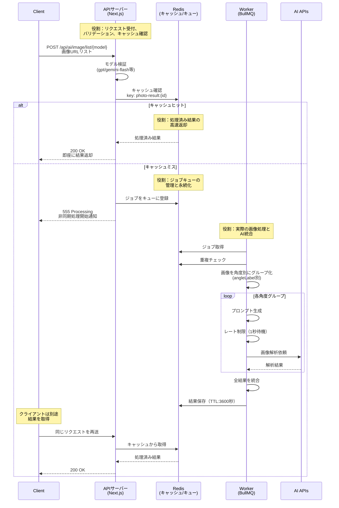

# システム構成

## 技術スタック

### Webフレームワーク
- **Next.js** (App Router)
- **TypeScript**
- **React**

### AI・機械学習
- **OpenAI API**
- **Google Generative AI**
- **DeepSeek**（予定）

※対応モデルの詳細は [`app/constants/general.ts`](../app/constants/general.ts) を参照

### データベース・キュー
- **Redis**: 7.0 (ジョブキュー・キャッシュ)
- **BullMQ** (非同期ジョブ処理)
- **IORedis** (Redisクライアント)

### 画像処理
- **Sharp** (画像リサイズ・最適化)

### 開発・テスト
- **Jest** (テストフレームワーク)
- **Testing Library** (React/Jest DOM対応)
- **ESLint** (Next.js Core Web Vitals設定)
- **Prettier** (コードフォーマッター)

### 評価システム
- **Python** 3.8+
- **Pandas** (データ処理)
- **Scikit-learn** (評価指標計算)

### インフラ・デプロイ
- **Docker** (コンテナ化)
- **Docker Compose** (開発環境構築)

## アーキテクチャ

### 主要コンポーネントの役割

#### APIサーバー (Next.js App Router)
- **リクエスト受付**: クライアントからのHTTPリクエストを処理
- **バリデーション**: 入力データの検証
- **キャッシュチェック**: 処理済み結果の即座返却
- **ジョブ登録**: 未処理リクエストをキューに登録
- **モデルルーティング**: URLパスから適切なAIモデルを選択

#### Redis
- **キャッシュストア**: 処理済み結果を1時間保存
- **ジョブキュー**: BullMQのバックエンドとして動作
- **重複排除**: 同一IDの重複処理を防止
- **データ永続化**: 結果の一時保存

#### ワーカー (BullMQ Worker)
- **非同期処理**: バックグラウンドでの重い処理を実行
- **画像グループ化**: 角度別に画像を整理
- **プロンプト生成**: 設備種別と角度に応じた適切なプロンプト作成
- **AI呼び出し**: 各AIプロバイダーとの通信管理
- **結果統合**: 複数の解析結果を統合してキャッシュ

##### API呼び出し最適化
- **OpenAI o1系対応**: 画像URLをBase64に変換して送信し、API呼び出しは指数バックオフで再試行
- **Gemini画像最適化**: Sharpによる画像リサイズ・WebP変換でトークン数を削減

#### 評価システム (Python)
- **プロンプトバージョン管理**: テキスト形式でGit管理、metadata.json自動生成
- **プロンプト同期**: `scripts/prompt-sync.sh`でテキスト → JSON変換し、APIサーバーに適用
- **評価実行**: `scripts/run-evaluation.sh`でAI APIを呼び出し、精度評価を実施
- **レポート生成**: HTMLレポート（summary.html, error_analysis.html）を自動生成
- **性能指標**: Accuracy, Precision, Recall, F1-Score, Specificity, MCCを計算

### 処理フロー

### データフロー詳細

1. **APIサーバー処理**
   - URLパスからAIモデルを特定（例：`/gpt` → GPT-4o）
   - リクエストボディをバリデーション
   - Redisでキャッシュを確認

2. **Redis処理**
   - キャッシュキー: `photo-result:{id}`
   - ジョブキュー: `photo-processing`
   - TTL: 3600秒（1時間）

3. **ワーカー処理**
   - 複数のジョブを並列処理
   - 角度別グループ化で効率的なAI呼び出し
   - レート制限で各AIプロバイダーの制限を遵守

4. **特殊ケース**
   - FORCE_NG: AIを呼ばずに強制NG判定
   - プロンプト生成失敗: FORCE_OKとして処理

## プロンプト管理

AI画像解析システムでは、プロンプトをテキストファイル（マスター）とJSONファイル（実行時）で二重管理し、実行時に動的に読み込む設計を採用しています。

### プロンプト管理の構成
- **マスター**: `evaluation/prompts/`（テキスト形式、Git管理）
- **中間生成物**: `evaluation/data/generated_prompts/`（JSON形式、gitignore対象）
- **実行時形式**: `app/prompts/`（JSON形式、中間生成物からコピー）
- **同期スクリプト**: `scripts/prompt-sync.sh`（テキスト → JSON変換 → コピー）
- **バージョン管理**: metadata.jsonで差分を自動記録

詳細な仕様は [画角仕様](./ANGLE_SPECIFICATIONS.md) および [プロンプト管理ガイド](./PROMPT_MANAGEMENT.md) を参照してください。

## 主な設計判断

### なぜ非同期処理？
- AI APIの処理時間が長い（数秒〜数十秒）
- 複数画像の並列処理が可能
- タイムアウトを回避

### なぜ複数AI？
- 各AIの得意分野を活用
- コスト最適化（用途に応じて使い分け）
- 障害時の代替手段

### なぜRedis？
- ジョブキューとキャッシュを一元管理
- 高速なデータアクセス
- Dockerで簡単に構築可能
