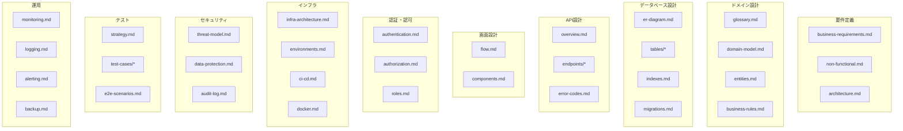

# ReSave ドキュメント

> 最終更新: 2026-01-02

## 概要

ReSaveは、忘却曲線に基づいた間隔反復システム（SRS）を採用した記憶カードアプリです。本ディレクトリには、開発・運用に必要なすべてのドキュメントが格納されています。

## ドキュメント構成

## クイックリンク

### 要件定義

| ドキュメント | 説明 |
|-------------|------|
| [ビジネス要件](./requirements/business-requirements.md) | ユーザーストーリー、機能要件、ビジネスリスク |
| [非機能要件](./requirements/non-functional.md) | パフォーマンス、可用性、セキュリティ要件 |
| [アーキテクチャ](./requirements/architecture.md) | システム構成、技術スタック、設計方針 |

### ドメイン設計

| ドキュメント | 説明 |
|-------------|------|
| [用語集](./domain/glossary.md) | プロジェクト固有の用語定義 |
| [ドメインモデル](./domain/domain-model.md) | エンティティ関連図、集約設計 |
| [エンティティ定義](./domain/entities.md) | 各エンティティの属性・責務 |
| [ビジネスルール](./domain/business-rules.md) | FSRSアルゴリズム、ストリーク計算 |

### データベース設計

| ドキュメント | 説明 |
|-------------|------|
| [ER図](./database/er-diagram.md) | テーブル関連図 |
| [テーブル定義](./database/tables/) | 各テーブルのスキーマ詳細 |
| [インデックス設計](./database/indexes.md) | パフォーマンス最適化 |
| [マイグレーション](./database/migrations.md) | DDL管理方針 |

### API設計

| ドキュメント | 説明 |
|-------------|------|
| [API概要](./api/overview.md) | 認証、共通仕様、エラーハンドリング |
| [エンドポイント](./api/endpoints/) | 各API詳細仕様 |
| [エラーコード](./api/error-codes.md) | エラーコード一覧 |

### 画面設計

| ドキュメント | 説明 |
|-------------|------|
| [画面遷移図](./screens/flow.md) | 画面フロー、状態遷移 |
| [コンポーネント仕様](./screens/components.md) | 共通UIコンポーネント |

### 認証・認可

| ドキュメント | 説明 |
|-------------|------|
| [認証設計](./auth/authentication.md) | JWT、OAuth、MFA |
| [認可設計](./auth/authorization.md) | RLSポリシー |
| [ロール定義](./auth/roles.md) | ユーザー権限 |

### インフラ

| ドキュメント | 説明 |
|-------------|------|
| [インフラ構成](./infrastructure/infra-architecture.md) | Vercel、Supabase構成 |
| [環境定義](./infrastructure/environments.md) | dev/staging/prod設定 |
| [CI/CD](./infrastructure/ci-cd.md) | GitHub Actions、デプロイフロー |
| [Docker](./infrastructure/docker.md) | ローカル開発環境 |

### セキュリティ

| ドキュメント | 説明 |
|-------------|------|
| [脅威モデル](./security/threat-model.md) | STRIDE分析 |
| [データ保護](./security/data-protection.md) | 暗号化、GDPR対応 |
| [監査ログ](./security/audit-log.md) | アクセスログ設計 |

### テスト

| ドキュメント | 説明 |
|-------------|------|
| [テスト戦略](./testing/strategy.md) | テストピラミッド、カバレッジ目標 |
| [テストケース](./testing/test-cases/) | 機能別テストケース |
| [E2Eシナリオ](./testing/e2e-scenarios.md) | 主要ユーザーフロー |

### 運用

| ドキュメント | 説明 |
|-------------|------|
| [監視設計](./operations/monitoring.md) | メトリクス、ダッシュボード |
| [ログ設計](./operations/logging.md) | 構造化ログ、保存期間 |
| [アラート設計](./operations/alerting.md) | 閾値、エスカレーション |
| [バックアップ](./operations/backup.md) | RTO/RPO、リストア手順 |

## 機能ID対応表

| 機能ID | 機能名 | 関連ドキュメント |
|--------|--------|-----------------|
| F-001〜F-005 | 認証・ユーザー管理 | [認証API](./api/endpoints/auth.md), [認証設計](./auth/authentication.md) |
| F-013〜F-019 | カード管理 | [カードAPI](./api/endpoints/cards.md), [カードテーブル](./database/tables/cards.md) |
| F-020〜F-025 | 学習・復習 | [学習API](./api/endpoints/study.md), [ビジネスルール](./domain/business-rules.md) |
| F-030〜F-033 | 進捗・統計 | [統計API](./api/endpoints/stats.md), [学習ログ](./database/tables/study_logs.md) |
| F-040〜F-042 | 通知 | [通知API](./api/endpoints/notifications.md), [通知設定](./database/tables/notification_settings.md) |
| F-050〜F-052 | データ同期 | [API概要](./api/overview.md) |

## 変更履歴

| 日付 | 内容 | 担当 |
|------|------|------|
| 2026-01-02 | 初版作成 | Claude Code |
