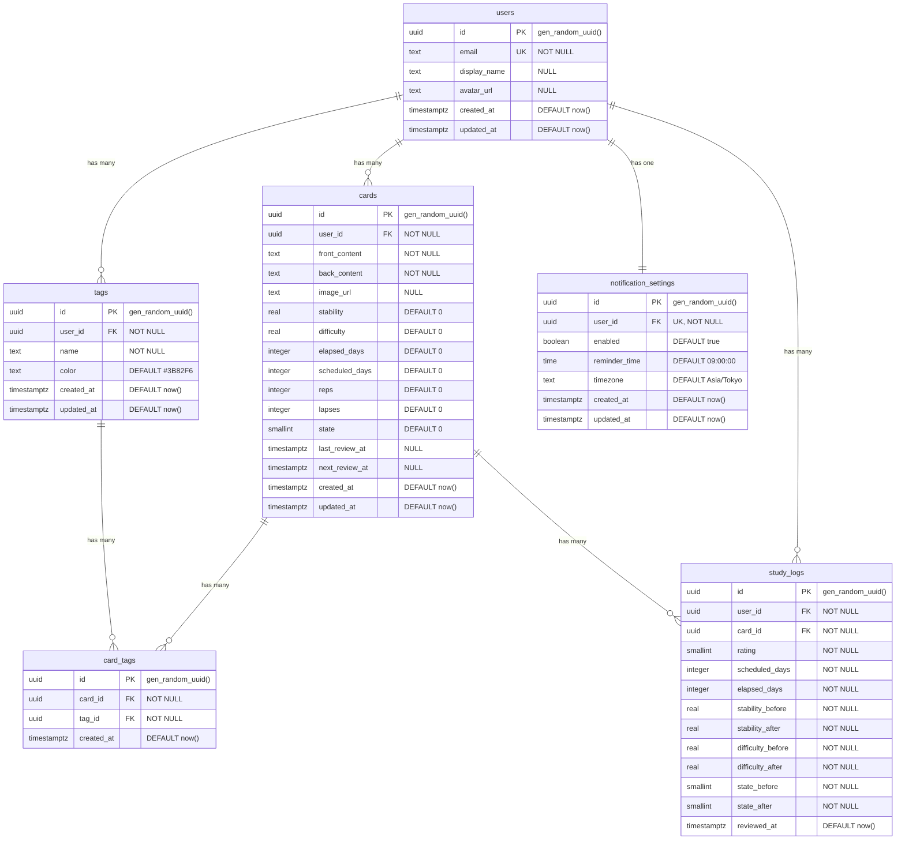

# ER図

> 関連ドキュメント:
> - [ビジネス要件](../requirements/business-requirements.md)
> - [アーキテクチャ](../requirements/architecture.md)
> - [テーブル定義](./tables/)
> - [インデックス設計](./indexes.md)
> - [マイグレーション運用](./migrations.md)

## 1. ER図



## 2. テーブル関係の説明

### 2.1 概要

本システムは6つのテーブルで構成され、ユーザーの記憶カード学習データを管理します。

### 2.2 エンティティ関係

| 関係 | カーディナリティ | 説明 |
|------|-----------------|------|
| users - cards | 1:N | ユーザーは複数のカードを所有 |
| users - tags | 1:N | ユーザーは複数のタグを作成 |
| users - study_logs | 1:N | ユーザーは複数の学習ログを持つ |
| users - notification_settings | 1:1 | ユーザーは1つの通知設定を持つ |
| cards - card_tags | 1:N | カードは複数のタグを持てる |
| tags - card_tags | 1:N | タグは複数のカードに付与可能 |
| cards - study_logs | 1:N | カードは複数の学習履歴を持つ |

### 2.3 多対多関係

**cards - tags（カードとタグ）**

`card_tags` 中間テーブルにより多対多関係を実現しています。

- 1つのカードに複数のタグを付与可能
- 1つのタグを複数のカードに付与可能
- タグによるフィルタリング・検索機能を実現

## 3. FSRS（Free Spaced Repetition Scheduler）関連フィールド

### 3.1 cardsテーブルのFSRSフィールド

| フィールド | 説明 |
|-----------|------|
| stability | 記憶の安定性（忘却に対する耐性） |
| difficulty | カードの難易度（0.0〜1.0） |
| elapsed_days | 前回復習からの経過日数 |
| scheduled_days | 次回復習までの予定日数 |
| reps | 復習回数 |
| lapses | 忘却回数（「覚え直し」選択回数） |
| state | カード状態（0:New, 1:Learning, 2:Review, 3:Relearning） |

### 3.2 study_logsテーブルのFSRSフィールド

| フィールド | 説明 |
|-----------|------|
| rating | ユーザー評価（1:Again, 2:Hard, 3:Good, 4:Easy） |
| stability_before/after | 復習前後の安定性 |
| difficulty_before/after | 復習前後の難易度 |
| state_before/after | 復習前後のカード状態 |

## 4. RLS（Row Level Security）ポリシー概要

全テーブルでRLSを有効化し、ユーザーは自身のデータのみアクセス可能です。

```sql
-- 基本ポリシーパターン
CREATE POLICY "Users can access own data"
ON {table_name} FOR ALL
USING (auth.uid() = user_id);
```

詳細は各テーブル定義を参照してください。

## 5. 命名規則

| 項目 | 規則 | 例 |
|------|------|-----|
| テーブル名 | snake_case、複数形 | users, cards, card_tags |
| カラム名 | snake_case | user_id, created_at |
| 主キー | id（UUID） | id |
| 外部キー | {参照テーブル単数形}_id | user_id, card_id |
| タイムスタンプ | *_at | created_at, updated_at |
| 真偽値 | is_*, has_*, enabled | enabled |
