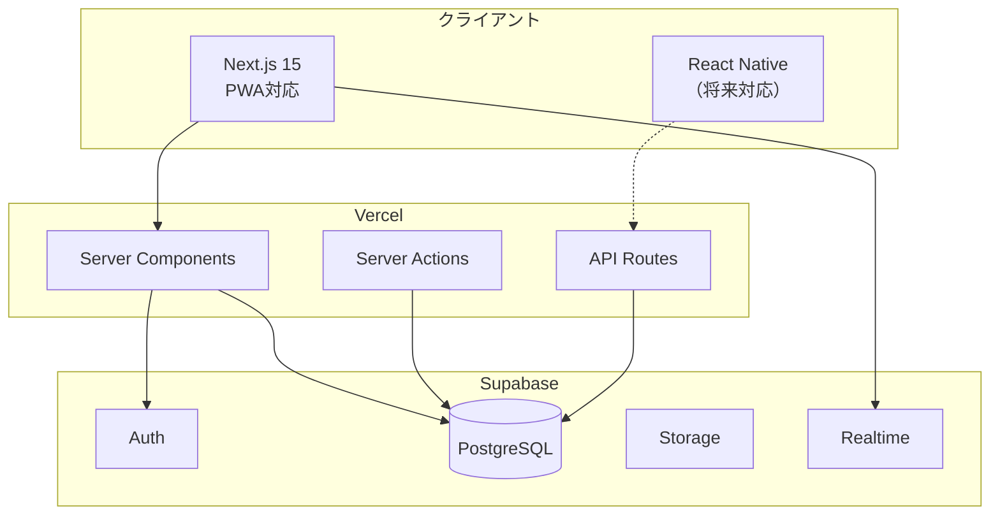
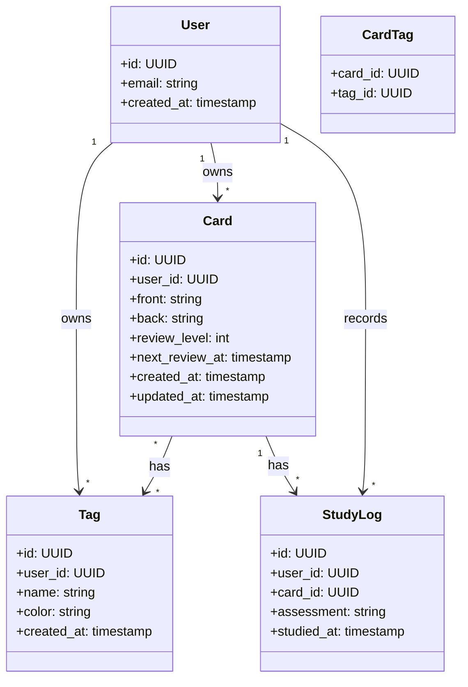
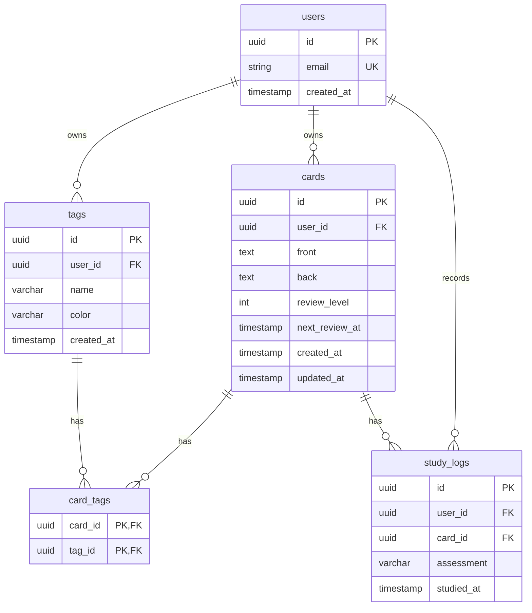
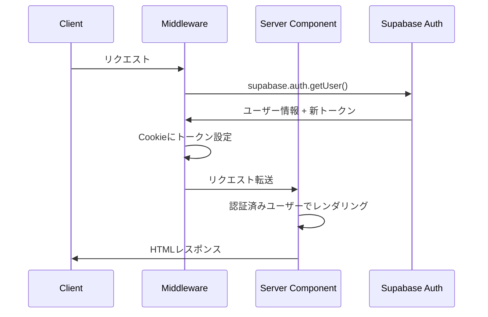
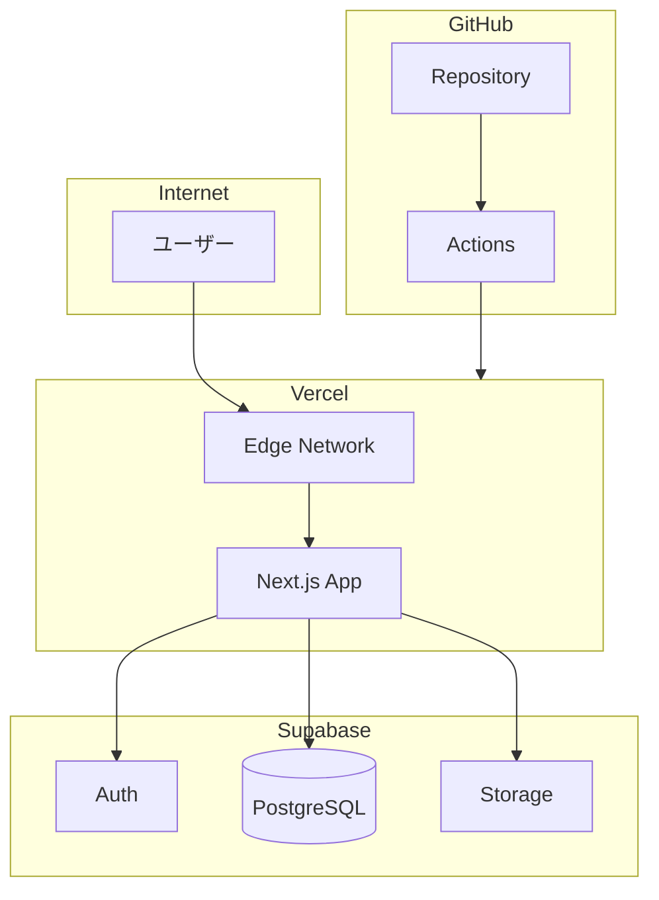
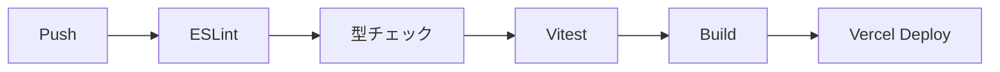

# システムアーキテクチャ

> 関連ドキュメント: [ビジネス要件](./business-requirements.md) | [非機能要件](./non-functional.md)
> 最終更新: 2026-01-02

---

## 1. アーキテクチャ概要

### 1.1 システム全体像



### 1.2 設計方針

| 方針 | 詳細 |
|------|------|
| **Server First** | Server Componentsをデフォルトとし、`use client`は最小限の葉コンポーネントにのみ使用 |
| **シンプルさ優先** | 過度な抽象化を避け、将来のRN対応を見据えつつも現時点はWeb特化 |
| **Supabase活用** | 認証・DB・ストレージをSupabaseに集約し、バックエンド開発コストを最小化 |
| **PWA対応** | オフライン学習は将来対応。まずはインストール可能なPWAとして提供 |

---

## 2. 技術スタック

### 2.1 フロントエンド

| 項目 | 選定技術 | バージョン | 選定理由 |
|-----|---------|-----------|---------|
| フレームワーク | Next.js | 15.x | App Router + RSC、Vercel最適化 |
| React | React | 19.x | Server Components、Concurrent Features |
| 言語 | TypeScript | 5.x | 型安全、DX向上 |
| スタイリング | Tailwind CSS | 4.x | CSS-first-config、ユーティリティCSS |
| UIコンポーネント | shadcn/ui | latest | Radix UIベース、コピペ方式でカスタマイズ自由 |
| アイコン | Lucide React | latest | 軽量、shadcn/uiとの親和性 |
| アニメーション | tw-animate-css | latest | Tailwind v4対応 |
| PWA | @serwist/next | latest | next-pwa後継、Service Worker管理 |

### 2.2 状態管理・データフェッチ

| 項目 | 選定技術 | 選定理由 |
|-----|---------|---------|
| サーバー状態 | TanStack Query | キャッシュ、リフェッチ、楽観的更新 |
| クライアント状態 | useState / Zustand | シンプルな状態はuseState、グローバル状態はZustand |
| フォーム | React Hook Form + Zod | 複雑なフォームのバリデーション |
| シンプルなフォーム | Server Actions + Zod | Server Componentsと相性良好 |

### 2.3 バックエンド（Supabase）

| 項目 | 選定技術 | 選定理由 |
|-----|---------|---------|
| 認証 | Supabase Auth | メール/パスワード、OAuth対応、Cookie-based SSR対応 |
| データベース | Supabase Database (PostgreSQL) | RLS、リアルタイム対応、無料枠あり |
| ストレージ | Supabase Storage | 画像添付用（将来対応） |
| クライアントSDK | @supabase/ssr | Server/Client両対応、Cookie管理 |

### 2.4 テスト

| 項目 | 選定技術 | 選定理由 |
|-----|---------|---------|
| ユニットテスト | Vitest | 高速、ESM対応、Jest互換API |
| コンポーネントテスト | Testing Library | ユーザー視点のテスト |
| E2Eテスト | Playwright | クロスブラウザ、高速 |

### 2.5 開発ツール・インフラ

| 項目 | 選定技術 | 選定理由 |
|-----|---------|---------|
| パッケージマネージャ | pnpm | 高速、ディスク効率 |
| モノレポ | Turborepo | ビルドキャッシュ、将来のRN対応 |
| Linter | ESLint | コード品質 |
| Formatter | Prettier | フォーマット統一 |
| ホスティング | Vercel | Next.js最適化、自動デプロイ |
| CI/CD | GitHub Actions | ビルド・テスト・デプロイ自動化 |
| エラー監視 | Sentry | エラートラッキング（将来対応） |

### 2.6 技術選定の経緯

| 項目 | 採用案 | 代替案 | 代替を選ばなかった理由 |
|-----|-------|-------|---------------------|
| UI | shadcn/ui | MUI, Chakra UI | コピペ方式で完全カスタマイズ可能、バンドルサイズ小 |
| 認証 | Supabase Auth | NextAuth.js, Clerk | DB/Storageと統合、無料枠が充実 |
| DB | Supabase (PostgreSQL) | PlanetScale, Neon | Auth/Storageと統合、RLS対応 |
| 状態管理 | TanStack Query | SWR | mutation対応、DevTools、楽観的更新 |
| PWA | @serwist/next | next-pwa | next-pwaは非推奨、Serwistが後継 |

---

## 3. ディレクトリ構成

```
resave/
├── apps/
│   └── web/                          # Next.js (PWA対応)
│       ├── src/
│       │   ├── app/
│       │   │   ├── layout.tsx
│       │   │   ├── page.tsx          # ダッシュボード（今日の復習）
│       │   │   ├── manifest.ts       # PWAマニフェスト
│       │   │   ├── sw.ts             # Service Worker
│       │   │   ├── (auth)/
│       │   │   │   ├── login/page.tsx
│       │   │   │   ├── signup/page.tsx
│       │   │   │   └── reset-password/page.tsx
│       │   │   ├── cards/
│       │   │   │   ├── page.tsx      # カード一覧
│       │   │   │   ├── new/page.tsx  # カード作成
│       │   │   │   └── [id]/
│       │   │   │       ├── page.tsx  # カード詳細
│       │   │   │       └── edit/page.tsx
│       │   │   ├── study/
│       │   │   │   └── page.tsx      # 学習セッション
│       │   │   ├── tags/
│       │   │   │   └── page.tsx      # タグ管理
│       │   │   ├── stats/
│       │   │   │   └── page.tsx      # 統計
│       │   │   └── settings/
│       │   │       └── page.tsx      # 設定
│       │   ├── components/
│       │   │   ├── ui/               # shadcn/uiコンポーネント
│       │   │   ├── cards/            # カード関連
│       │   │   ├── study/            # 学習関連
│       │   │   └── layout/           # レイアウト
│       │   ├── lib/
│       │   │   ├── supabase/
│       │   │   │   ├── client.ts     # ブラウザ用クライアント
│       │   │   │   ├── server.ts     # サーバー用クライアント
│       │   │   │   └── middleware.ts # Auth middleware
│       │   │   ├── utils.ts
│       │   │   └── constants.ts
│       │   ├── hooks/
│       │   │   ├── useCards.ts
│       │   │   ├── useTags.ts
│       │   │   ├── useStudy.ts
│       │   │   └── useStats.ts
│       │   ├── actions/              # Server Actions
│       │   │   ├── cards.ts
│       │   │   ├── tags.ts
│       │   │   └── study.ts
│       │   └── types/
│       │       └── index.ts
│       ├── middleware.ts             # Supabase Auth middleware
│       ├── next.config.ts
│       ├── tailwind.config.ts        # v4ではCSS-firstだが互換用
│       ├── components.json           # shadcn/ui設定
│       └── package.json
│
├── packages/
│   ├── types/                        # 共通型定義（将来RN対応用）
│   │   ├── src/
│   │   │   ├── index.ts
│   │   │   ├── card.ts
│   │   │   ├── tag.ts
│   │   │   ├── study.ts
│   │   │   └── user.ts
│   │   └── package.json
│   │
│   └── utils/                        # 共通ユーティリティ
│       ├── src/
│       │   ├── index.ts
│       │   ├── scheduling.ts         # 間隔スケジューリング
│       │   └── validation.ts         # Zodスキーマ
│       └── package.json
│
├── supabase/
│   ├── migrations/
│   │   └── 20260102000000_init.sql
│   ├── seed.sql
│   └── config.toml
│
├── .github/
│   └── workflows/
│       ├── ci.yml
│       └── deploy.yml
│
├── package.json
├── pnpm-workspace.yaml
├── turbo.json
└── CLAUDE.md
```

### 各ディレクトリの役割

| ディレクトリ | 役割 |
|------------|-----|
| `apps/web/` | Next.js Webアプリ（PWA対応） |
| `apps/web/src/app/` | App Router ページ |
| `apps/web/src/components/` | Reactコンポーネント |
| `apps/web/src/lib/` | ユーティリティ、Supabaseクライアント |
| `apps/web/src/hooks/` | TanStack Queryカスタムフック |
| `apps/web/src/actions/` | Server Actions |
| `packages/types/` | 共通型定義（将来RN共有用） |
| `packages/utils/` | 共通ユーティリティ（スケジューリング等） |
| `supabase/` | マイグレーション、シード |

---

## 4. ドメイン設計

### 4.1 用語集

| 用語 | 英語表記 | 定義 | 備考 |
|-----|---------|-----|-----|
| カード | Card | 表面（質問）と裏面（答え）で構成される暗記単位 | |
| タグ | Tag | カードに付与するラベル | 1カード複数タグ可 |
| 復習レベル | ReviewLevel | 現在の復習段階（0-5） | 間隔: 1,3,7,14,30,180日 |
| 学習ログ | StudyLog | 学習セッションの記録 | |
| 評価 | Assessment | OK/覚えた/覚え直し | |

### 4.2 ドメインモデル



### 4.3 エンティティ定義

#### Card
| 属性名 | 型 | 必須 | 説明 |
|-------|---|-----|-----|
| id | UUID | Yes | 主キー |
| user_id | UUID | Yes | 所有者（FK → users.id） |
| front | TEXT | Yes | 表面（質問） |
| back | TEXT | Yes | 裏面（答え） |
| review_level | INT | Yes | 復習レベル（0-5）、デフォルト0 |
| next_review_at | TIMESTAMP | No | 次回復習日、NULLは完了 |
| created_at | TIMESTAMP | Yes | 作成日時 |
| updated_at | TIMESTAMP | Yes | 更新日時 |

**責務**: 暗記内容の保持、復習スケジュール管理

#### Tag
| 属性名 | 型 | 必須 | 説明 |
|-------|---|-----|-----|
| id | UUID | Yes | 主キー |
| user_id | UUID | Yes | 所有者 |
| name | VARCHAR(50) | Yes | タグ名 |
| color | VARCHAR(7) | Yes | 色コード（#RRGGBB） |
| created_at | TIMESTAMP | Yes | 作成日時 |

**責務**: カードの分類・フィルタリング

### 4.4 ビジネスルール

| ID | カテゴリ | ルール | 例外 |
|----|---------|-------|-----|
| BR-001 | 復習 | 「OK」評価時、review_levelを+1し、対応する間隔後のnext_review_atを設定 | level 5の場合は完了 |
| BR-002 | 復習 | 「覚え直し」評価時、review_levelを0にリセット | - |
| BR-003 | 復習 | 「覚えた」評価時、next_review_atをNULLに設定（完了扱い） | - |
| BR-004 | カード | 1カードに複数タグを付与可能 | - |
| BR-005 | 同期 | ログイン時、全カード・タグをサーバーと同期 | - |

### 4.5 固定間隔スケジューリング

```
review_level: 0 → 1日後
review_level: 1 → 3日後
review_level: 2 → 7日後
review_level: 3 → 14日後
review_level: 4 → 30日後
review_level: 5 → 180日後
review_level: 6 → 完了（next_review_at = NULL）
```

---

## 5. データベース設計

### 5.1 ER図



### 5.2 テーブル定義

#### users テーブル（Supabase Auth管理）
Supabase Authが自動作成。`auth.users`を参照。

#### cards テーブル
| カラム名 | 型 | NULL | デフォルト | 説明 |
|---------|---|------|-----------|-----|
| id | UUID | NO | gen_random_uuid() | PK |
| user_id | UUID | NO | - | FK → auth.users.id |
| front | TEXT | NO | - | 表面（質問） |
| back | TEXT | NO | - | 裏面（答え） |
| review_level | INT | NO | 0 | 復習レベル（0-6） |
| next_review_at | TIMESTAMPTZ | YES | NOW() + INTERVAL '1 day' | 次回復習日 |
| created_at | TIMESTAMPTZ | NO | NOW() | 作成日時 |
| updated_at | TIMESTAMPTZ | NO | NOW() | 更新日時 |

**制約**: PK: `id`, FK: `user_id`, INDEX: `user_id`, `next_review_at`

#### tags テーブル
| カラム名 | 型 | NULL | デフォルト | 説明 |
|---------|---|------|-----------|-----|
| id | UUID | NO | gen_random_uuid() | PK |
| user_id | UUID | NO | - | FK → auth.users.id |
| name | VARCHAR(50) | NO | - | タグ名 |
| color | VARCHAR(7) | NO | '#6366f1' | 色コード |
| created_at | TIMESTAMPTZ | NO | NOW() | 作成日時 |

**制約**: PK: `id`, FK: `user_id`, UNIQUE: `(user_id, name)`

#### card_tags テーブル
| カラム名 | 型 | NULL | デフォルト | 説明 |
|---------|---|------|-----------|-----|
| card_id | UUID | NO | - | FK → cards.id |
| tag_id | UUID | NO | - | FK → tags.id |

**制約**: PK: `(card_id, tag_id)`, FK: `card_id`, `tag_id`

#### study_logs テーブル
| カラム名 | 型 | NULL | デフォルト | 説明 |
|---------|---|------|-----------|-----|
| id | UUID | NO | gen_random_uuid() | PK |
| user_id | UUID | NO | - | FK → auth.users.id |
| card_id | UUID | NO | - | FK → cards.id |
| assessment | VARCHAR(20) | NO | - | 'ok', 'remembered', 'again' |
| studied_at | TIMESTAMPTZ | NO | NOW() | 学習日時 |

**制約**: PK: `id`, FK: `user_id`, `card_id`, INDEX: `user_id, studied_at`

### 5.3 Row Level Security (RLS)

```sql
-- cards: ユーザーは自分のカードのみアクセス可能
ALTER TABLE cards ENABLE ROW LEVEL SECURITY;

CREATE POLICY "Users can CRUD own cards" ON cards
  FOR ALL USING (auth.uid() = user_id);

-- tags: ユーザーは自分のタグのみアクセス可能
ALTER TABLE tags ENABLE ROW LEVEL SECURITY;

CREATE POLICY "Users can CRUD own tags" ON tags
  FOR ALL USING (auth.uid() = user_id);

-- card_tags: カード所有者のみ操作可能
ALTER TABLE card_tags ENABLE ROW LEVEL SECURITY;

CREATE POLICY "Users can CRUD own card_tags" ON card_tags
  FOR ALL USING (
    EXISTS (SELECT 1 FROM cards WHERE cards.id = card_id AND cards.user_id = auth.uid())
  );

-- study_logs: ユーザーは自分のログのみアクセス可能
ALTER TABLE study_logs ENABLE ROW LEVEL SECURITY;

CREATE POLICY "Users can CRUD own study_logs" ON study_logs
  FOR ALL USING (auth.uid() = user_id);
```

### 5.4 マイグレーション運用
- **ツール**: Supabase CLI (`supabase db push`, `supabase migration`)
- **命名規則**: `YYYYMMDDHHMMSS_description.sql`
- **ロールバック方針**: 手動で逆マイグレーションを作成

---

## 6. API設計

### 6.1 概要

本プロジェクトでは、**Server Actions**をメインのデータ操作手段として使用。
TanStack Queryと組み合わせてクライアント側のキャッシュ・楽観的更新を実現。

| 操作 | 方式 |
|------|------|
| データ取得（初期） | Server Components で直接Supabase呼び出し |
| データ取得（リフェッチ） | TanStack Query + Supabaseクライアント |
| データ変更 | Server Actions + TanStack Query mutation |

### 6.2 Server Actions

```typescript
// app/actions/cards.ts
'use server'

import { createServerClient } from '@/lib/supabase/server'
import { revalidatePath } from 'next/cache'

export async function createCard(data: { front: string; back: string; tagIds: string[] }) {
  const supabase = await createServerClient()
  // ... カード作成処理
  revalidatePath('/cards')
}

export async function updateCard(id: string, data: Partial<Card>) {
  // ...
}

export async function deleteCard(id: string) {
  // ...
}

export async function submitAssessment(cardId: string, assessment: 'ok' | 'remembered' | 'again') {
  // 評価に応じてreview_level更新、study_log作成
  // ...
}
```

### 6.3 TanStack Query フック

```typescript
// hooks/useCards.ts
export const cardKeys = {
  all: ['cards'] as const,
  lists: () => [...cardKeys.all, 'list'] as const,
  list: (filters: CardFilters) => [...cardKeys.lists(), filters] as const,
  today: () => [...cardKeys.all, 'today'] as const,
  detail: (id: string) => [...cardKeys.all, 'detail', id] as const,
}

export function useTodayCards() {
  return useQuery({
    queryKey: cardKeys.today(),
    queryFn: () => fetchTodayCards(),
  })
}

export function useSubmitAssessment() {
  const qc = useQueryClient()
  return useMutation({
    mutationFn: ({ cardId, assessment }) => submitAssessment(cardId, assessment),
    onSuccess: () => {
      qc.invalidateQueries({ queryKey: cardKeys.today() })
    },
  })
}
```

### 6.4 API Routes（将来のRN対応用）

将来React Native対応時に必要となるREST APIは、`app/api/`に配置。

| メソッド | パス | 説明 |
|---------|-----|-----|
| GET | /api/cards | カード一覧 |
| POST | /api/cards | カード作成 |
| GET | /api/cards/:id | カード詳細 |
| PUT | /api/cards/:id | カード更新 |
| DELETE | /api/cards/:id | カード削除 |
| GET | /api/cards/today | 今日の復習カード |
| POST | /api/study | 学習結果送信 |

---

## 7. 認証・認可設計

### 7.1 認証方式

- **方式**: Supabase Auth (Cookie-based SSR)
- **パッケージ**: `@supabase/ssr`
- **アクセストークン有効期限**: 1時間
- **リフレッシュトークン有効期限**: 7日

### 7.2 認証フロー



### 7.3 Middleware実装

```typescript
// middleware.ts
import { createServerClient } from '@supabase/ssr'
import { NextResponse, type NextRequest } from 'next/server'

export async function middleware(request: NextRequest) {
  let supabaseResponse = NextResponse.next({ request })

  const supabase = createServerClient(
    process.env.NEXT_PUBLIC_SUPABASE_URL!,
    process.env.NEXT_PUBLIC_SUPABASE_ANON_KEY!,
    {
      cookies: {
        getAll() {
          return request.cookies.getAll()
        },
        setAll(cookiesToSet) {
          cookiesToSet.forEach(({ name, value }) => request.cookies.set(name, value))
          supabaseResponse = NextResponse.next({ request })
          cookiesToSet.forEach(({ name, value, options }) =>
            supabaseResponse.cookies.set(name, value, options)
          )
        },
      },
    }
  )

  const { data: { user } } = await supabase.auth.getUser()

  // 未認証ユーザーを認証ページへリダイレクト
  if (!user && !request.nextUrl.pathname.startsWith('/login') && !request.nextUrl.pathname.startsWith('/signup')) {
    const url = request.nextUrl.clone()
    url.pathname = '/login'
    return NextResponse.redirect(url)
  }

  return supabaseResponse
}

export const config = {
  matcher: ['/((?!_next/static|_next/image|favicon.ico|.*\\.(?:svg|png|jpg|jpeg|gif|webp)$).*)'],
}
```

### 7.4 権限マトリクス

| 機能 | 未認証 | 認証済み |
|-----|-------|---------|
| ログイン/登録ページ | ○ | リダイレクト |
| カード操作 | - | 自分のみ |
| タグ操作 | - | 自分のみ |
| 学習セッション | - | 自分のカードのみ |
| 統計閲覧 | - | 自分のみ |

---

## 8. インフラ設計

### 8.1 構成図



### 8.2 環境別設定

| 項目 | dev | preview | prod |
|-----|-----|---------|------|
| URL | localhost:3000 | pr-xxx.vercel.app | resave.app |
| Supabase | ローカル or dev | dev | prod |
| ログレベル | DEBUG | INFO | WARN |
| PWA | 無効 | 無効 | 有効 |

### 8.3 CI/CD



- **ツール**: GitHub Actions
- **トリガー**:
  - `main`ブランチ → 本番デプロイ
  - PR → Previewデプロイ
- **チェック項目**: lint, typecheck, test, build

---

## 9. セキュリティ設計

### 9.1 脅威モデル

| 脅威 | 対象 | リスク | 対策 |
|-----|-----|-------|-----|
| 認証なりすまし | Auth | 高 | Supabase Auth + HTTPS + Cookie HttpOnly |
| データ改ざん | DB | 中 | RLS, Server Actions内でのバリデーション |
| XSS | フロント | 中 | React自動エスケープ, CSP |
| CSRF | Actions | 中 | SameSite Cookie, Origin検証 |
| SQLインジェクション | DB | 高 | Supabaseパラメータ化クエリ |

### 9.2 データ保護

| 分類 | 例 | 保護レベル |
|-----|---|----------|
| 認証情報 | パスワード | Supabase Auth管理（bcrypt） |
| 個人識別 | メールアドレス | RLSで所有者のみ |
| 学習データ | カード内容 | RLSで所有者のみ |

### 9.3 環境変数

```env
# 公開可能（クライアントで使用）
NEXT_PUBLIC_SUPABASE_URL=https://xxx.supabase.co
NEXT_PUBLIC_SUPABASE_ANON_KEY=eyJ...

# サーバーのみ
SUPABASE_SERVICE_ROLE_KEY=eyJ...  # 管理用（通常は不使用）
```

---

## 10. テスト設計

### 10.1 テストピラミッド

| 種別 | 比率 | ツール | 対象 |
|-----|-----|-------|-----|
| ユニット | 70% | Vitest | ユーティリティ、フック、スケジューリングロジック |
| コンポーネント | 20% | Testing Library | UIコンポーネント |
| E2E | 10% | Playwright | 主要フロー |

### 10.2 カバレッジ目標

- 全体: 80%以上
- `packages/utils/scheduling.ts`: 100%（コアロジック）
- 認証・学習フロー: E2Eで担保

### 10.3 E2Eシナリオ

| ID | シナリオ | 優先度 |
|----|---------|-------|
| E2E-001 | ユーザー登録 → ログイン | P0 |
| E2E-002 | カード作成 → タグ付け → 一覧確認 | P0 |
| E2E-003 | 今日の復習 → 学習 → 評価 → 次回復習日更新 | P0 |
| E2E-004 | パスワードリセット | P1 |

---

## 11. 運用設計

### 11.1 監視

| メトリクス | 閾値 | アラート |
|-----------|-----|---------|
| エラーレート | > 1% | Slack通知 |
| レスポンスタイム(p99) | > 500ms | Slack通知 |

### 11.2 ログ設計

- **出力先**: Vercel Logs
- **レベル**: ERROR, WARN, INFO
- **フォーマット**: JSON構造化ログ

### 11.3 バックアップ

| 対象 | 頻度 | 保持期間 | 方式 |
|-----|-----|---------|-----|
| DB | 日次 | 30日 | Supabase自動バックアップ |
| Storage | リアルタイム | 無期限 | Supabase Storage |

---

## 12. 外部サービス連携

| サービス | 用途 | 費用 |
|---------|-----|------|
| Supabase | 認証・DB・Storage | 無料枠（500MB DB, 1GB Storage） |
| Vercel | ホスティング | 無料枠（Hobby） |
| GitHub Actions | CI/CD | 無料（Public repo） |

---

## 13. 今後の検討事項

- [ ] React Native (Expo) 対応
- [ ] プッシュ通知（Firebase Cloud Messaging / Expo Push）
- [ ] オフライン対応（Service Workerでキャッシュ）
- [ ] 画像添付機能
- [ ] Google OAuth対応
- [ ] AI によるカード自動生成

---

## 14. 参考情報

- [Next.js Documentation](https://nextjs.org/docs)
- [Supabase Documentation](https://supabase.com/docs)
- [Supabase SSR Guide](https://supabase.com/docs/guides/auth/server-side/nextjs)
- [shadcn/ui](https://ui.shadcn.com)
- [TanStack Query](https://tanstack.com/query)
- [Serwist (PWA)](https://serwist.pages.dev/docs/next/getting-started)
