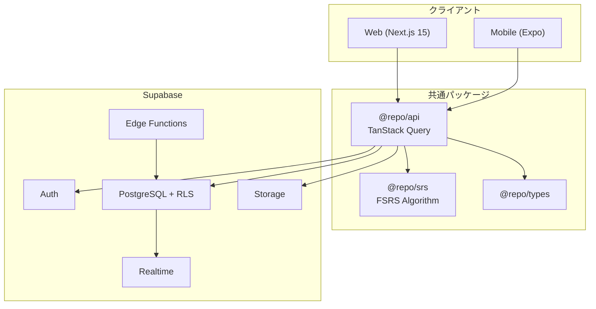

# システムアーキテクチャ

> 関連ドキュメント: [ビジネス要件](./business-requirements.md)
> 最終更新: 2026-01-02

## 1. アーキテクチャ概要

### 1.1 システム全体像



### 1.2 設計方針

- **重視したポイント**: シンプルなUX、クロスプラットフォーム、低コスト運用
- **基本アプローチ**: Supabase BaaSによるサーバーレス構成、モノレポでWeb/Mobile間のコード共有最大化

## 2. 技術スタック

### 2.1 フロントエンド（Web）

| 項目 | 選定技術 | バージョン | 選定理由 |
|-----|---------|-----------|---------|
| フレームワーク | Next.js (App Router) | 15.x | RSC対応、Vercel親和性、Turbopack |
| UIライブラリ | React | 19.x | Server Components、Server Actions |
| 状態管理（サーバー） | TanStack Query | 5.x | キャッシュ、楽観的更新 |
| 状態管理（クライアント） | Zustand | 5.x | 軽量、シンプル |
| スタイリング | Tailwind CSS | 4.x | Oxide Engine、CSS-first |
| UIコンポーネント | shadcn/ui | latest | コピペ方式、Radix UI基盤 |
| フォーム | React Hook Form + Zod | latest | 型安全バリデーション |
| 国際化 | next-intl | latest | App Router最適化 |

### 2.2 フロントエンド（モバイル）

| 項目 | 選定技術 | バージョン | 選定理由 |
|-----|---------|-----------|---------|
| フレームワーク | Expo | SDK 52+ | React Native公式推奨、OTA更新 |
| ルーティング | Expo Router | 4.x | ファイルベース |
| スタイリング | NativeWind | 4.x | Tailwind互換 |
| 通知 | Expo Notifications | latest | プッシュ通知 |

### 2.3 バックエンド

| 項目 | 選定技術 | バージョン | 選定理由 |
|-----|---------|-----------|---------|
| BaaS | Supabase | latest | PostgreSQL、RLS、オープンソース |
| 認証 | Supabase Auth | latest | Email/Google OAuth/MFA |
| Edge Functions | Deno Runtime | latest | 通知スケジュール、SRS計算 |
| API形式 | Supabase Client + Server Actions | - | 型安全、RLS連携 |

### 2.4 データストア

| 項目 | 選定技術 | 選定理由 |
|-----|---------|---------|
| メインDB | PostgreSQL (Supabase) | リレーショナル、RLS、複雑なクエリ |
| ファイルストレージ | Supabase Storage | 画像添付、CDN配信 |
| リアルタイム同期 | Supabase Realtime | デバイス間同期 |

### 2.5 インフラ・DevOps

| 項目 | 選定技術 | 選定理由 |
|-----|---------|---------|
| ホスティング | Vercel | Next.js公式、Edge対応 |
| CI/CD | GitHub Actions | Turborepoキャッシュ連携 |
| モノレポ | Turborepo + pnpm | 高速ビルド、リモートキャッシュ |
| エラー監視 | Sentry | Web/Mobile両対応 |

### 2.6 テスト

| 項目 | 選定技術 | 選定理由 |
|-----|---------|---------|
| ユニットテスト | Vitest | 高速、TypeScript対応 |
| E2Eテスト | Playwright | クロスブラウザ |

## 3. ディレクトリ構成

```
resave/
├── apps/
│   ├── web/                      # Next.js
│   │   ├── src/
│   │   │   ├── app/[locale]/     # 国際化ルート
│   │   │   ├── components/       # UIコンポーネント
│   │   │   ├── lib/supabase/     # Supabaseクライアント
│   │   │   └── i18n/             # 国際化設定
│   │   └── messages/             # 翻訳ファイル (ja/en/zh)
│   │
│   └── mobile/                   # Expo
│       ├── app/                  # Expo Router
│       └── components/
│
├── packages/
│   ├── api/                      # TanStack Query hooks
│   ├── srs/                      # FSRSアルゴリズム
│   ├── types/                    # 共通型定義
│   ├── utils/                    # ユーティリティ
│   └── config/                   # ESLint/TS/Prettier設定
│
├── supabase/
│   ├── migrations/               # DBマイグレーション
│   └── functions/                # Edge Functions
│
├── pnpm-workspace.yaml
└── turbo.json
```

### 各ディレクトリの役割

| ディレクトリ | 役割 |
|------------|-----|
| `apps/web` | Next.js Webアプリケーション |
| `apps/mobile` | Expo モバイルアプリケーション |
| `packages/api` | TanStack Query hooks、Supabaseクライアント |
| `packages/srs` | FSRSアルゴリズム実装 |
| `packages/types` | TypeScript型定義 |
| `packages/utils` | 共通ユーティリティ |
| `supabase/` | マイグレーション、Edge Functions |

## 4. 外部サービス連携

| サービス | 用途 | 選定理由 |
|---------|-----|---------|
| Supabase | BaaS (認証/DB/Storage/Realtime) | PostgreSQL基盤、低コスト、OSS |
| Vercel | Webホスティング | Next.js公式、自動デプロイ |
| Expo EAS | モバイルビルド/配信 | OTA更新、ストア申請自動化 |
| Sentry | エラー監視 | Web/Mobile両対応 |
| Resend | メール送信 | パスワードリセット等 |

## 5. セキュリティ設計

### 5.1 認証・認可

- **Supabase Auth**: JWTベース認証
- **Row Level Security (RLS)**: PostgreSQLレベルでのアクセス制御
- **OAuth 2.0**: Googleログイン対応
- **MFA**: 多要素認証オプション

```sql
-- 例: ユーザーは自分のデッキのみアクセス可能
CREATE POLICY "Users can only access their own decks"
ON decks FOR ALL
USING (auth.uid() = user_id);
```

### 5.2 データ保護

- 全通信HTTPS必須
- Supabaseによるデータベース暗号化
- 環境変数で秘密情報管理（.envは.gitignore）
- CORS許可オリジン明示指定

## 6. 技術選定の経緯

### 6.1 検討した代替案

| 項目 | 採用案 | 代替案 | 代替を選ばなかった理由 |
|-----|-------|-------|---------------------|
| BaaS | Supabase | Firebase | NoSQLでリレーション処理複雑、ベンダーロックイン |
| モバイル | Expo | Flutter | Dart学習コスト、Webとコード共有不可 |
| SRSアルゴリズム | FSRS | SM-2 | FSRSは20-30%効率的（2023年ML設計） |
| 状態管理 | TanStack Query + Zustand | Redux | 学習コスト高、オーバースペック |
| i18n | next-intl | next-i18next | App Router対応不完全、設定複雑 |

### 6.2 今後の検討事項

| 項目 | 内容 | 優先度 |
|-----|-----|-------|
| PWA対応 | オフライン対応、インストール可能化 | 中 |
| AIカード生成 | GPT API連携 | 中 |
| デッキ共有 | 公開URL、マーケット機能 | 中 |
| Stripe決済 | プレミアムプラン | 低 |

## 7. 参考情報

- [Next.js 15 Docs](https://nextjs.org/docs)
- [Supabase Docs](https://supabase.com/docs)
- [Expo Docs](https://docs.expo.dev/)
- [FSRS Algorithm](https://github.com/open-spaced-repetition/fsrs4anki/wiki/abc-of-fsrs)
- [Turborepo Docs](https://turborepo.com/docs)
- [next-intl](https://next-intl.dev/)
