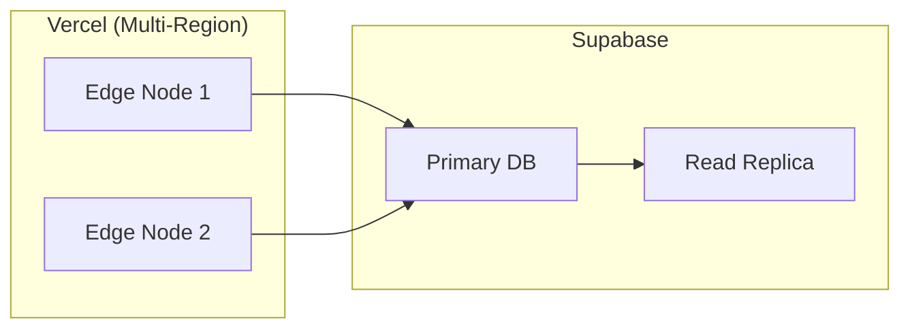

# 非機能要件定義書

> 関連ドキュメント: [ビジネス要件](./business-requirements.md) | [アーキテクチャ](./architecture.md)
> 最終更新: 2026-01-02

## 1. パフォーマンス要件

### 1.1 応答時間

| 指標 | 目標値 | 計測方法 |
|------|--------|----------|
| Web LCP (Largest Contentful Paint) | 2.5秒以内 | Vercel Analytics |
| Web FID (First Input Delay) | 100ms以内 | Vercel Analytics |
| Web CLS (Cumulative Layout Shift) | 0.1以下 | Vercel Analytics |
| API 95パーセンタイル応答時間 | 500ms以内 | Supabase Dashboard |
| カード表示（フリップ操作） | 50ms以内 | クライアント計測 |

### 1.2 スループット

| 指標 | 目標値 | 備考 |
|------|--------|------|
| 同時接続ユーザー数 | 1,000 | 初期想定 |
| 1秒あたりリクエスト数 | 100 RPS | APIエンドポイント合計 |
| バッチ処理（通知送信） | 10,000件/分 | Edge Functions |

### 1.3 データ量

| 指標 | 想定値 | 備考 |
|------|--------|------|
| 1ユーザーあたりカード数 | 最大10,000枚 | 上限設定なし |
| カード画像サイズ | 最大5MB/枚 | Supabase Storage |
| 学習ログ保存期間 | 無期限 | 統計表示のため |

## 2. 可用性要件

### 2.1 稼働率

| 項目 | 目標値 | 備考 |
|------|--------|------|
| サービス稼働率 | 99.5%以上 | 月間ダウンタイム3.65時間以内 |
| 計画メンテナンス | 月1回/30分以内 | 深夜帯に実施 |

### 2.2 障害復旧

| 指標 | 目標値 | 備考 |
|------|--------|------|
| RTO (Recovery Time Objective) | 4時間 | サービス復旧までの時間 |
| RPO (Recovery Point Objective) | 1時間 | データ損失許容時間 |

### 2.3 冗長性

- Vercel: グローバルEdge Network による自動フェイルオーバー
- Supabase: PostgreSQL のRead Replica（Proプラン以上）

## 3. スケーラビリティ要件

### 3.1 垂直スケーリング

| リソース | 初期 | 最大 |
|----------|------|------|
| Vercel Functions メモリ | 1024MB | 3008MB |
| Supabase DB | 1GB RAM | 8GB RAM |

### 3.2 水平スケーリング

| 項目 | 方式 |
|------|------|
| Webアプリ | Vercel Serverless（自動スケール） |
| Edge Functions | Supabase Edge（リージョン分散） |
| データベース接続 | Supabase Pooler（コネクションプール） |

### 3.3 将来の拡張性

- ユーザー数10倍増加時: Supabase Proプランへアップグレード
- ユーザー数100倍増加時: Supabase Enterpriseまたはセルフホスト検討

## 4. セキュリティ要件

### 4.1 認証・認可

| 要件 | 実装 |
|------|------|
| パスワードポリシー | 最低8文字、英数字混合 |
| セッション有効期限 | 7日間（JWT） |
| MFA | TOTP対応（オプション） |
| OAuth | Google（必須）、Apple（将来） |
| アクセス制御 | Row Level Security (RLS) |

### 4.2 データ保護

| 要件 | 実装 |
|------|------|
| 通信暗号化 | TLS 1.3 |
| 保存データ暗号化 | AES-256（Supabase標準） |
| パスワード保存 | bcrypt（ストレッチング） |
| 個人情報 | GDPR準拠（削除権対応） |

### 4.3 脆弱性対策

| 脅威 | 対策 |
|------|------|
| SQLインジェクション | パラメータバインディング（Supabase Client） |
| XSS | React自動エスケープ、CSP設定 |
| CSRF | SameSite Cookie、Origin検証 |
| 認証バイパス | RLSによる多層防御 |

> 詳細: [脅威モデル](../security/threat-model.md)

## 5. 保守性要件

### 5.1 コード品質

| 指標 | 目標値 |
|------|--------|
| テストカバレッジ | 80%以上 |
| TypeScript strict mode | 必須 |
| ESLint エラー | 0件 |
| Prettier | 自動フォーマット |

### 5.2 ドキュメント

| 種類 | 要件 |
|------|------|
| APIドキュメント | 全エンドポイント記載 |
| コードコメント | 複雑なロジックのみ |
| 変更履歴 | Git + Conventional Commits |

### 5.3 依存関係管理

| 項目 | 方針 |
|------|------|
| パッケージ更新 | 月次で確認 |
| セキュリティパッチ | 72時間以内に適用 |
| メジャーアップデート | 四半期レビュー |

## 6. 運用性要件

### 6.1 監視

| 対象 | ツール | 閾値 |
|------|--------|------|
| アプリケーション | Sentry | エラー率1%以上で警告 |
| インフラ | Vercel Analytics | LCP 3秒以上で警告 |
| データベース | Supabase Dashboard | CPU 80%以上で警告 |

### 6.2 ログ

| 種類 | 保存期間 | 備考 |
|------|----------|------|
| アプリケーションログ | 30日 | Vercel Logs |
| アクセスログ | 90日 | Supabase Logs |
| 監査ログ | 1年 | セキュリティイベント |

### 6.3 バックアップ

| 対象 | 頻度 | 保存期間 |
|------|------|----------|
| データベース | 日次 | 7日 |
| ストレージ | 週次 | 30日 |

> 詳細: [バックアップ設計](../operations/backup.md)

## 7. ユーザビリティ要件

### 7.1 対応環境

| プラットフォーム | 対応バージョン |
|-----------------|---------------|
| Chrome | 最新2バージョン |
| Safari | 最新2バージョン |
| Firefox | 最新2バージョン |
| Edge | 最新2バージョン |
| iOS | 15.0以上 |
| Android | 10.0以上 |

### 7.2 アクセシビリティ

| 基準 | 目標 |
|------|------|
| WCAG | 2.1 Level AA |
| キーボード操作 | 全機能対応 |
| スクリーンリーダー | VoiceOver/TalkBack対応 |
| カラーコントラスト | 4.5:1以上 |

### 7.3 国際化

| 言語 | 対応状況 |
|------|----------|
| 日本語 | 初期対応 |
| 英語 | 初期対応 |
| 中国語（簡体） | 初期対応 |

## 8. 法令・コンプライアンス要件

### 8.1 個人情報保護

| 法令 | 対応 |
|------|------|
| GDPR | データ削除権、ポータビリティ |
| 個人情報保護法（日本） | 利用目的明示、第三者提供同意 |

### 8.2 規約

| 文書 | 要件 |
|------|------|
| 利用規約 | サービス登録時に同意必須 |
| プライバシーポリシー | 公開必須 |
| 特定商取引法表記 | 有料プラン導入時に必須 |

## 変更履歴

| 日付 | バージョン | 変更内容 | 担当 |
|------|-----------|----------|------|
| 2026-01-02 | 1.0 | 初版作成 | Claude Code |
