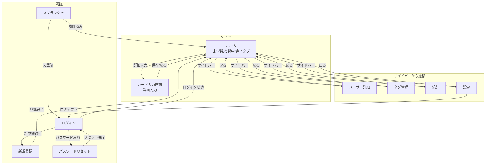
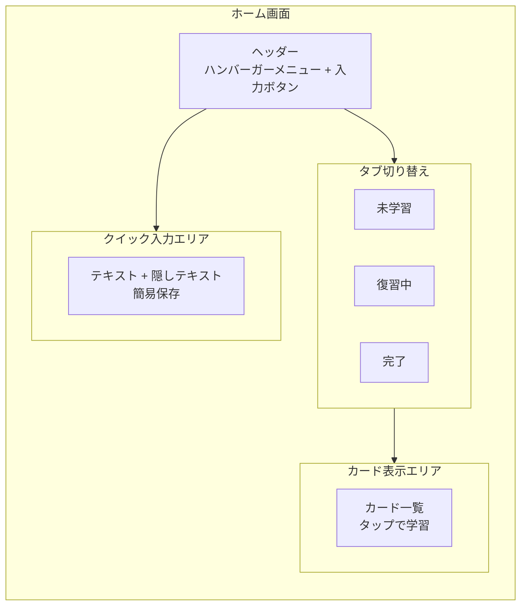
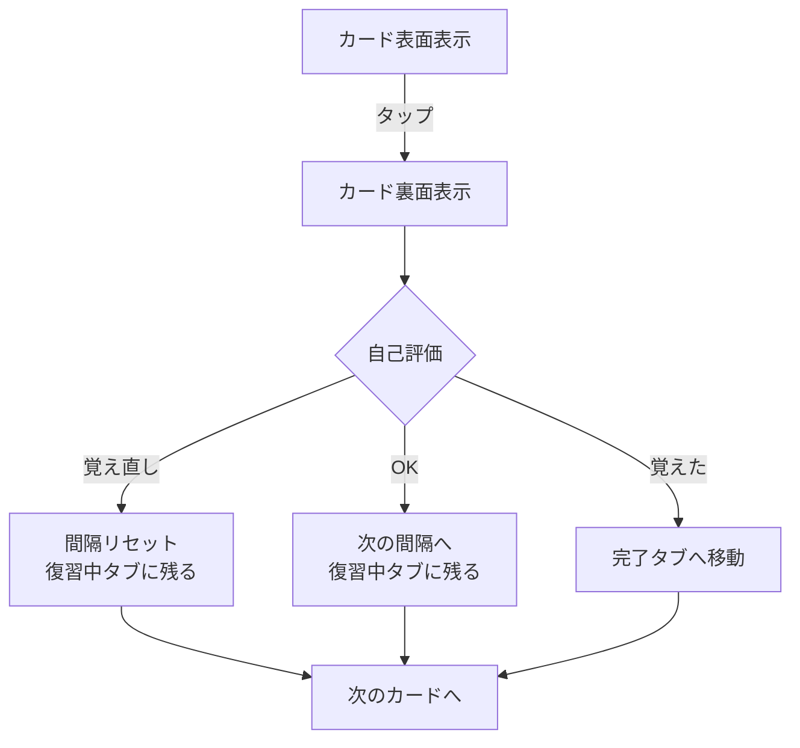
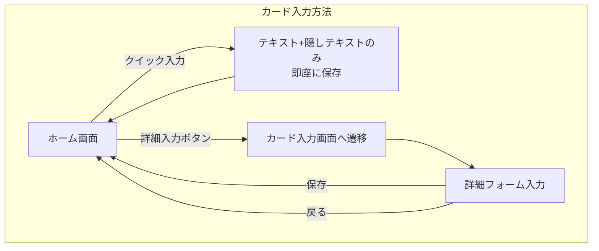
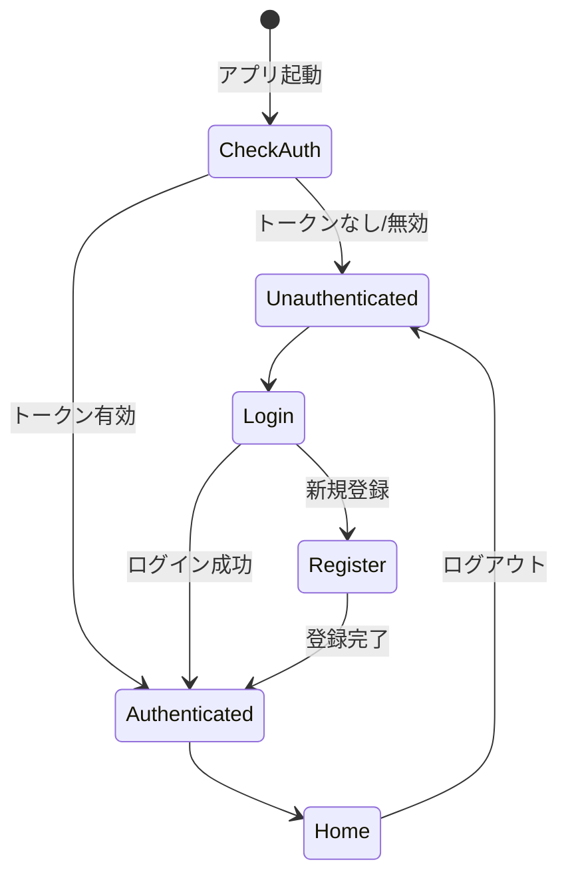

# 画面遷移図

> 関連: [ビジネス要件](../requirements/business-requirements.md) | [機能一覧](../requirements/functions/_index.md)

## 設計方針

**ホーム画面ですべて完結する**

- ホーム画面内のタブで「未学習」「復習中」「完了」を切り替え
- 各タブにカードが表示され、その場で学習・評価が完了
- サイドバー（ドロワー）から設定・ユーザー詳細等に遷移
- カード作成は「クイック入力」と「詳細入力画面」の2パターン

---

## 全体フロー



---

## ホーム画面の構造



### ホーム画面のタブ

| タブ | 表示内容 | 操作 |
|-----|---------|------|
| 未学習 | まだ一度も学習していないカード | タップで初回学習 |
| 復習中 | 今日復習が必要なカード | タップで復習・評価 |
| 完了 | 「覚えた」評価で完了したカード | 閲覧のみ（復習対象外） |

### カード操作フロー（ホーム画面内）



---

## カード入力フロー



### クイック入力（ホーム画面内）

ホーム画面で最小限の情報だけを入力して即座に保存。

| 項目 | 必須 | 説明 |
|-----|-----|------|
| テキスト | 必須 | カードの表面（覚えたいこと） |
| 隠しテキスト | - | カードの裏面（答え） |

### 詳細入力画面

より詳細な情報を入力する専用画面。

| 項目 | 必須 | 説明 |
|-----|-----|------|
| テキスト | 必須 | カードの表面（覚えたいこと）※500文字制限 |
| 隠しテキスト | - | カードの裏面（答え） |
| タグ | - | 分類用タグ |
| ソース | - | 参照元URL |
| リピート | - | 間隔反復の設定 |

---

## サイドバーメニュー

```
[サイドバー]
├── ユーザー詳細（プロフィール）
├── タグ管理
├── 統計
├── 設定
└── ログアウト
```

---

## 画面一覧

### 認証系画面

| 画面名 | 概要 | 対応機能 |
|-------|------|---------|
| スプラッシュ | 初期ロード・認証状態チェック | - |
| ログイン | メール/パスワード認証 | F-002 |
| 新規登録 | アカウント作成 | F-001 |
| パスワードリセット | パスワード再設定 | F-003 |

### メイン画面

| 画面名 | 概要 | 対応機能 |
|-------|------|---------|
| ホーム | カード表示（未学習/復習中/完了タブ）・学習・評価・クイック入力 | F-013, F-020, F-021, F-022, F-023 |
| カード入力画面 | 詳細なカード作成・編集 | F-013, F-014, F-016 |

### サイドバーから遷移する画面

| 画面名 | 概要 | 対応機能 |
|-------|------|---------|
| ユーザー詳細 | プロフィール表示・編集 | F-005 |
| タグ管理 | タグの作成・編集・削除 | F-017 |
| 統計 | 日別学習カード数・グラフ | F-030 |
| 設定 | 各種設定・ログアウト | - |

---

## 認証状態による分岐



---

## UI構成イメージ

### ホーム画面

```
┌─────────────────────────────────────┐
│ ☰  ReSave                    [+]   │  ← ヘッダー（+で詳細入力画面へ）
├─────────────────────────────────────┤
│ ┌─────────────────────────────────┐ │
│ │ [クイック入力]                   │ │  ← 展開式またはインライン
│ │ テキスト: ___________________   │ │
│ │ 隠し:    ___________________   │ │
│ │                       [保存]   │ │
│ └─────────────────────────────────┘ │
├─────────────────────────────────────┤
│  [未学習]  [復習中]  [完了]          │  ← タブ
├─────────────────────────────────────┤
│                                     │
│  ┌─────────────────────────────┐   │
│  │  カード表面                  │   │
│  │  （タップで裏面表示）         │   │
│  └─────────────────────────────┘   │
│                                     │
│  ┌─────────────────────────────┐   │
│  │  カード表面                  │   │
│  └─────────────────────────────┘   │
│           ...                       │
└─────────────────────────────────────┘
```

### カード入力画面（詳細）

```
┌─────────────────────────────────────┐
│ « 戻る                              │
├─────────────────────────────────────┤
│                                     │
│ ●テキスト                           │
│ ┌─────────────────────────────┐    │
│ │ 確実に覚えたいこと            │    │
│ └─────────────────────────────┘    │
│                           0 / 500   │
│                                     │
│ 隠しテキスト                         │
│ ┌─────────────────────────────┐    │
│ │ 質問の回答など               │    │
│ └─────────────────────────────┘    │
│                                     │
│              [保存] ● 必須項目       │
│                                     │
│ ─────────────────────────────────── │
│                                     │
│ タグ                                │
│ ┌─────────────────────────────┐    │
│ │ タグを選択                   │    │
│ └─────────────────────────────┘    │
│                                     │
│ ソース                              │
│ ┌─────────────────────────────┐    │
│ │ http://                      │    │
│ └─────────────────────────────┘    │
│                                     │
│ リピート                            │
│ ┌─────────────────────────────┐    │
│ │ 間隔反復                     │    │
│ └─────────────────────────────┘    │
│ ⓘ 間隔反復について                  │
│                                     │
│              [保存]                  │
│                                     │
└─────────────────────────────────────┘
```

### サイドバー

```
┌─────────────────┐
│ ☰ サイドバー     │
├─────────────────┤
│ ユーザー詳細     │
│ タグ管理        │
│ 統計            │
│ 設定            │
├─────────────────┤
│ ログアウト       │
└─────────────────┘
```

---

## データ同期ポイント（F-050）

| タイミング | 同期内容 |
|-----------|---------|
| アプリ起動時 | 最新データをフェッチ |
| カード作成時 | 即時同期 |
| 自己評価時 | 評価結果を即時同期 |
| バックグラウンド復帰時 | 差分同期 |

---

## 変更履歴

| 日付 | バージョン | 変更内容 | 作成者 |
|------|-----------|----------|--------|
| 2026-01-02 | 1.4 | 画像アップロードと公開状態を削除 | Claude Code |
| 2026-01-02 | 1.3 | クイック入力とカード入力画面（詳細）を追加 | Claude Code |
| 2026-01-02 | 1.2 | ホーム画面内タブ構造に変更。サイドバーナビゲーション採用 | Claude Code |
| 2026-01-02 | 1.1 | ホーム画面中心の構造に変更。学習画面を廃止 | Claude Code |
| 2026-01-02 | 1.0 | 初版作成 | Claude Code |
